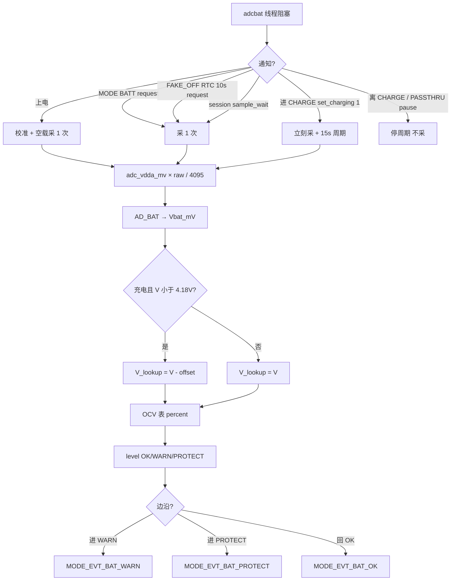

# ADC 流程图

用法：[`README.md`](README.md)、`{"cmd":"test.adc"}`。

```mermaid
flowchart TD
  A[adcbat 线程阻塞] --> B{通知?}
  B -->|上电| C[校准 + 空载采 1 次]
  B -->|MODE BATT request| D[采 1 次]
  B -->|进 CHARGE set_charging 1| E[立刻采 + 15s 周期]
  B -->|离 CHARGE / PASSTHRU pause| F[停周期 不采]
  B -->|FAKE_OFF RTC 10s request| D
  B -->|session sample_wait| D
  C --> G["adc_vdda_mv × raw / 4095"]
  D --> G
  E --> G
  G --> H[AD_BAT → Vbat_mV]
  H --> I{充电且 V 小于 4.18V?}
  I -->|是| J[V_lookup = V - offset]
  I -->|否| K[V_lookup = V]
  J --> L[OCV 表 percent]
  K --> L
  L --> M[level OK/WARN/PROTECT]
  M --> N{边沿?}
  N -->|进 WARN| O[MODE_EVT_BAT_WARN]
  N -->|进 PROTECT| P[MODE_EVT_BAT_PROTECT]
  N -->|回 OK| Q[MODE_EVT_BAT_OK]
```

`OFF`/`FORCE_OFF` 不采（STOP2）。
