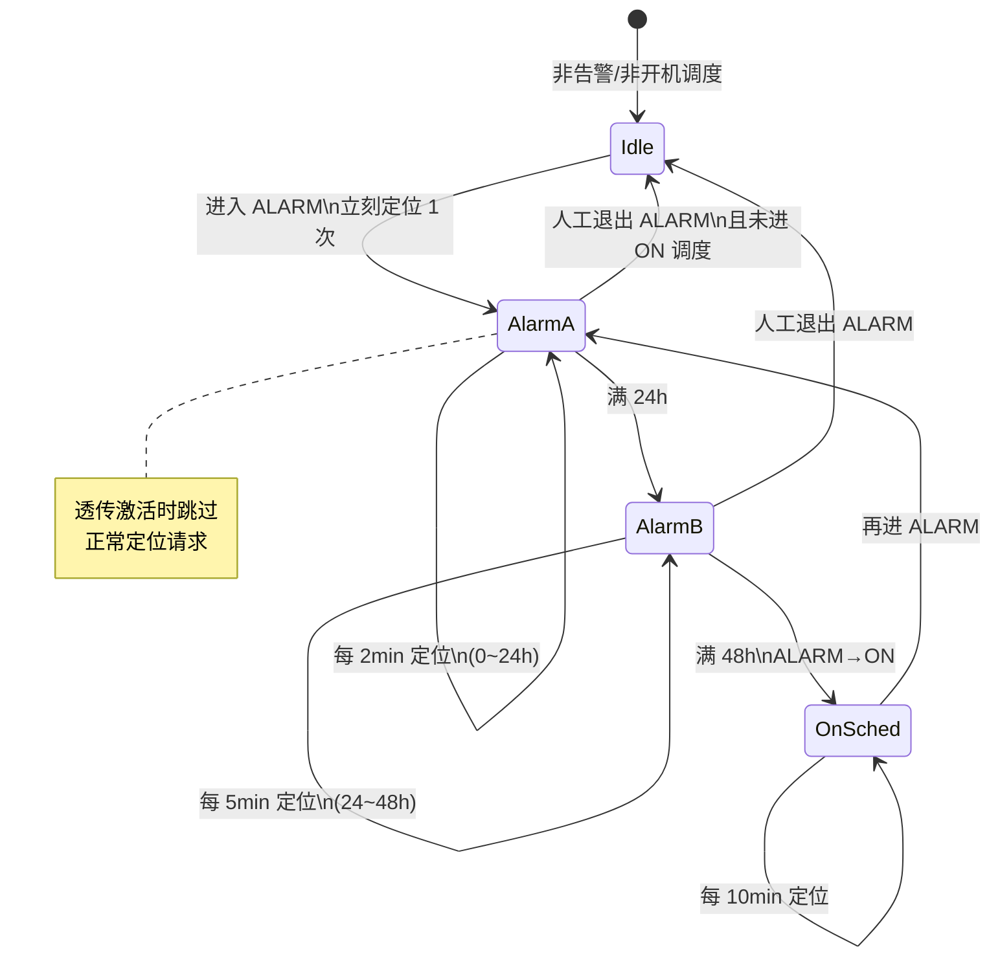
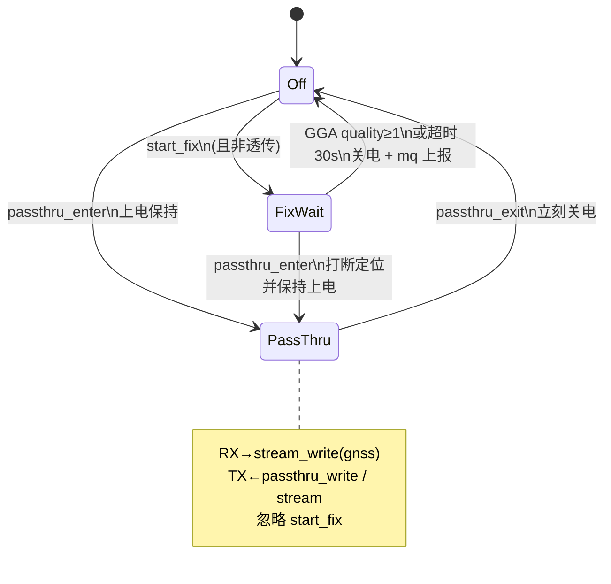

# BSP/gnss — GNSS 定位与透传

模块：中科微 **ATGM336H-F8N**（USART3 / 115200 8N1，NMEA0183）。  
协议：`Zkw_BDS-GNSS_InterfaceSpec_r6.3.2`；硬件手册：ATGM336H-F8N 用户手册。

引脚见 `board/board_pins.h`：`EN_PGNSS`（低开）、`EN_LNA_GNSS`（高开）、`EN_PLNA`（高开，与 RDSS **共享 refcount**）。

编译开关：`USE_GNSS`（`config/product_config.h`）。

---

## 1. 两种工作模式

| 模式 | 行为 |
|------|------|
| **正常定位** | 上电 → 等有效定位或超时 → **立刻关电** → 结果经 `rt_mq` 上报 |
| **透传** | 由 **MODE `PASSTHRU`** 启停；上电保持；退出/保护时关电 |

### 低压保护（由 MODE 门控）

门限：`ADC_BAT_PROTECT_ENTER_PCT`（`adc_bat.h`）。MODE 进保护 / 退出透传时调 `gnss_on_bat_protect()` 关电。GNSS 驱动不再自检电量。

有效定位（本期）：**GGA quality ≥ 1**。  
定位超时：**30s**（冷启动 TTFF 典型 ≤23s，偏紧；后续可调）。

---

## 2. 电源

上电顺序（概念）：

1. `plna_acquire()`（共享脚，引用计数）
2. `EN_LNA_GNSS = 1`
3. `EN_PGNSS = 0`（低有效）
4. 延时后开 USART3

下电：关串口数据路径 → `EN_PGNSS = 1` → `EN_LNA_GNSS = 0` → `plna_release()`。

`EN_PLNA`：**GNSS / RDSS 各自 acquire/release**，计数到 0 才真正拉低。

---

## 3. 定位调度（session 后做；规则先锁定）

由 `app/session` 在对应 MODE 下触发 `gnss_start_fix()`（BSP 只执行单次会话）。

| 阶段 | 时长窗口 | 周期 | 说明 |
|------|----------|------|------|
| ALARM-A | 进告警起 **0～24h** | **每 2 分钟** | 进 `ALARM` 时 **立刻** 定 1 次，再按 2min |
| ALARM-B | **24～48h** | **每 5 分钟** | |
| 结束告警 | **≥48h** | — | 切换到 **`ON`（开机模式）** |
| ON | 开机态持续 | **每 10 分钟** | |

> 报文（RDSS）节奏与 GNSS 定位节奏对齐；组包内容含定位、电量%、系统状态等（RDSS 后做）。

### 调度状态图

---

## 4. GNSS 驱动内部状态

---

## 5. 与上层接口

| API / 对象 | 方向 | 说明 |
|------------|------|------|
| `gnss_start_fix()` | session → GNSS | 请求一次正常定位（非阻塞） |
| `gnss_result_mq` / `gnss_msg_t` | GNSS → session/RDSS | 完成通知（成功/超时 + 坐标缓存） |
| `gnss_get_fix()` | 查询 | 读最近一次有效定位 |
| `gnss_passthru_enter/exit` | CLI/stream | 透传进出 |
| `stream` 通道 `gnss` | 透传数据 | `USE_GNSS=1` 时 `built:1`；`stream.set` 联通透传 |

本期 session 调度未接；可用 CLI/`gnss_start_fix` 自测，结果 mq 可先打日志。

---

## 6. 文件

| 文件 | 内容 |
|------|------|
| `gnss.h` / `gnss.c` | 任务、模式、电源、UART、NMEA、mq |
| `../pwr/pwr_plna.*` | `EN_PLNA` 引用计数 |
| `README.md` | 本规则与状态图 |
