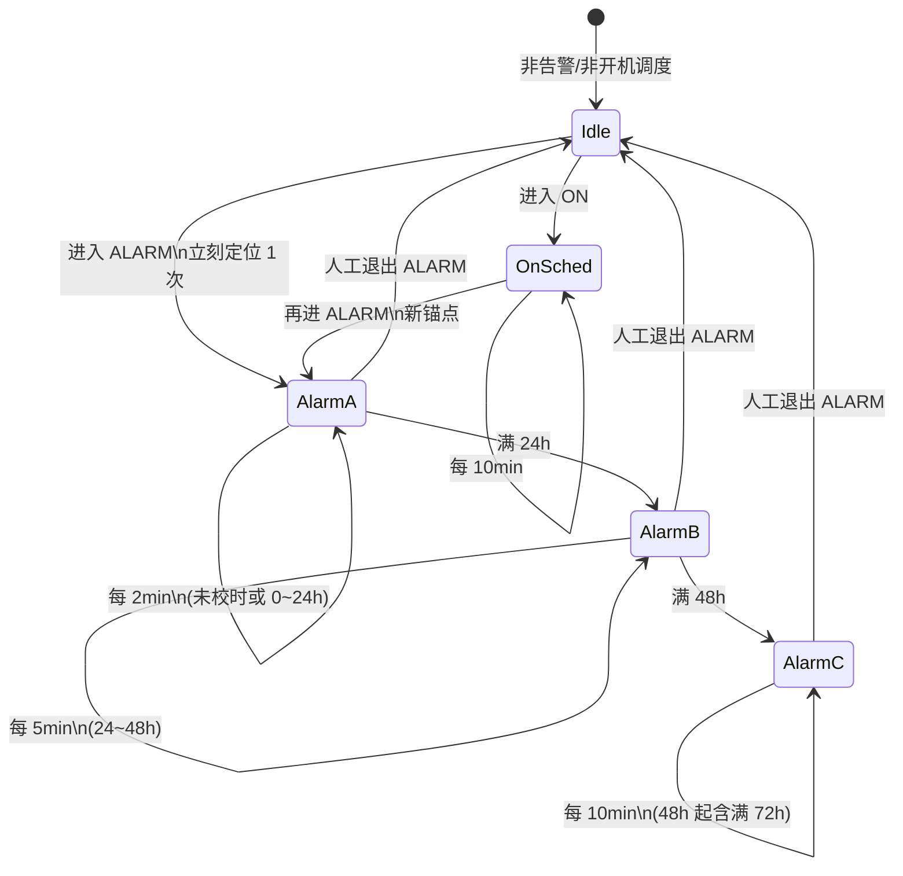
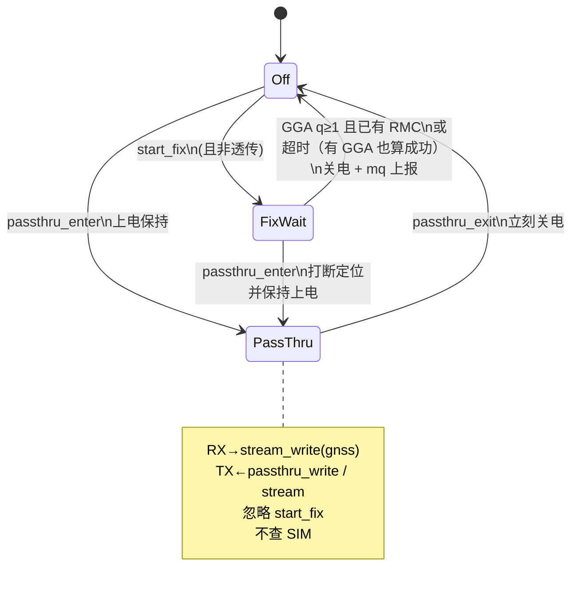

# BSP/gnss — GNSS 定位与透传

> **变更记录（2026-08-18）**  
> 本模块协议未改。假关机浅醒不跑 GNSS；低电 N / 告警拍仍走 `gnss_start_fix`。STOP2 前须已关电源轨。

模块：中科微 **ATGM336H-F8N**（USART3 / 115200 8N1，NMEA0183）。  
协议：`Zkw_BDS-GNSS_InterfaceSpec_r6.3.2`；硬件手册：ATGM336H-F8N 用户手册。

引脚见 `board/board_pins.h`：`EN_PGNSS`（低开）、`EN_LNA_GNSS`（高开）、`EN_PLNA`（高开，与 RDSS **共享 refcount**）。

编译开关：`USE_GNSS`（`config/product_config.h`）。

流程图与 CLI：[`flow.md`](flow.md)。调度节奏图仍见下文第 3 节。

---

## 1. 两种工作模式

| 模式 | 行为 |
|------|------|
| **正常定位** | 上电 → 等有效定位或超时 → **立刻关电** → 结果经 `rt_mq` 上报 |
| **透传** | 由 **MODE `PASSTHRU`** 启停；上电保持；退出/保护时关电。CDC ulog 由 MODE 静音，本驱动不关日志 |

### 低压保护（由 MODE 门控）

门限：`ADC_BAT_PROTECT_ENTER_PCT`（`adc_bat.h`）。MODE 进保护 / 退出透传时调 `gnss_on_bat_protect()` 关电。GNSS 驱动不再自检电量。

有效定位（本期）：**GGA quality ≥ 1**。  
同一拍再收 **RMC**（`status=A` + `date=ddmmyy`）合成 UTC Unix，写入 `gnss_fix_t.unix_sec`。  
定位超时：**30s**。GGA 已成功但尚无 RMC：等到超时仍上报定位，`unix_sec=0`。

---

## 1.1 时间（RMC → Unix，不配 JSON 日历）

NMEA 语句分工：

| 语句 | 默认 | 有什么 | 本固件 |
|------|------|--------|--------|
| GGA | 开 | 时刻 `hhmmss`、位置、质量 | **定位判据** |
| RMC | 一般开 | 时刻 + 日期 `ddmmyy` + `A/V` | **年月日时分秒** → Unix |
| ZDA | 常关 | 四位年 + 日/月 + 时刻 | **不用**（不发配置去开） |

RMC 两位年按 `2000+yy`。`status≠A` 或日期空/全 0：本拍不给出 Unix。  
转换在 GNSS 内用 UTC 公式，不走 `mktime`（避免时区偏 8 小时）。

**谁写 RTC：** GNSS **只填** `unix_sec`，**不** `rtc_post_unix`。校时策略在 `app/session`（见下节与 `BSP/rtc/README.md`）。  
透传：只转发原文，不解析、不校时。

---

---

## 2. 电源

上电顺序（概念）：

1. `plna_acquire()`（共享脚，引用计数）
2. `EN_LNA_GNSS = 1`
3. `EN_PGNSS = 0`（低有效）
4. 延时后开 USART3

下电：关串口数据路径 → `EN_PGNSS = 1` → `EN_LNA_GNSS = 0` → `plna_release()`。

`EN_PLNA`：**GNSS / RDSS 各自 acquire/release**，计数到 0 才真正拉低。

---

## 3. 定位调度（session 后做；规则先锁定）

由 `app/session` 在对应 MODE 下触发 `gnss_start_fix()`（BSP 只执行单次会话）。

校时（写 RTC）**不在本驱动**：session 在 ON 第一次有效 Unix、或未校时的 ALARM 第一次有效 Unix 时 `rtc_post_unix(RTC_SRC_GNSS)`。RDSS 不校时。细则 `BSP/rtc/README.md`。

| 阶段 | 时长窗口 | 周期 | 说明 |
|------|----------|------|------|
| ALARM-A | 进告警起 **0～24h** | **每 2 分钟** | 进 `ALARM` 时 **立刻** 定 1 次，再按 2min |
| ALARM-B | **24～48h** | **每 5 分钟** | |
| ALARM-C | **48h 起（含 ≥72h）** | **每 10 分钟** | 满 72h 仍停 ALARM，报文 A |
| ON | 开机态持续 | **每 10 分钟** | 独立通道，不由告警到期进入 |

> 报文（RDSS）节奏与 GNSS 定位节奏对齐。未校时一直 2min，不切 5/10min。细则 `app/session/README.md`、`app/mode/fsm.md`。

### 调度状态图

---

## 4. GNSS 驱动内部状态

---

## 5. 与上层接口

| API / 对象 | 方向 | 说明 |
|------------|------|------|
| `gnss_start_fix()` | session → GNSS | 请求一次正常定位（非阻塞） |
| `gnss_result_mq` / `gnss_msg_t` | GNSS → session | 完成通知；`fix.unix_sec` 来自 RMC |
| `gnss_get_fix()` | 查询 | 读最近一次有效定位（含 unix） |
| `gnss_passthru_enter/exit` | CLI/stream | 透传进出 |
| `stream` 通道 `gnss` | 透传数据 | `USE_GNSS=1` 时 `built:1`；`stream.set` 联通透传 |

CLI `test.gnss.fix` 可自测；应答含 `unix`（无 RMC 则为 0）。**不**因此写 RTC（产品校时只走 session 的 ON/ALARM 策略）。

---

## 6. 文件

| 文件 | 内容 |
|------|------|
| `gnss.h` / `gnss.c` | 任务、模式、电源、UART、NMEA、mq |
| `../pwr/pwr_plna.*` | `EN_PLNA` 引用计数 |
| `README.md` | 本规则与状态图 |
