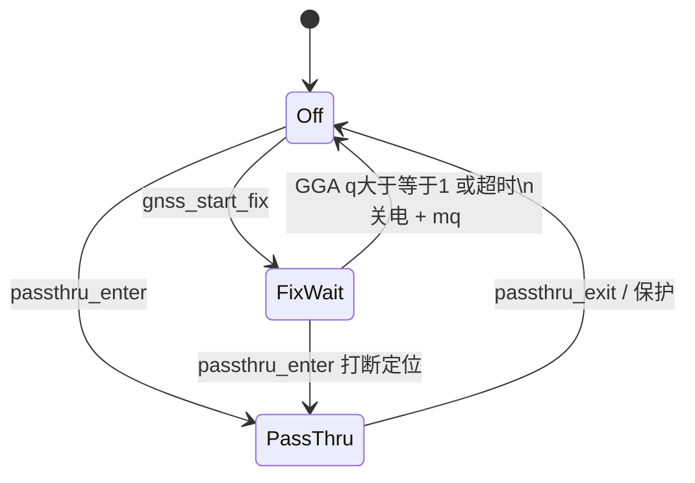
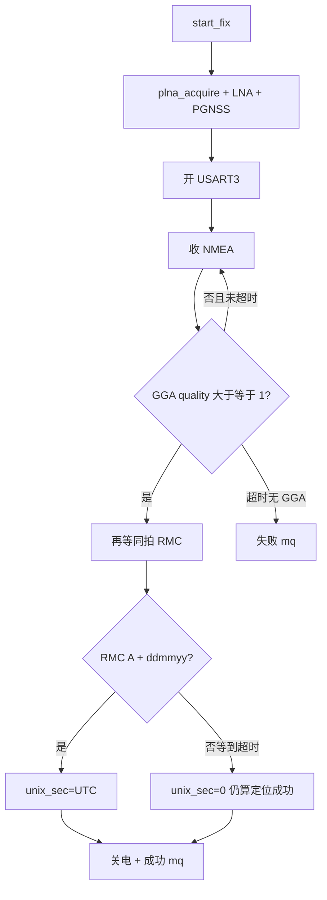

# GNSS 流程图

规则与引脚：[`README.md`](README.md)。用法：CLI `test.gnss.fix` / `stream.set` `name:gnss`。串口助手逐步操作：[`docs/board_bringup.md`](../../docs/board_bringup.md) 第 0.3、7 节。

## 驱动状态



## 一拍定位



透传：RX → `stream_write("gnss")` → `cdc_acm_write`；PC 非 `{` 行 → `gnss_passthru_write`。不解析、不校时。

## 使用

```json
{"id":17,"cmd":"test.gnss.fix"}
{"id":3,"cmd":"stream.set","name":"gnss","enable":1}
{"id":6,"cmd":"stream.set","name":"gnss","enable":0}
```

`test.gnss.fix` **不写 RTC**。产品校时只在 session 的 ON/未校时 ALARM。关透传必须 `{` 开头。
