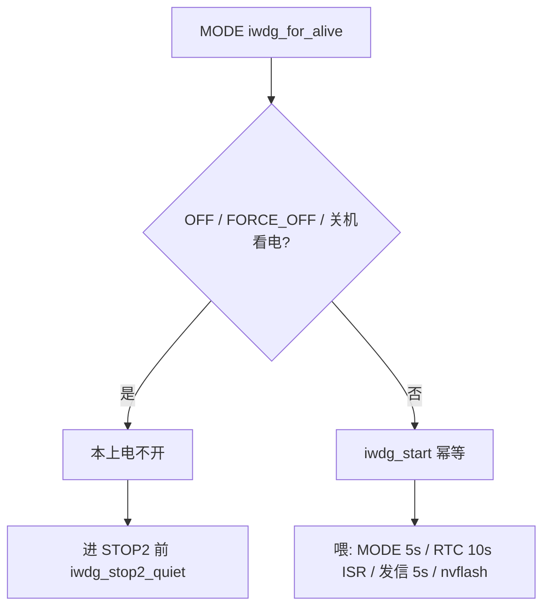

# IWDG 流程图

不要开 `RT_USING_WDT`。超时 ≈26s。

```mermaid
flowchart TD
  A[MODE iwdg_for_alive] --> B{OFF / FORCE_OFF / 关机看电?}
  B -->|是| C[本上电不开]
  B -->|否| D[iwdg_start 幂等]
  D --> E[喂: MODE 5s / RTC 10s ISR / 发信 5s / nvflash]
  C --> F[进 STOP2 前 iwdg_stop2_quiet]
```

冷启动真关机先不开，才能干净 STOP2（Enable 后通常关不掉）。
