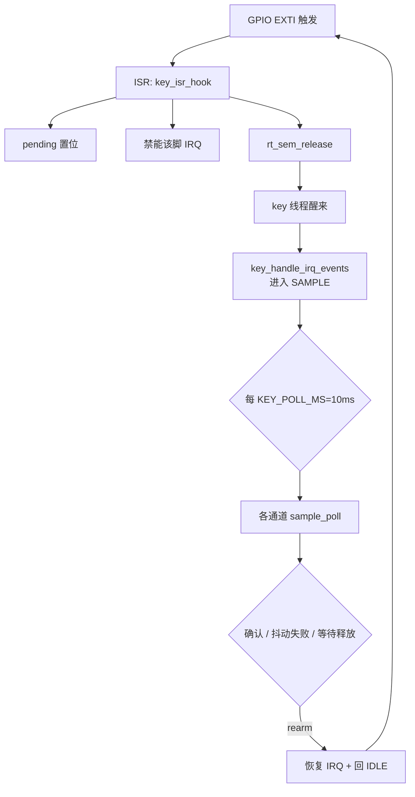
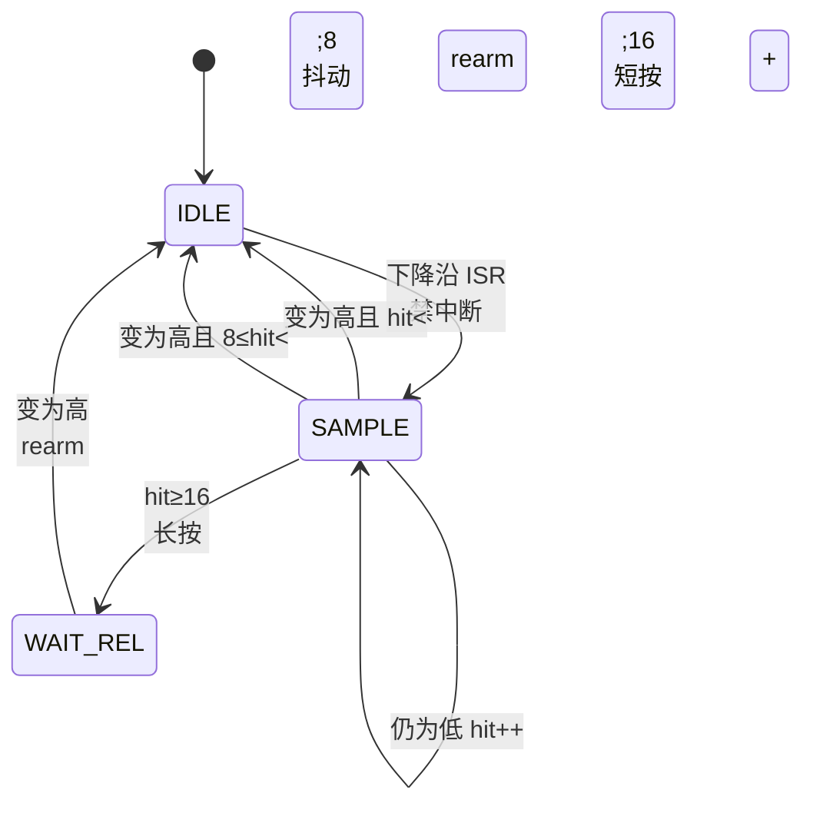
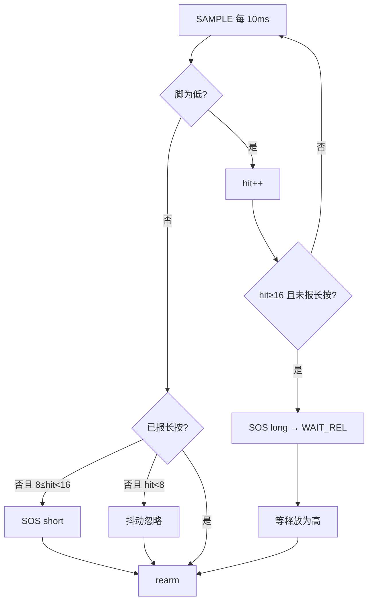
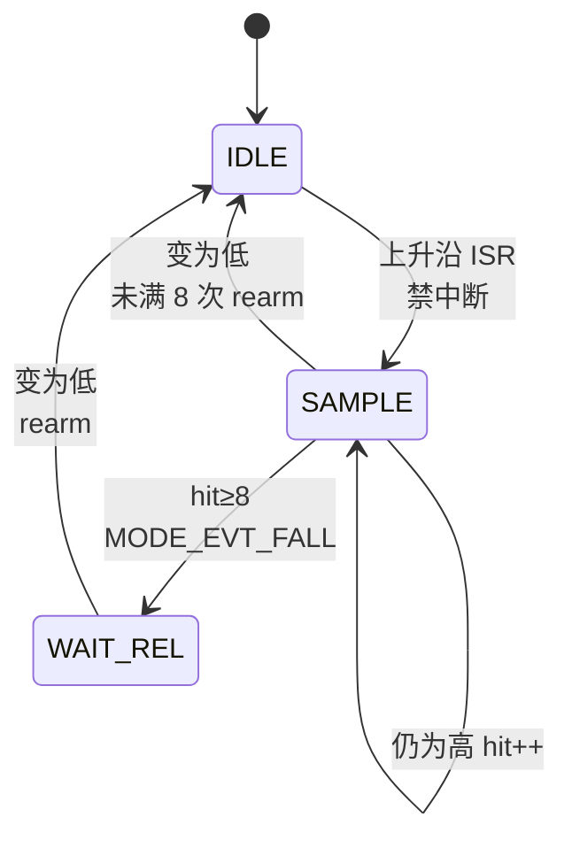
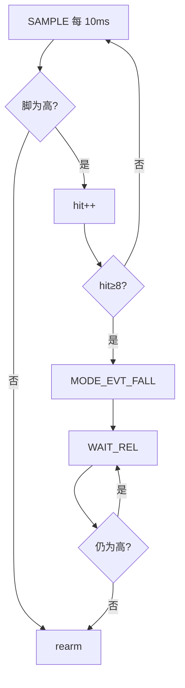
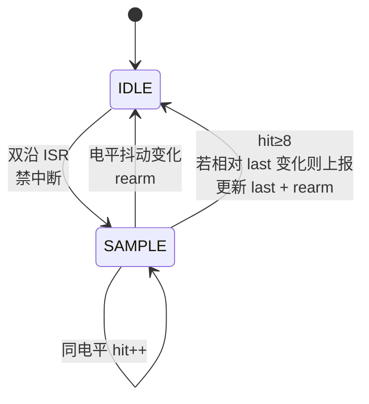
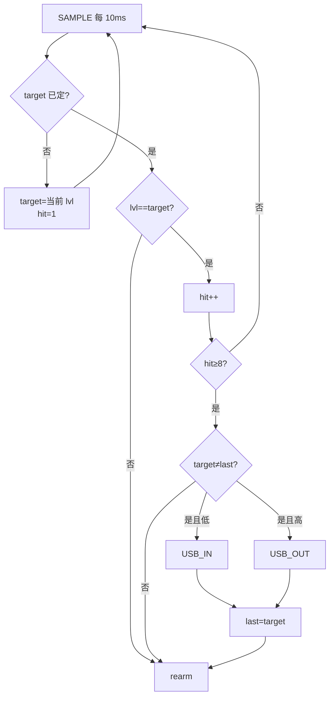
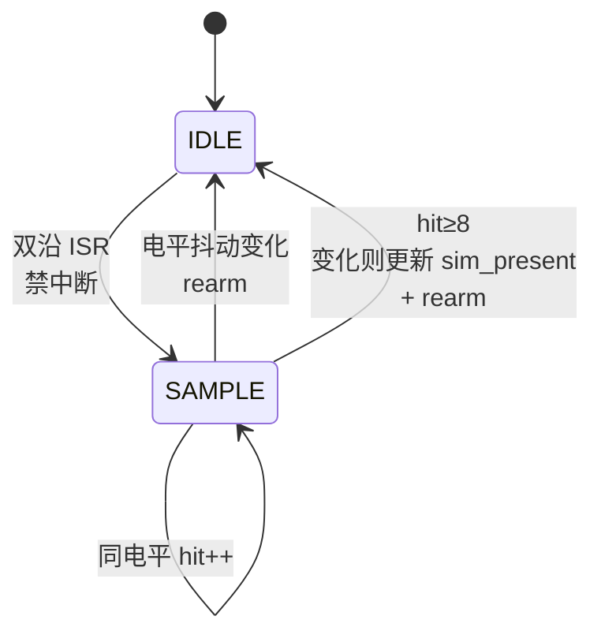
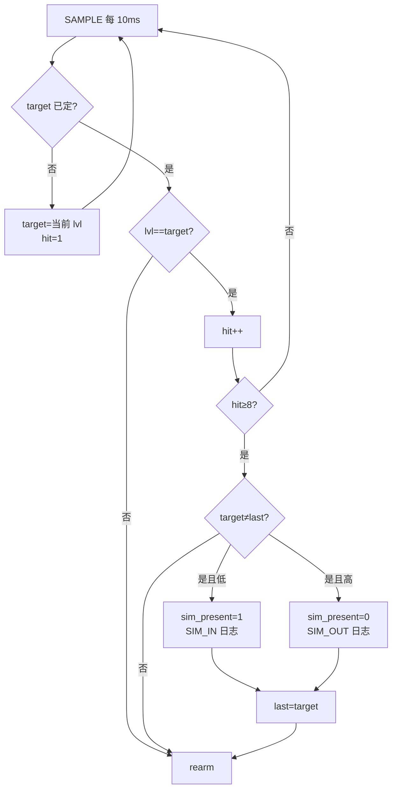

# KEY：四路 IO 执行逻辑（供确认）

实现：`key.c` + `board_key_irq.c`。  
共性：**EXTI 触发 → ISR 禁能该脚中断 → 置 pending + 释放信号量 → key 线程进入采样 → 每 10ms 轮询 → 确认/失败后 rearm（恢复中断）**。

| 参数 | 默认 | 说明 |
|------|------|------|
| `KEY_POLL_MS` | **10** | 轮询节拍（ms） |
| `KEY_FILTER_CNT` | **8** | FALL / USB / SIM 连续稳定次数（≈80ms） |
| `SOS_SHORT_CNT` | **8** | SOS 短按下限（≈80ms） |
| `SOS_LONG_CNT` | **16** | SOS 长按阈值（≈160ms） |

---

## 0. 总框架（四路共用）

**ISR 约束**：只做 pending + 禁中断 + 信号量，不做打印/滤波。

**线程**：`key`；有信号量立刻处理 pending；无事件也按 10ms 超时醒来，继续对已在 SAMPLE/WAIT_REL 的通道采样。

---

## 1. SOS（PA0）

| 项 | 现实现 |
|----|--------|
| 引脚 | `SOS_KEY` PA0，有效=**低** |
| 中断 | **下降沿** |
| 滤波 | 连续有效 `hit++`；**中途一次无效则清零并 rearm** |
| 短按 | 松手前 `hit ∈ [8, 16)` → `MODE_EVT_SOS_SHORT` |
| 长按 | `hit ≥ 16` → `MODE_EVT_SOS_LONG`，再等释放后 rearm |
| 互斥 | 已报长按则本次不再报短按 |

---

## 2. FALL（PB12，水浸）

| 项 | 现实现 |
|----|--------|
| 引脚 | `FALL_KEY` PB12，有效=**高**（`active_low=0`） |
| 中断 | **上升沿** |
| 滤波 | SAMPLE 中连续 **8 次有效高** 才确认；**任一次无效 → 立即 rearm** |
| 确认后 | `MODE_EVT_FALL`，进 `WAIT_REL`，等变为无效（低）再 rearm |

---

## 3. USB_IN（PA7）

| 项 | 现实现 |
|----|--------|
| 引脚 | `USB_IN` PA7 |
| 中断 | **双沿**（升/降） |
| 滤波 | 进入 SAMPLE 后锁定 `target_lvl`，连续 **8 次同电平**；中途电平变 → rearm |
| 上报 | 稳定电平 **≠ last_lvl** 时：低→`MODE_EVT_USB_IN`；高→`MODE_EVT_USB_OUT` |
| 上电 | 读一次初始电平写入 `last_lvl`，避免与 mode 重复报 USB_IN |
| 确认后 | **立刻 rearm**（无 WAIT_REL） |

---

## 4. SIM（PA5，北斗卡检测）

| 项 | 现实现 |
|----|--------|
| 引脚 | `RD_BD_SIMCARD` PA5；**低=有卡，高=无卡** |
| 中断 | **双沿** |
| 滤波 | **与 USB 同一套**：连续 8 次同电平；抖动则 rearm |
| 确认后 | 电平相对 `last_lvl` 变化时：低→`sim_present=1` + 日志；高→`sim_present=0` + 日志 |
| MODE | **不进 MODE**（非状态，仅能力位） |
| 上电 | 读初始电平 → `sim_present` / `last_lvl` |
| 确认后 | **立刻 rearm** |

---

## 5. 四路对照（确认用）

| | SOS | FALL | USB | SIM |
|--|-----|------|-----|-----|
| 脚 | PA0 | PB12 | PA7 | PA5 |
| 中断沿 | 下降 | 上升 | **双沿** | **双沿** |
| 有效电平 | 低 | 高 | 稳定低/高 | 稳定低/高 |
| 滤波次数 | 短≥8 / 长≥16 | ≥8 有效 | ≥8 同电平 | ≥8 同电平 |
| 一次无效 | **清零 rearm** | **清零 rearm** | 相对 target 变则 rearm | 同 USB |
| 确认后 | 长按等释放；短按直接 rearm | 等释放再 rearm | 直接 rearm | 直接 rearm |
| 输出 | MODE 短/长 | MODE_FALL | MODE USB_IN/OUT | 仅 `sim_present`+日志 |
| 算法族 | 按键时长 | 单沿有效脉冲 | **双沿电平** | **同 USB** |

---

## 6. 文件

| 文件 | 职责 |
|------|------|
| `board_key_irq.*` | 挂 EXTI、沿配置、ISR 调 hook |
| `key.c` | pending、禁中断、10ms 轮询滤波、事件/日志 |
| `key.h` | 周期/滤波次数、`sim_present()` |

请按上表与流程图确认；有偏差直接改需求，我再改代码。
