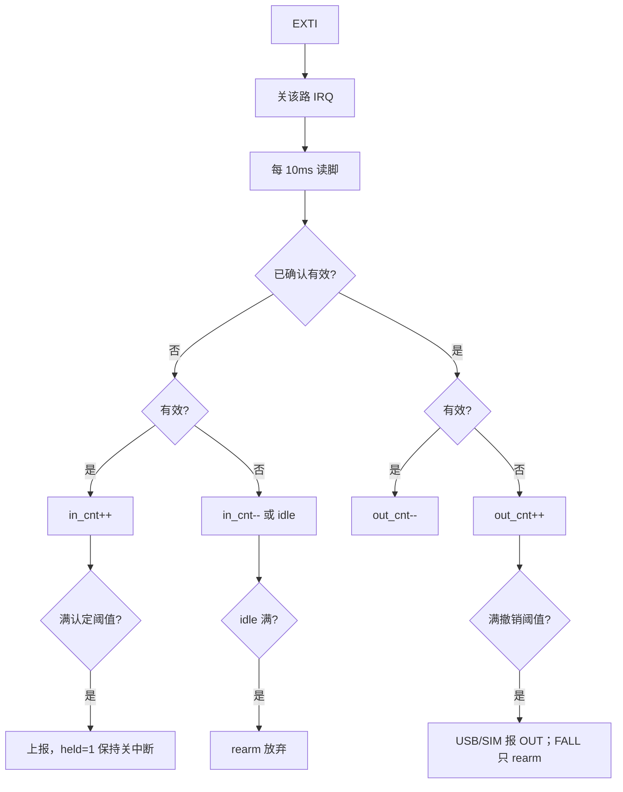
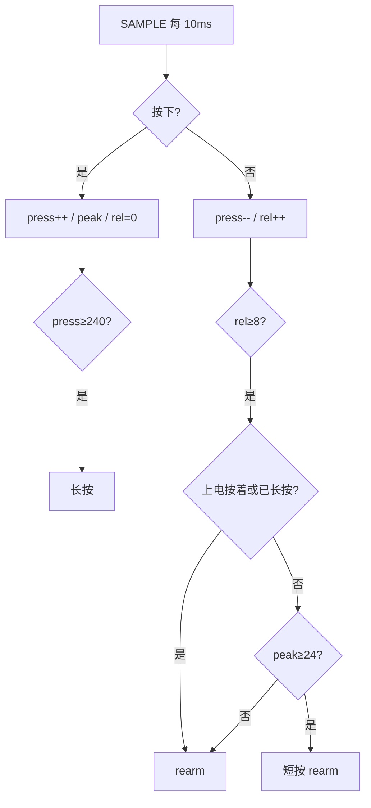

# KEY：四路 IO 执行逻辑（供确认）

> **变更记录（2026-08-26）**  
> 四路：EXTI 只叫醒并关中断，之后 10ms 轮询。USB/SIM/FALL 积分加减；SOS 按下积分、松手 8 拍确认。

| 参数 | 默认 | 说明 |
|------|------|------|
| `KEY_POLL_MS` | **10** | 采样节拍 |
| `USB_IN_CONFIRM_CNT` | **8** | USB 插入积分（≈80ms） |
| `USB_OUT_CONFIRM_CNT` | **24** | USB 拔出积分（≈240ms） |
| `SIM_IN_CONFIRM_CNT` | **16** | 插卡积分 |
| `SIM_OUT_CONFIRM_CNT` | **24** | 拔卡积分 |
| `FALL_ON_CONFIRM_CNT` | **16** | FALL 认定 |
| `FALL_OFF_CONFIRM_CNT` | **24** | FALL 撤销后才 rearm |
| `SOS_SHORT_CNT` | **24** | 短按下限（看 peak） |
| `SOS_LONG_CNT` | **240** | 长按（按下积分满立刻报） |
| `SOS_REL_CNT` | **8** | 确认松开（≈80ms） |

---

## 0. 采集

EXTI 只叫醒、禁 IRQ。滤波在线程里 10ms 读脚。确认有效后 IRQ 保持关。滤波/按着期间 `pm_lock`（USB/SIM 已确认在位不算忙，避免有卡无法 STOP2）。

| 路 | 脚 | EXTI | 有效 |
|--|--|--|--|
| SOS | PA0 | 下降沿 | 低 |
| USB | PA7 | 双沿 | 低=插入 |
| FALL | PB12 | 上升沿 | 高 |
| SIM | PA5 | 双沿 | 低=有卡 |

上电 / STOP2：SOS/FALL 采复位锁存；USB/SIM 无沿，禁 IRQ 后按电平积分。未插入/无卡积满 idle 只 rearm，不上报 OUT。

---

## 1. USB / SIM / FALL（积分）

```text
有效：in_cnt++（已 held 则 out_cnt--）
无效：in_cnt--；已 held 则 out_cnt++
in_cnt ≥ 插入/认定阈值 → 上报 IN / FALL，held=1，IRQ 保持关
out_cnt ≥ 拔出/撤销阈值 → 上报 OUT（FALL 不上报撤销），rearm
未 held 且 in_cnt=0 再连续无效满插入阈值 → 放弃毛刺沿，rearm
```



`usb_present()` / `sim_present()` 跟 **held** 走。

---

## 2. SOS（按下积分，松手另判）

```text
按下：press++（封顶长按），peak 取最大，rel=0
      press≥240 → 立刻长按
松开：press--；rel++（连续无效）
      rel≥8 → 确认松开
        上电按着 / 已长按：不报短按，rearm
        否则 peak≥24 → 短按，rearm
        否则当毛刺，rearm
```

中途抖 1～2 拍：press 只减 1，rel 被下一次按下清零，长按不会从头再来。  
松手不等 press 减到 0，所以短按不会再晚 240ms。

STOP2 叫醒仍按着：`boot_press`，只可能长按，松手不报短按。



---

## 3. 对照

| | SOS | FALL | USB | SIM |
|--|--|--|--|--|
| 滤波 | 按下积分；松手 8 拍 | 积分加减 | 积分加减 | 积分加减 |
| 确认 | 短 peak≥24 / 长 240 | 认定 16 / 撤销 24 | 插入 **8** / 拔出 24 | 插卡 16 / 拔卡 24 |
| rearm | 确认松开 | 确认撤销 | 确认拔出 | 确认拔卡 |
