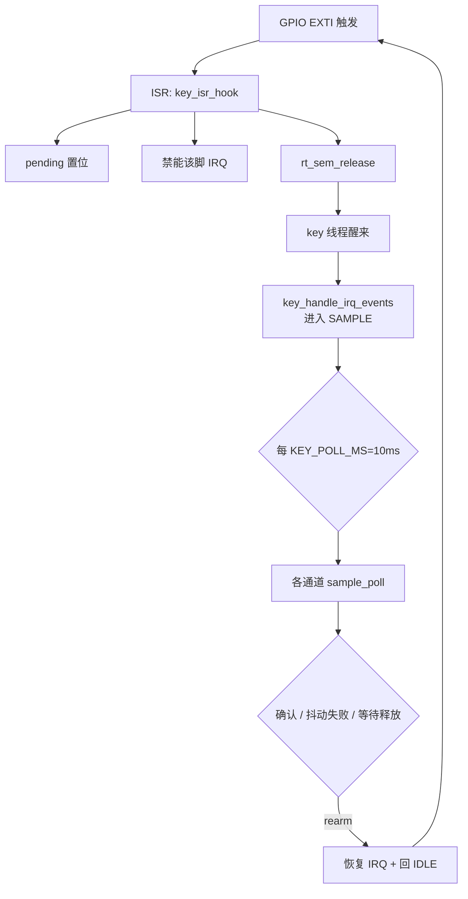
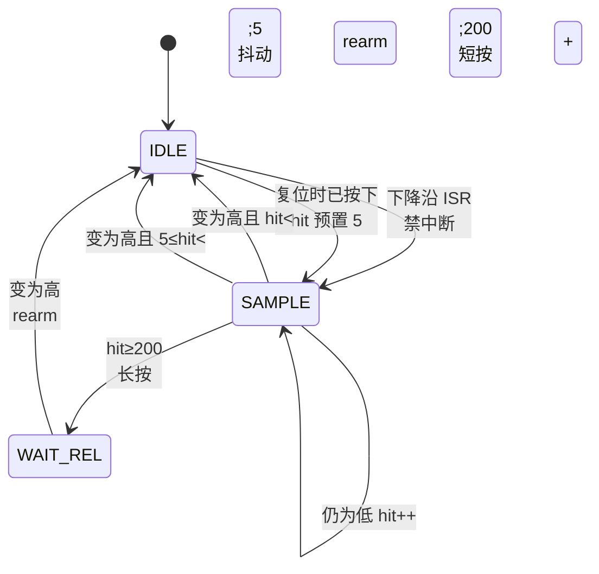
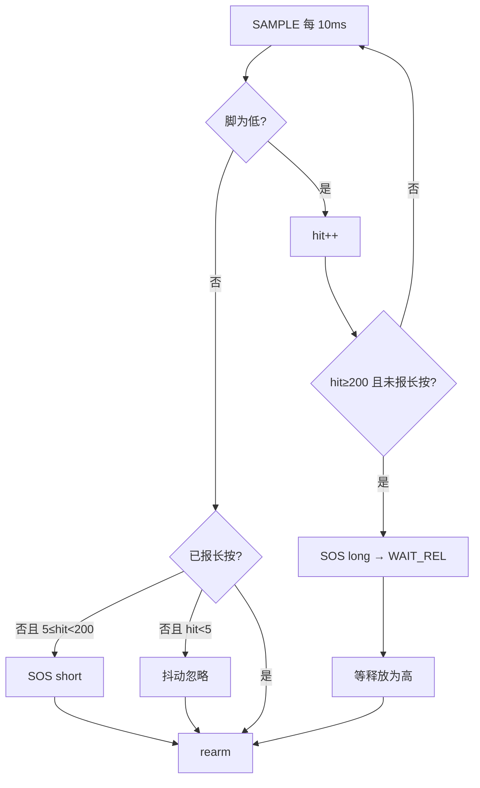
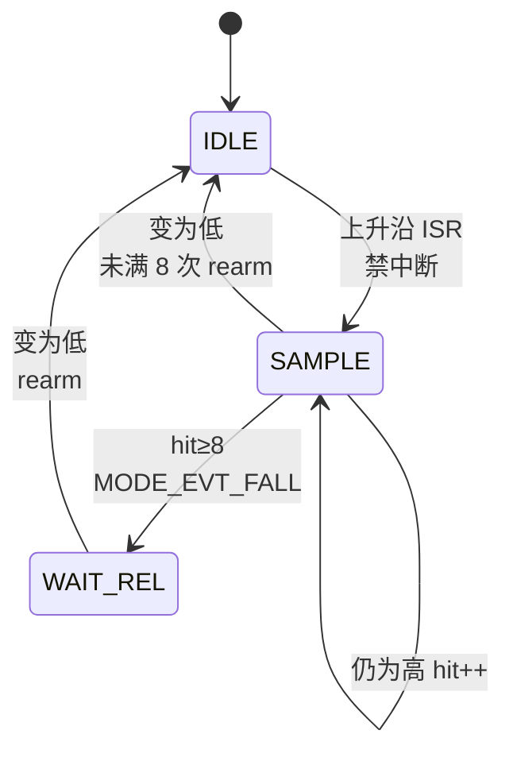
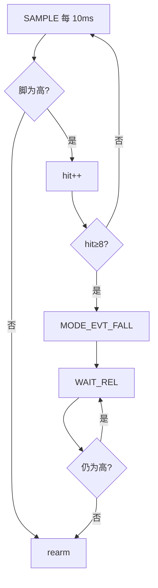
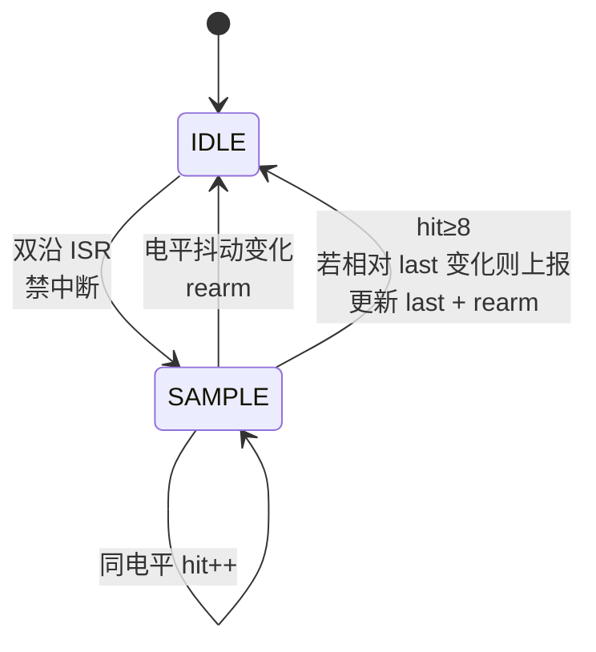
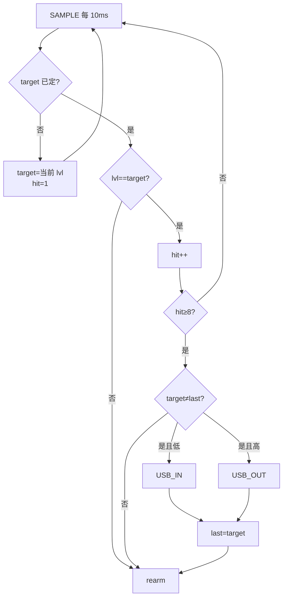
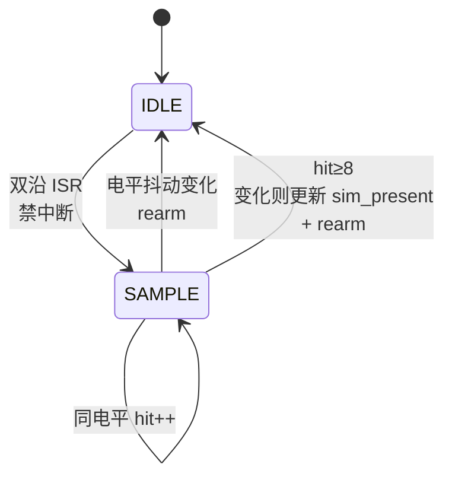
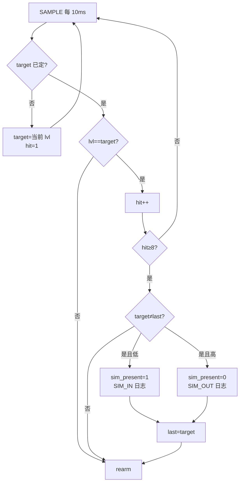

# KEY：四路 IO 执行逻辑（供确认）

> **变更记录（2026-08-21）**  
> - **复位电平接管**：STOP2 唤醒走软件复位，按下那一刻的 EXTI 沿在复位里就没了，只靠沿会**整次按下丢掉**。现在 `board_gpio_early_init()` 在复位最早期锁存 SOS/FALL 电平，`key_init()` 据此把滤波状态机接上。  
> - **长按阈值**：原来 160ms，人手一按就是长按，短按窗口按不出来。改成 **2s**（短按下限 50ms）。  
> - 新增 `key_is_busy()`：MODE 真关机前要查，正在滤波/正按着就先不进 STOP2。  
> - 2026-08-18：滤波/USB 双沿未改。

实现：`key.c` + `board_key_irq.c`。  
共性：**EXTI 触发 → ISR 禁能该脚中断 → 置 pending + 释放信号量 → key 线程进入采样 → 每 10ms 轮询 → 确认/失败后 rearm（恢复中断）**。

| 参数 | 默认 | 说明 |
|------|------|------|
| `KEY_POLL_MS` | **10** | 轮询节拍（ms） |
| `KEY_FILTER_CNT` | **8** | FALL / USB / SIM 连续稳定次数（≈80ms） |
| `SOS_SHORT_CNT` | **5** | SOS 短按下限（≈50ms 消抖） |
| `SOS_LONG_CNT` | **200** | SOS 长按阈值（**≈2s**） |

短按 = 松手时 `hit ∈ [5, 200)`，即**按 50ms～2s 松手**；按满 2s 不松手就是长按。

---

## 0.1 复位时已经按着怎么办（STOP2 唤醒必读）

真关机在 STOP2，唤醒后 `pm_stop2_on_rram()` 直接 `NVIC_SystemReset()`。所以按一次 SOS 的时间线是：

```text
按下 → EXTI 唤醒 → 软件复位 → 重新上电跑 → EXTI 才装好
        ↑ 这个沿在复位里丢了，装好中断后不会再来一次
```

对策（`board_gpio.c` + `key.c`）：

| 步骤 | 在哪 |
|------|------|
| 复位最早期只锁存 PA0 / PB12 **电平** | `board_gpio_early_init()` |
| STOP2 醒：PM 写 BKP；early_init 读走 | `board_boot_from_stop2()` |
| MODE：SOS 唤醒→BATT，FALL 仍有效→ALARM | `mode_init` |
| KEY：脚还低才 SAMPLE，只认长按 | `key_take_boot_level()` |
| MODE 别抢先睡：`key_is_busy()` 为真时不进 STOP2 | `app/mode/mode.c` |

叫醒那一次：MODE 已经进 BATT。KEY 若脚还低，只把长按接到 2s；松手不再报短按（否则会当成第二次短按开机）。

`key_is_busy()` 为真的条件：pending 非空、任一通道在 SAMPLE/WAIT_REL、或 SOS 脚仍为低。

---

## 0. 总框架（四路共用）



**ISR 约束**：只做 pending + 禁中断 + 信号量，不做打印/滤波。

**线程**：`key`；有信号量立刻处理 pending；无事件也按 10ms 超时醒来，继续对已在 SAMPLE/WAIT_REL 的通道采样。

---

## 1. SOS（PA0）

| 项 | 现实现 |
|----|--------|
| 引脚 | `SOS_KEY` PA0，有效=**低** |
| 中断 | **下降沿** |
| 进 SAMPLE | 下降沿 ISR；**或**复位时就按着（`board_boot_sos_down()`，`hit` 预置 5） |
| 滤波 | 连续有效 `hit++`；**中途一次无效则清零并 rearm** |
| 短按 | 松手前 `hit ∈ [5, 200)` → `MODE_EVT_SOS_SHORT` |
| 长按 | `hit ≥ 200`（≈2s）→ `MODE_EVT_SOS_LONG`，再等释放后 rearm |
| 互斥 | 已报长按则本次不再报短按 |





---

## 2. FALL（PB12，水浸）

| 项 | 现实现 |
|----|--------|
| 引脚 | `FALL_KEY` PB12，有效=**高**（`active_low=0`） |
| 中断 | **上升沿** |
| 滤波 | SAMPLE 中连续 **8 次有效高** 才确认；**任一次无效 → 立即 rearm** |
| 确认后 | `MODE_EVT_FALL`，进 `WAIT_REL`，等变为无效（低）再 rearm |





---

## 3. USB_IN（PA7）

| 项 | 现实现 |
|----|--------|
| 引脚 | `USB_IN` PA7 |
| 中断 | **双沿**（升/降） |
| 滤波 | 进入 SAMPLE 后锁定 `target_lvl`，连续 **8 次同电平**；中途电平变 → rearm |
| 上报 | 稳定电平 **≠ last_lvl** 时：低→`MODE_EVT_USB_IN`；高→`MODE_EVT_USB_OUT` |
| 上电 | 读一次初始电平写入 `last_lvl`，避免与 mode 重复报 USB_IN |
| 确认后 | **立刻 rearm**（无 WAIT_REL） |





---

## 4. SIM（PA5，北斗卡检测）

| 项 | 现实现 |
|----|--------|
| 引脚 | `RD_BD_SIMCARD` PA5；**低=有卡，高=无卡** |
| 中断 | **双沿** |
| 滤波 | **与 USB 同一套**：连续 8 次同电平；抖动则 rearm |
| 确认后 | 电平相对 `last_lvl` 变化时：低→`sim_present=1` + 日志；高→`sim_present=0` + 日志 |
| MODE | 插拔确认后投 `MODE_EVT_SIM`（假关机 ON 开/关 10s 灯）；不是工作模式 |
| 会话 | **拍前**无卡：SESSION 不开 LNA/GNSS/RDSS；**拍中拔卡不中断**本拍；定时器照走 |
| 透传 | **不理会有没有卡**，照常上电 |
| 上电 | 读初始电平 → `sim_present` / `last_lvl` |
| 确认后 | **立刻 rearm** |





---

## 5. 四路对照（确认用）

| | SOS | FALL | USB | SIM |
|--|-----|------|-----|-----|
| 脚 | PA0 | PB12 | PA7 | PA5 |
| 中断沿 | 下降 | 上升 | **双沿** | **双沿** |
| 有效电平 | 低 | 高 | 稳定低/高 | 稳定低/高 |
| 滤波次数 | 短≥5 / 长≥200 | ≥8 有效 | ≥8 同电平 | ≥8 同电平 |
| 复位时已有效 | **接管**（`hit`=5） | **接管**（重新采 8 次） | 上电读初值 | 上电读初值 |
| 一次无效 | **清零 rearm** | **清零 rearm** | 相对 target 变则 rearm | 同 USB |
| 确认后 | 长按等释放；短按直接 rearm | 等释放再 rearm | 直接 rearm | 直接 rearm |
| 输出 | MODE 短/长 | MODE_FALL | MODE USB_IN/OUT | 仅 `sim_present`+日志；透传不查卡 |
| 算法族 | 按键时长 | 单沿有效脉冲 | **双沿电平** | **同 USB** |

---

## 6. 文件

| 文件 | 职责 |
|------|------|
| `board_key_irq.*` | 挂 EXTI、沿配置、ISR 调 hook |
| `key.c` | pending、禁中断、10ms 轮询滤波、复位电平接管、事件/日志 |
| `key.h` | 周期/滤波次数、`sim_present()`、`key_is_busy()` |
| `board/board_gpio.*` | 复位最早期锁存 `board_boot_sos_down()` / `board_boot_fall_active()` |

请按上表与流程图确认；有偏差直接改需求，我再改代码。
