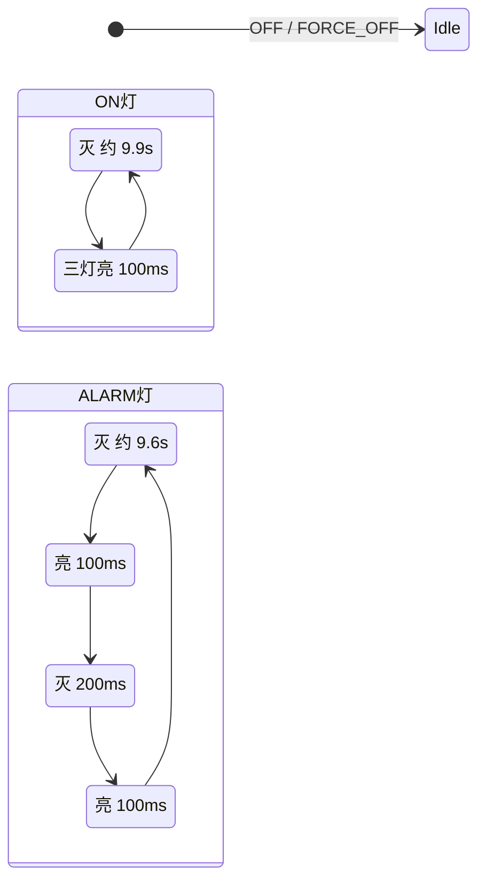

# BSP/led — 电量指示

流程图：[`flow.md`](flow.md)。用法：`{"cmd":"test.led","mode":4,"pct":50}`。

> **变更记录（2026-08-25）**  
> BATT：5 秒从进看电算，流水后最后一档保持到窗口结束；二次 BATT 消息不重播。看电窗口内 MODE 不进 LOW_BATT。  
> ON 有卡从进 ON 起 RTC 10s 闪。假关机打 100ms 脉冲时 `pm_lock`，避免 STOP0 把灯冻在常亮。无卡 ON：5s 内每秒三灯 100ms，再灭灯假关机。`FAKE_OFF←ALARM` 仍 RTC 10s 双闪。  
>
> **变更记录（2026-08-24）**  
> STOP0 只在 `FAKE_OFF`。BATT 看电是 RUN，流水靠 tick。  
> STOP2 前 `led_output_off()` 同步灭灯：灯靠消息，线程来不及处理 OFF 时 GPIO 仍可能亮着入睡。  
> BATT 流水各档仍 300ms；**最后一档保持到 5s 窗口结束**（原先最后一档也只亮 300ms 就灭）。ADC 晚到会改最后一档。  
> 进 `FAKE_OFF←ALARM` 立刻灭灯等 RTC 10s：不能先三灯亮 100ms 再靠 tick 灭，STOP0 会冻在常亮。
>
> **变更记录（2026-08-18）**  
> `FAKE_OFF` 期间等 RTC `LED_MSG_HB` 打一拍灯（STOP0 下 SysTick 会停，不能靠软件空等 9.9s）。动画规则不变。

## 硬件极性

LED1 / LED2 / LED3：**低电平点亮**。软件动画逻辑仍用「1=亮、0=灭」，仅在写 GPIO 时取反。

## 输入（消息队列）

| 消息 | 来源 | API |
|------|------|-----|
| `LED_MSG_PERCENT` | ADC | `led_post_percent()` |
| `LED_MSG_MODE` | MODE | `led_post_mode()` |

MODE 发给 LED 的是 **视图**：`FAKE_OFF←ALARM` 映射为 ALARM；`FAKE_OFF←ON` 有卡映射为 ON、无卡映射为 OFF；`PASSTHRU`+USB 映射为 CHARGE。

## 显示规则

| 视图 | 行为 |
|------|------|
| `OFF` / `FORCE_OFF` | 全灭 |
| `ON` / `LOW_BATT` | 每 **10s** 三灯同亮 **100ms**，其余灭。无卡 ON 提示改为每 **1s** 亮 100ms，共 **5s** |
| `ALARM` | 每 **10s 双闪**：100ms 亮 → **200ms** 灭 → 100ms 亮 |
| `BATT` | 流水 1 轮后 **最后一档保持到进 BATT 起 5s 结束**，到点随 MODE 灭 |
| `CHARGE` | 流水循环；电量 **≥98%** 三灯常亮 |

`FAKE_OFF←ALARM` 走 ALARM 双闪，RTC 10s 投 `LED_MSG_HB`；`led_wait_rtc_hb(1)` 后不再用 tick 空等。`FAKE_OFF←ON` **有卡**同样等 RTC 打 100ms；无卡视图是 OFF，心跳不打灯。

### 流水（档位 30% / 70%）

- &lt;30%：LED1 300ms → **保持 LED1** 直到看电 5s 结束  
- &lt;70%：LED1 300ms → LED1+2 300ms → **保持 LED1+2**  
- ≥70%：LED1 → LED1+2 → 三灯（前两档各 300ms）→ **保持三灯**  

充电流水轮间间隔 300ms。看电最后一档不是 300ms 就灭。
