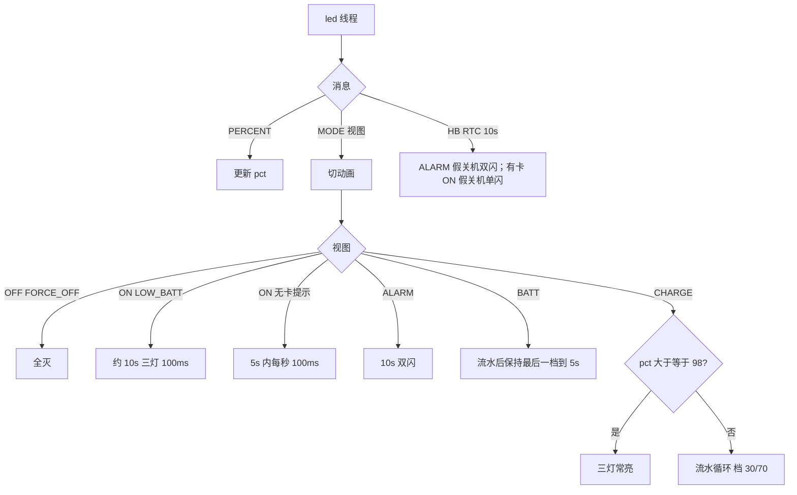

# LED 流程图

极性：低电平点亮。用法：`{"cmd":"test.led","mode":4,"pct":50}`。MODE 推的是**视图**（FAKE_OFF←ALARM→ALARM；FAKE_OFF←ON 有卡→ON / 无卡→OFF；PASSTHRU+USB→CHARGE）。

`FAKE_OFF` 下 SysTick 会停，脉冲靠 `LED_MSG_HB`，不要靠软件空等 9.9s。
