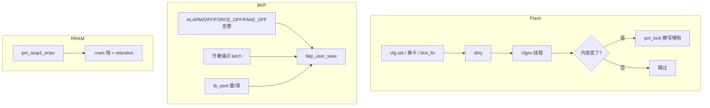
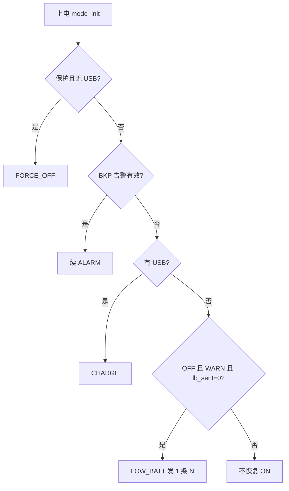

# 三套库流程图

总规则：[`README.md`](README.md)。Flash 只 `cfg` 写；BKP 只 `mode` 写；R-SRAM 现作 STOP2 栈。

```mermaid
flowchart TD
  subgraph Flash
    C1[cfg.set / 换卡 / first_fix] --> C2[dirty]
    C2 --> C3[cfgnv 线程]
    C3 --> C4{内容变了?}
    C4 -->|是| C5[pm_lock 擦写喂狗]
    C4 -->|否| C6[跳过]
  end
  subgraph BKP
    M1[ALARM/OFF/FORCE_OFF/FAKE_OFF告警] --> M2[bkp_user_save]
    M3[节奏锚点 latch] --> M2
    M4[lb_sent 置/清] --> M2
  end
  subgraph RRAM
    S1[pm_stop2_enter] --> S2[.rram 栈 + retention]
  end
```

```mermaid
flowchart TD
  R[上电 mode_init] --> P{保护且无 USB?}
  P -->|是| F[FORCE_OFF]
  P -->|否| A{BKP 告警有效?}
  A -->|是| AL[续 ALARM]
  A -->|否| U{有 USB?}
  U -->|是| CH[CHARGE]
  U -->|否| W{OFF 且 WARN 且 lb_sent=0?}
  W -->|是| N[LOW_BATT 发 1 条 N]
  W -->|否| O[不恢复 ON]
```

2/5/10min 节拍、透传、卡号未变：**不写 Flash/BKP**。
