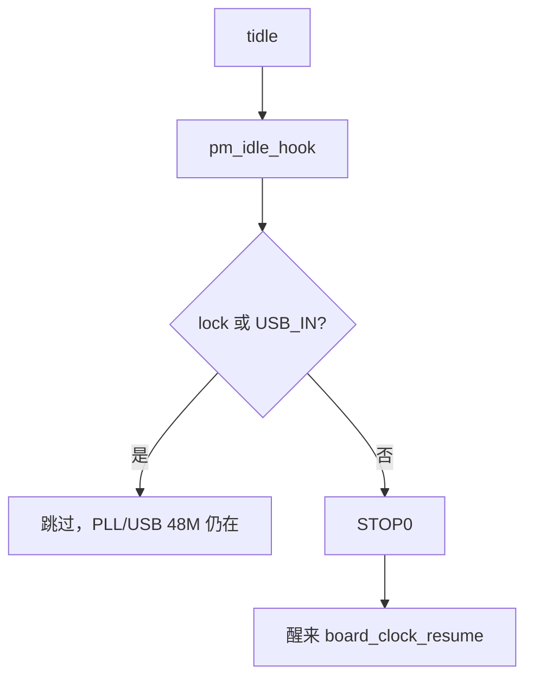
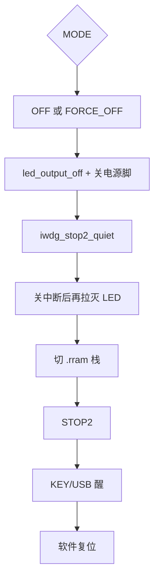

# PM / STOP 流程图

MCU 睡：本目录。射频轨：`BSP/pwr`。细则：[`docs/low_power_stop2.md`](../../docs/low_power_stop2.md)。

用法：`{"cmd":"test.pm"}`；`lock`/`unlock`/`hold_ms`。

已 lock：MODE 非 FAKE_OFF；KEY 滤波；nvflash；会话发信。USB 线：idle 读 `board_usb_inserted()`。
仅 `FAKE_OFF` 放行 STOP0（RTC 10s 闪灯）。OFF/FORCE_OFF 走 STOP2。
