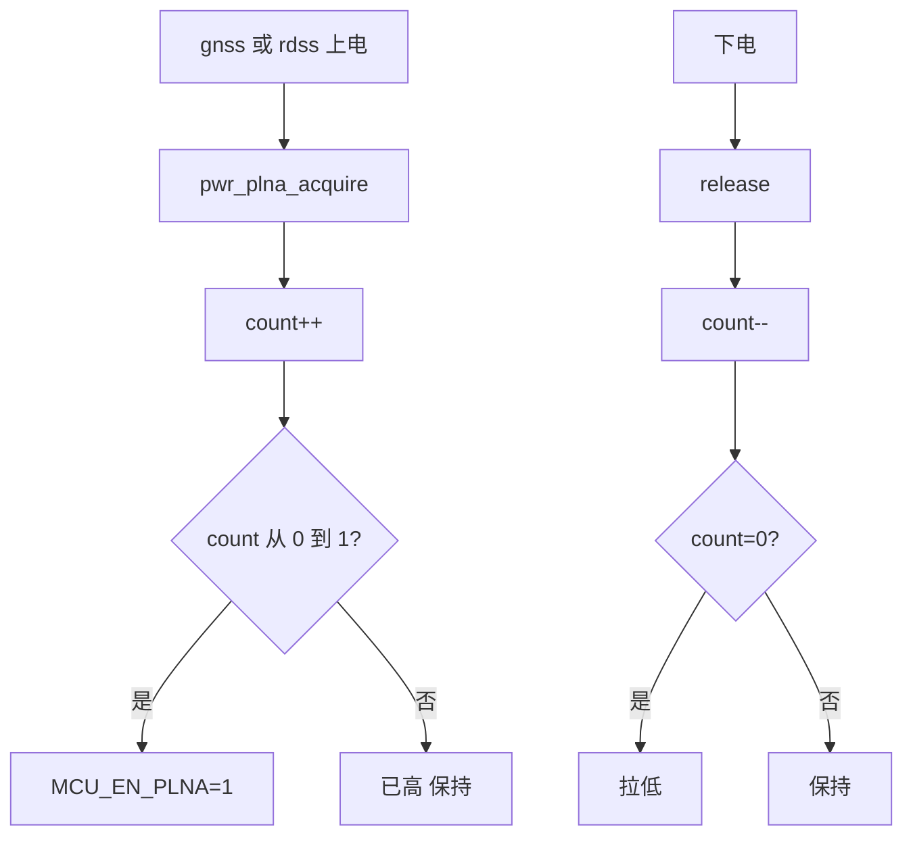

# 共享电源 PLNA 流程图

GNSS 专用 `EN_PGNSS` / `EN_LNA_GNSS` 由 GNSS 自管，不在本计数里。

```mermaid
flowchart TD
  A[gnss 或 rdss 上电] --> B[pwr_plna_acquire]
  B --> C[count++]
  C --> D{count 从 0 到 1?}
  D -->|是| E[MCU_EN_PLNA=1]
  D -->|否| F[已高 保持]
  G[下电] --> H[release]
  H --> I[count--]
  I --> J{count=0?}
  J -->|是| K[拉低]
  J -->|否| L[保持]
```

进 STOP2 前 count 必须为 0。
