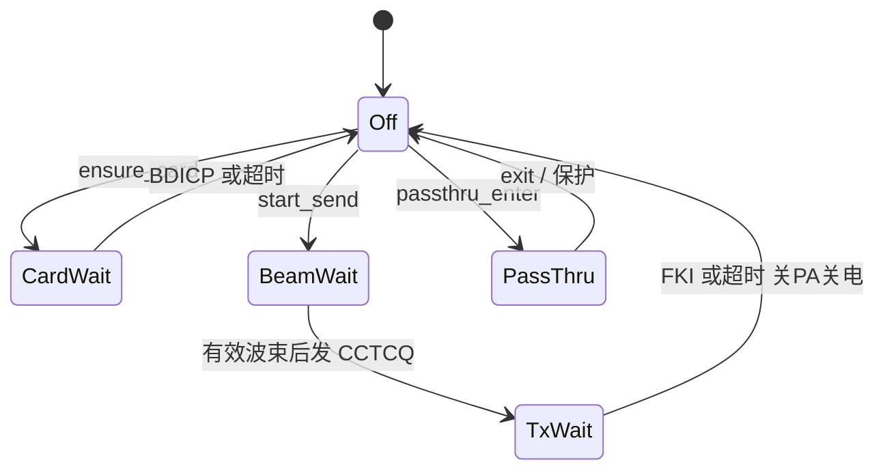
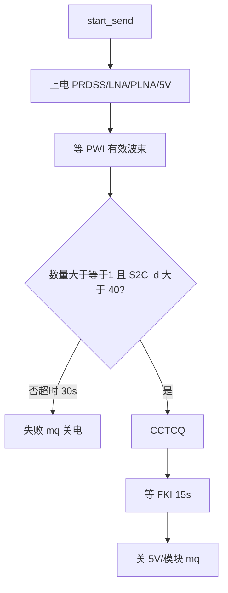

# RDSS 流程图

规则：[`README.md`](README.md)。用法：`test.rdss.card` / `test.rdss.send` / `stream.set` `rdss`。串口助手逐步操作：[`docs/board_bringup.md`](../../docs/board_bringup.md) 第 0.3、8 节。

## 驱动状态



## 发信一拍



透传不查卡。产品 SESSION 拍前无卡则本层不会被叫到。

## 使用

```json
{"id":18,"cmd":"test.rdss.card"}
{"id":19,"cmd":"test.rdss.send"}
{"id":4,"cmd":"stream.set","name":"rdss","enable":1}
{"id":7,"cmd":"stream.set","name":"rdss","enable":0}
```

先 `cfg.get` 看 `bd_card`。**本版** 5V 随 RDSS 上电，不看 `pa_enable`。TD3203B 规格：VCC_PA(5V) 只供发射功放，接收/查卡只需 VCC 3.3V；下一版再试「仅发射窗口开 PA」（见 [`README.md`](README.md) 2026-08-27 备注）。
