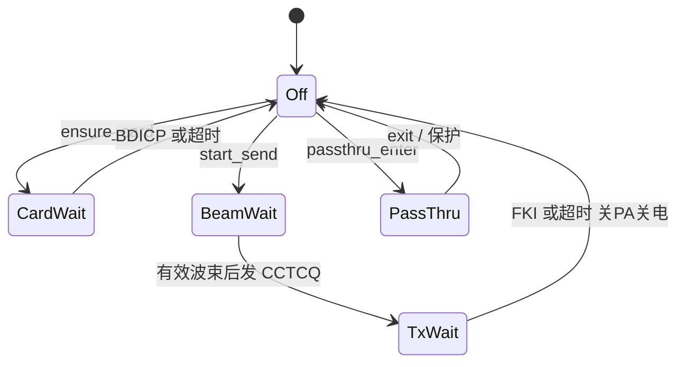
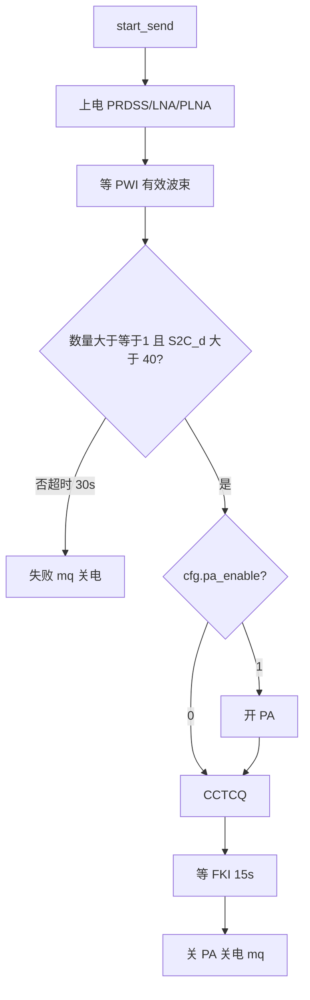

# RDSS 流程图

规则：[`README.md`](README.md)。用法：`test.rdss.card` / `test.rdss.send` / `stream.set` `rdss`。

## 驱动状态



## 发信一拍



透传不查卡。产品 SESSION 拍前无卡则本层不会被叫到。

## 使用

```json
{"id":18,"cmd":"test.rdss.card"}
{"id":19,"cmd":"test.rdss.send"}
{"cmd":"stream.set","name":"rdss","enable":1}
```

先 `cfg.get` 看 `bd_card`。`pa_enable` 默认 0。
