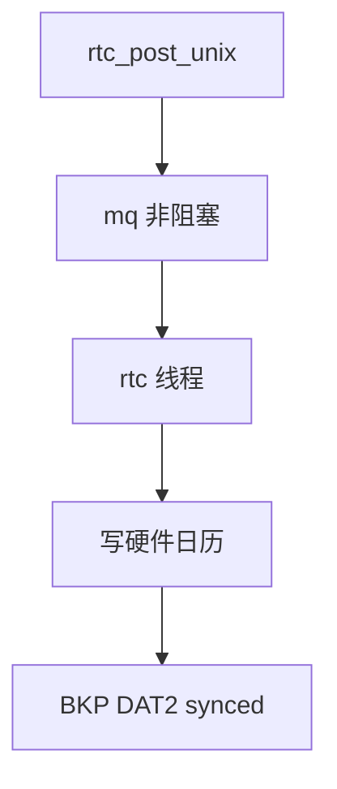
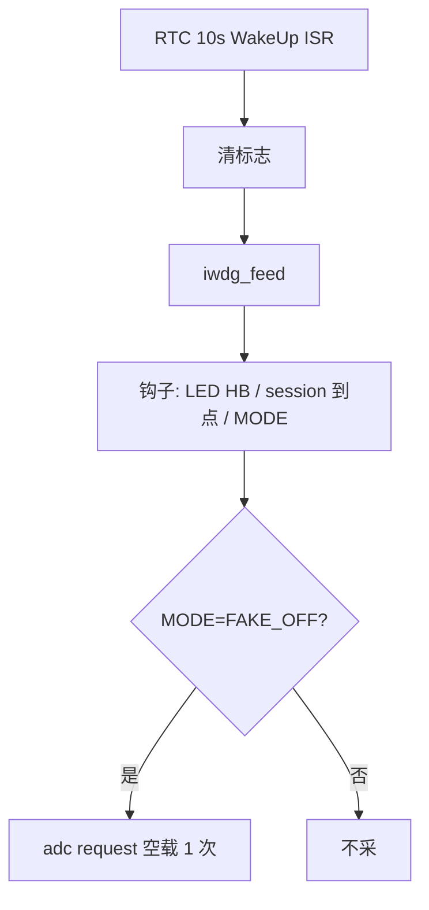

# RTC 流程图

用法：[`README.md`](README.md)。产品只 GNSS 校时。调试：`{"cmd":"test.rtc"}` / 带 `"unix"`。

```mermaid
flowchart TD
  A[rtc_post_unix] --> B[mq 非阻塞]
  B --> C[rtc 线程]
  C --> D[写硬件日历]
  D --> E[BKP DAT2 synced]
```

```mermaid
flowchart TD
  W[RTC 10s WakeUp ISR] --> X[清标志]
  X --> Y[iwdg_feed]
  Y --> Z[钩子: LED HB / session 到点 / MODE]
  Z --> M{MODE=FAKE_OFF?}
  M -->|是| N[adc request 空载 1 次]
  M -->|否| O[不采]
```

读：`rtc_get_unix()` 未 synced 返回 **0**。短报文时间戳不读 RTC。
