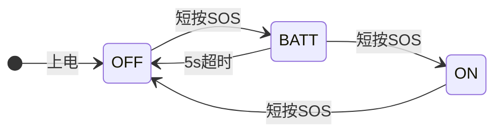
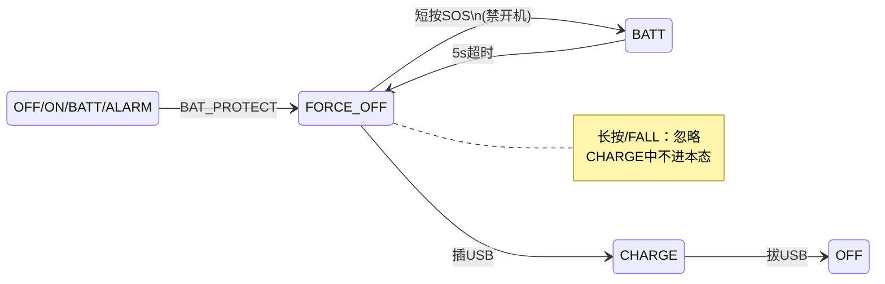
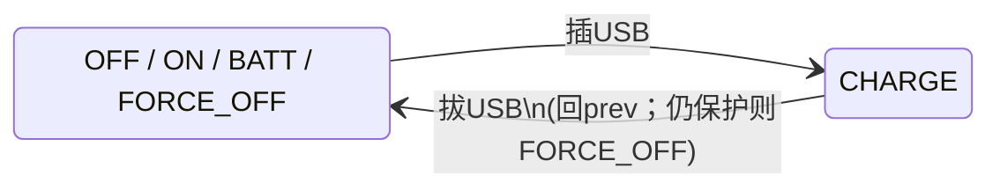
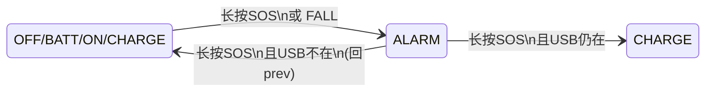

# 整机模式状态机（定稿）

产品规则已全部确认，实现以本文为准。

## 已确认决策

| # | 结论 |
|---|------|
| 1 | **开关机短按环**：`OFF` → `BATT` → `ON` → `OFF`（每步短按 SOS） |
| 2 | **任意状态**长按 SOS，或检测到 FALL → 进入 `ALARM`（`FORCE_OFF`/保护中除外） |
| 3 | 退出 `ALARM` 时若 USB 仍在位 → 自动进 `CHARGE` |
| 4 | 优先级：**告警 > 强制关机约束 > 充电 > 其他**；`prev` **只记一层** |
| 5 | **充电优先于电量 5s 窗口**：`BATT` 期间 `USB_IN` → `CHARGE` |
| 6 | USB 脚 **双沿中断** + 滤波后按电平报 `USB_IN` / `USB_OUT` |
| 7 | **充电态短按 SOS：忽略** |
| 8 | **告警中重复 FALL：保持告警，不刷新 GNSS/RDSS 会话** |
| 9 | ALARM 定位/报文节奏：**0～24h / 2min**，**24～48h / 5min**，满 **48h → ON**；ON 每 **10min**（见 `BSP/gnss/README.md`） |
| 10 | 保护/`FORCE_OFF`：禁透传与告警（门限 `ADC_BAT_PROTECT_ENTER_PCT`）；仍可 `BATT` 看电 |
| 11 | **`FORCE_OFF`**：`Vbat` 进保护 → 强制关机；**仅 USB→`CHARGE` 解除**；可短按进 `BATT` 看电，**禁止开机** |
| 12 | **透传** `MODE_ST_PASSTHRU` + `MODE_PT_GNSS`/`RDSS` 掩码：CLI `stream.set` 进出；仅 **ON/CHARGE** 可进；**OFF 不可**；SOS/FALL 须先退出；保护关电退出；插 USB **保持透传**，LED 仅显示充电视图 |
| 13 | **`LOW_BATT`**：ADC 进入预警（&lt;12%）且当前为 **ON** → 发 **1 条** 常态短报文 → 回 **ON**；ALARM/CHARGE 等忽略预警边沿 |

补充（开关机与电量）：

| 场景 | 行为 |
|------|------|
| `OFF` + 短按 SOS | → `BATT`（prev=`OFF`）；显示电量 **5s** |
| `BATT` + 短按 SOS | → `ON`（确认开机；保护/`FORCE_OFF` 下禁止） |
| `BATT` + 5s 超时 | → `prev`（`OFF` 或 `FORCE_OFF`） |
| `ON` + 短按 SOS | → `OFF`（直接关机，不再经 `BATT`） |
| 保护边沿 | → `FORCE_OFF`（`CHARGE` 中保持充电） |
| `FORCE_OFF` + USB | → `CHARGE`（prev=`OFF`） |

---

## 状态

| 状态 | 含义 |
|------|------|
| `OFF` | 关机（上电默认） |
| `BATT` | 显示电量（窗口 **5s**） |
| `ON` | 开机 |
| `ALARM` | 告警（进入时启动 GNSS/RDSS 会话；退出时停止） |
| `CHARGE` | 充电 |
| `FORCE_OFF` | 低压强制关机（ADC 保护）；仅充电解除 |
| `PASSTHRU` | 调试透传（`MODE_PT_GNSS` / `MODE_PT_RDSS` 可组合） |
| `LOW_BATT` | 低电预警：只发 1 条短报文后回 ON |
| `SLEEP` | 假关机（**预留空，未实施**） |

### 透传与 LED 耦合

| 层 | 行为 |
|----|------|
| MODE FSM | 插/拔 USB **不离开** `PASSTHRU`；`s_pt_resume` 记住进入前的 ON/CHARGE |
| LED | `PASSTHRU` + USB → 显示 **CHARGE** 动画；无 USB → 全灭（视图映射，非改状态） |
| 驱动 | 仅由 MODE 调 `gnss/rdss_passthru_*` / 关电 |

### 一层 `prev`

| 动作 | `prev` 写法 |
|------|-------------|
| 进入 `BATT` | `prev` = `OFF` 或 `FORCE_OFF`，供 5s 超时返回 |
| 进入 `ALARM` | `prev` = 当前态；**已在 `ALARM` 则不改**（含重复 FALL） |
| 进入 `CHARGE` | 仅非 `ALARM`；`prev` = 底层态。从 `FORCE_OFF`/`BATT←FORCE_OFF` 进充电时写 **`OFF`** |
| 退出 `ALARM` | USB 在位 → `CHARGE`；否则 → 原 `prev`；若仍保护 → `FORCE_OFF` |
| 退出 `CHARGE`（`USB_OUT`） | → `prev`；若仍保护 → `FORCE_OFF` |

---

## 优先级

```text
ALARM(应急)  >  FORCE_OFF约束  >  CHARGE  >  BATT / ON / OFF
```

- `ALARM` 中：`USB_IN` / `USB_OUT` / `FALL` / `SOS_SHORT` 均不改变状态；`FALL` **不**重启会话  
- 非告警：`USB_IN` → `CHARGE`（可打断 `BATT` / 解除 `FORCE_OFF`）  
- `CHARGE` 中：`SOS_SHORT` **忽略**；保护事件**不**切 `FORCE_OFF`  
- `FORCE_OFF`：禁 `ALARM` / 禁开机；可 `BATT` 看电；USB→`CHARGE`

---

## 输入事件

| 事件 | 来源 |
|------|------|
| `SOS_SHORT` | SOS 短按 |
| `SOS_LONG` | SOS 长按 |
| `FALL` | FALL 确认（告警中重复到达则忽略副作用） |
| `USB_IN` / `USB_OUT` | USB 双沿 + 滤波后按电平区分 |
| `BATT_TO` | 电量窗 5s 超时（MODE 定时） |
| `BAT_PROTECT` | ADC 进入保护（`ADC_BAT_PROTECT_ENTER_PCT`） |

KEY / ADC → MODE：`rt_event`。

### USB 双沿

1. `BOARD_USB_IN_IRQ_MODE = PIN_IRQ_MODE_RISING_FALLING`  
2. ISR：关中断 → 唤醒 KEY 任务 → 浮空输入连续滤波  
3. 确认后读电平 → `USB_IN` 或 `USB_OUT` → rearm 双沿  
4. 上电：读一次电平，已插入则直接 `CHARGE`（prev=`OFF`）

---

## 状态图

拆成多张，避免交叉线。公共规则：

- **非 FORCE_OFF / 非保护**：长按 SOS 或 FALL → `ALARM`
- **优先级**：应急告警 > 强制关机约束 > 充电 > 其他
- `CHARGE` / `ALARM` 下短按 SOS：**忽略**
- `ALARM` 中重复 FALL / USB 插拔：**保持告警，不刷新会话**

### 1）开关机与电量



### 2）强制关机（低压保护）



### 3）充电



### 4）告警（最高优先级，保护中禁止进入）



完整条件与动作见下方转移表。

---


## 转移表

| 当前 | 事件 | 下一态 | 动作 |
|------|------|--------|------|
| `OFF` | `SOS_SHORT` | `BATT` | prev=`OFF`；开 5s |
| `OFF` | `SOS_LONG` / `FALL` | `ALARM` | 非保护；启会话 |
| `OFF` | `USB_IN` | `CHARGE` | prev=`OFF` |
| `OFF` | `BAT_PROTECT` | `FORCE_OFF` | — |
| `BATT` | `SOS_SHORT` | `ON` / 保持 | 保护或 prev=`FORCE_OFF` 则**禁止开机** |
| `BATT` | `BATT_TO` | `prev` | 回 `OFF`/`FORCE_OFF` |
| `BATT` | `SOS_LONG` / `FALL` | `ALARM` | 非保护 |
| `BATT` | `USB_IN` | `CHARGE` | prev=底层；FORCE_OFF→写 OFF |
| `BATT` | `BAT_PROTECT` | `FORCE_OFF` | 关 5s |
| `ON` | `SOS_SHORT` | `OFF` | 若仍保护→再进 `FORCE_OFF` |
| `ON` | `SOS_LONG` / `FALL` | `ALARM` | 非保护 |
| `ON` | `USB_IN` | `CHARGE` | prev=`ON` |
| `ON` | `BAT_PROTECT` | `FORCE_OFF` | — |
| `FORCE_OFF` | `SOS_SHORT` | `BATT` | prev=`FORCE_OFF`；开 5s |
| `FORCE_OFF` | `SOS_LONG` / `FALL` | `FORCE_OFF` | **忽略** |
| `FORCE_OFF` | `USB_IN` | `CHARGE` | prev=`OFF`（解除强制关机） |
| `CHARGE` | `USB_OUT` | `prev` | 若仍保护→`FORCE_OFF` |
| `CHARGE` | `SOS_LONG` / `FALL` | `ALARM` | 非保护 |
| `CHARGE` | `SOS_SHORT` | `CHARGE` | **忽略** |
| `CHARGE` | `BAT_PROTECT` | `CHARGE` | **保持充电** |
| `ALARM` | `SOS_LONG` + USB 在 | `CHARGE` | 停会话 |
| `ALARM` | `SOS_LONG` + USB 不在 | `prev` | 停会话；仍保护→`FORCE_OFF` |
| `ALARM` | `FALL` | `ALARM` | 忽略，不刷新会话 |
| `ALARM` | `USB_IN` / `USB_OUT` | `ALARM` | 保持 |
| `ALARM` | `SOS_SHORT` | `ALARM` | 忽略 |
| `ALARM` | `BAT_PROTECT` | `FORCE_OFF` | **停会话** |
| `ON` | `BAT_WARN` | `LOW_BATT` | 停 ON 会话；发 1 条后 `LOW_BATT_DONE` |
| `LOW_BATT` | `LOW_BATT_DONE` | `ON` | 再启 10min 会话；若 USB→`CHARGE` |
| `LOW_BATT` | `SOS_SHORT` | `OFF` | 同 ON |
| `LOW_BATT` | `SOS_LONG` / `FALL` | `ALARM` | 同 ON |
| `LOW_BATT` | `USB_IN` | `CHARGE` | prev=`ON` |
| `LOW_BATT` | `BAT_PROTECT` | `FORCE_OFF` | 停会话 |

---

## 场景举例

```text
关机 → 看电量 → 再短按开机 → 再短按关机：
  OFF --SOS_SHORT--> BATT --SOS_SHORT--> ON --SOS_SHORT--> OFF

电量窗超时未确认 → 仍关机：
  OFF --SOS_SHORT--> BATT --BATT_TO--> OFF

电量窗插 USB（充电优先）：
  OFF --> BATT --USB_IN--> CHARGE(prev=OFF) --USB_OUT--> OFF

任意态进告警 / 告警中 FALL 不刷新：
  ON --FALL--> ALARM --FALL--> ALARM（无新会话）
  OFF --SOS_LONG--> ALARM --SOS_LONG--> OFF

告警优先于充电，退出后 USB 仍在则进充电：
  ON --> ALARM --USB_IN--> ALARM
       --SOS_LONG--> CHARGE(prev=ON) --USB_OUT--> ON

充电短按忽略：
  CHARGE --SOS_SHORT--> CHARGE
```

---

## 架构与文件

```text
BSP/key     滤波、USB 双沿、上报事件（不切模式）
app/mode    MODE 任务 + 状态机（mode.c / mode.h）
app/session 告警会话：GNSS/RDSS 启停（ALARM 进入/退出时由 mode 调用）
```

| 项 | 做法 |
|----|------|
| IPC | `rt_event` 或消息队列 |
| 任务 | KEY 与 MODE 分离 |
| USB | 双沿 + 滤波；上电采样一次 |

文档：

- 本文件 `app/mode/fsm.md` — 状态机定稿  
- `app/mode/README.md` — 目录说明  
- `docs/roadmap_power_msg.md` — 电源/报文规划  
- **`docs/low_power_stop2.md`** — STOP2 + 假关机（**仅方案，未实施**）

---

## 规划：假关机 `SLEEP`（预留空，不实施）

> 详见 [`docs/low_power_stop2.md`](../../docs/low_power_stop2.md)。**当前不增加转移、不写代码**；`mode.h` 仅注释预留。浅睡用 IDLE STOP0（`BSP/pm`）。
