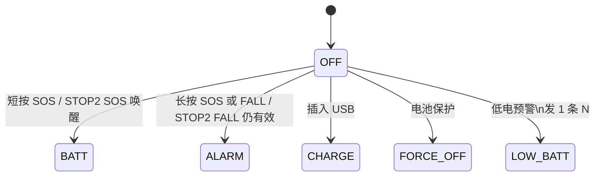
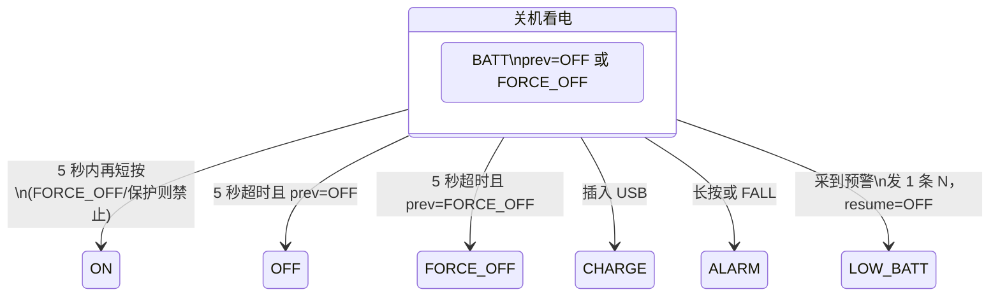
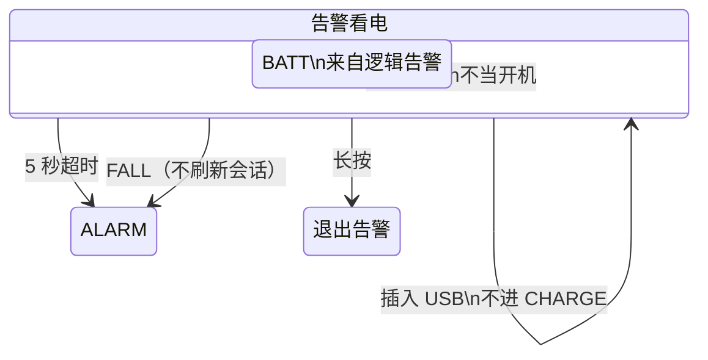
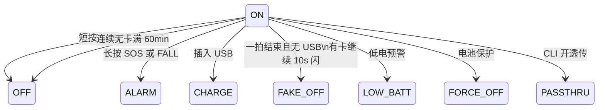
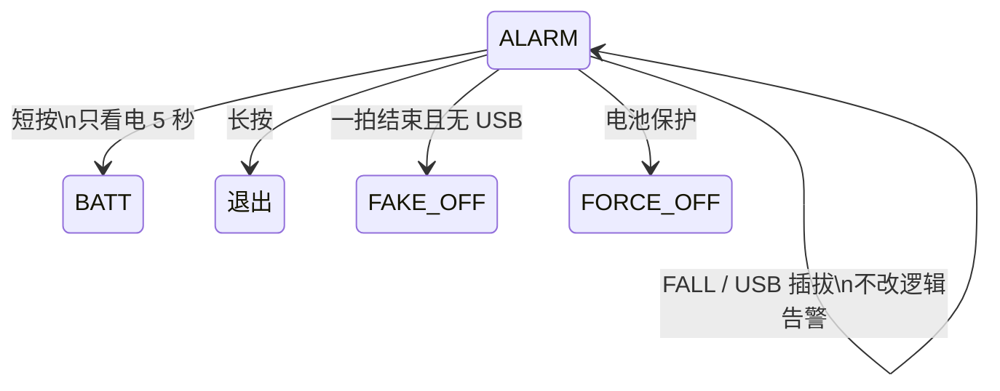
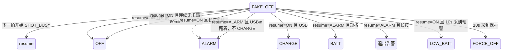
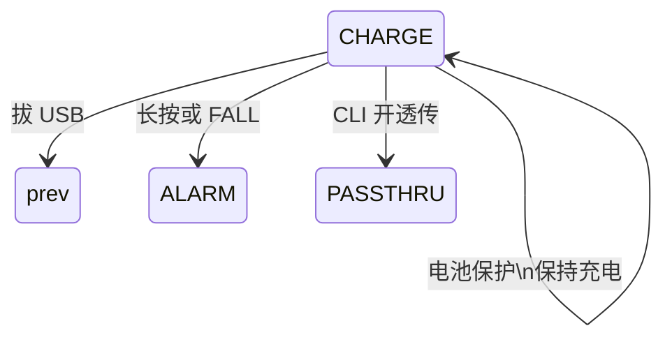
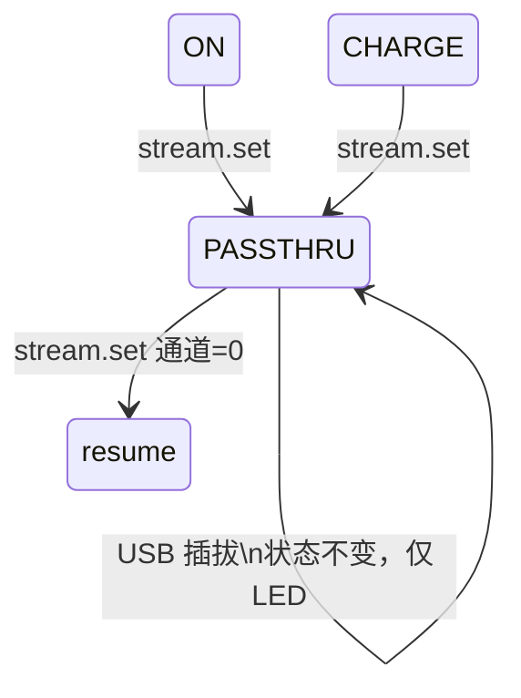
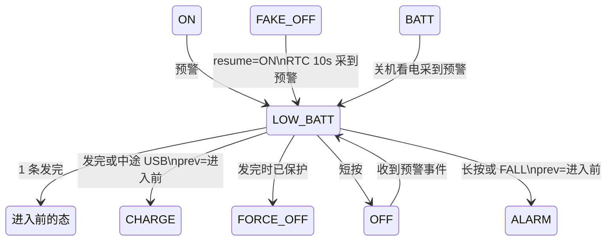
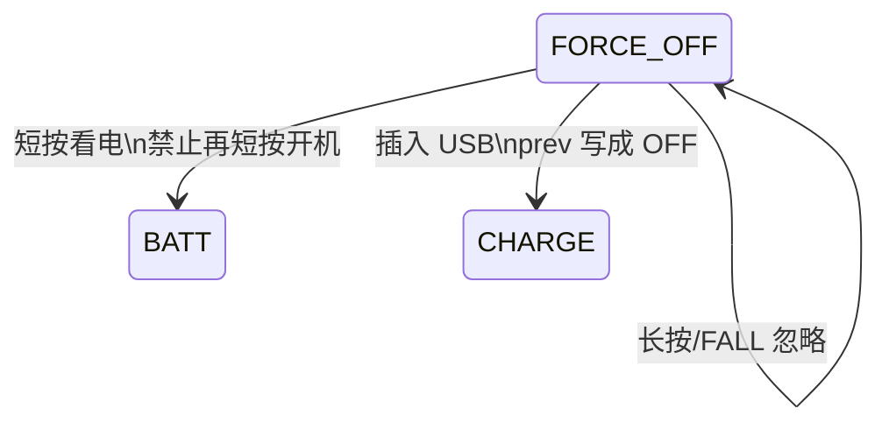

# 整机模式状态机（按「一个状态一张图」）

> **变更记录（2026-08-25）**  
> - 看电 BATT：5 秒从进入算，整段禁止 STOP0/STOP2，流水后最后一档保持到窗口结束。看电窗口内不进 `LOW_BATT`（超时回 OFF 再补）。  
> ON 有卡：进 ON 即开 RTC 10s 闪（搜星/假关机同一条节拍，不重开计数）。**无卡**先 5s 每秒 100ms，再到 `FAKE_OFF` 灭灯。`FAKE_OFF←ALARM` 仍 10s 双闪。  
> - ON / `FAKE_OFF←ON` 连续无卡满 60 分钟 → 真 `OFF`（编译期 `MODE_ON_NOSIM_OFF_MIN`，不进 JSON）。ALARM 无卡不自动关机。  
>
> **变更记录（2026-08-24）**  
> - 满 72h **不**自动切 ON：仍停 ALARM，灯双闪，报文 A，10min。ON 只从人开机等独立通道进入。  
> - 复位：BKP 告警有效即续 ALARM，不再因满 72h 清成 OFF。  
> - STOP0 **只在 `FAKE_OFF` 放行**（逻辑仍是 ON/ALARM，等 RTC 10s）。物理 ON/ALARM 发信、看电、充电不浅睡。STOP2 SOS 唤醒立刻进 BATT。  
>
> **变更记录（2026-08-18）**  
> - RTC 10s：`FAKE_OFF` 浅醒闪灯，并空载采 ADC 1 次（不开 CHARGE 的 15s 周期）；`OFF`/`FORCE_OFF` 不采。  
> - `LOW_BATT`：ON / `FAKE_OFF←ON` / OFF / 关机看电可进，发 1 条 N；**告警不插 N**。  
> - 冷启动 OFF 且已 WARN：发 1 条；BKP `lb_sent` 防止 STOP2 软件复位后重复发；电量回到 OK（≥17%）清标志。  
> - 72h 满且 USB 在位：仍进 CHARGE（prev=ON）。透传优先于充电外观。  
> - 真关机 STOP2、硬件 IWDG（非 OFF/FORCE_OFF 开，超时≈26s）已接代码；板级电流需实机确认。

预览 Mermaid：VS Code / Cursor 装 **Markdown Preview Mermaid Support**，本文件 `Ctrl+Shift+V`。

**怎么读：** 不要把所有箭头画在一张图里。下面每个状态只回答两件事：

1. **怎么进来**
2. **这个状态收到每个事件去哪**（没写的事件 = 忽略）

`BATT_TO` **不是状态**，是「看电 5 秒到了」这条**事件**。

---

## 0. 名词

| 名字 | 是什么 |
|------|--------|
| 物理态 | `mode_state_get()` 的枚举 |
| 逻辑告警 | 物理 `ALARM`，或 `FAKE_OFF` 且 resume=ALARM，或告警短按叠上的 `BATT` |
| `BATT_TO` | 事件：看电窗口 5 秒超时（`MODE_EVT_BATT_TO`） |
| `FAKE_OFF` | 假关机：逻辑仍是 ON 或 ALARM。有卡 ON 假关机 10s 单闪；无卡灭灯；ALARM 假关机 10s 双闪 |
| `OFF` / `FORCE_OFF` | 真关机：灯灭，进 STOP2，IWDG 不咬醒 |

优先级：**透传 > 逻辑告警 > 充电外观 > 其它**。透传时插 USB **不改** `PASSTHRU`，只改 LED 看起来像 CHARGE。

---

## 1. OFF（真关机）

**进来：** 上电默认；ON/FAKE_OFF←ON/LOW_BATT 短按；退出告警且 prev=OFF；CHARGE 拔 USB 且 prev=OFF；LOW_BATT 发完且进入前是 OFF。

STOP2 真关机醒后软件复位：USB → CHARGE；FALL 脚仍有效 → ALARM（保护/FORCE_OFF 除外）；其余 SOS 唤醒（含已松开的短按）→ 立刻 BATT。叫醒那一次按键不算第二次短按。



本态无周期采电、无 RTC 10s。灯灭。人/USB 之外不处理。  
预警从哪来：上电空载 1 次、关机看电 `BATT` 的 `request()`、看电超时回到 OFF 时已是 WARN。  
冷启动 OFF 且已 WARN：**发 1 条 N**。已发标志写 BKP（`lb_sent`）；STOP2 软件复位后仍 WARN **不再发**。电量回到 OK（≥17%）清标志，下一轮 WARN 再发。真掉电 BKP 丢失，下次上电当新的一轮。  
发完 1 条 N → 回 OFF → 再 **STOP2**。

---

## 2. BATT（只是看电 5 秒，不是常驻态）

**进来：** 仅从 OFF / FORCE_OFF 短按，或逻辑告警短按叠上看电。

两种来源规则不同：





**`BATT_TO` = 上图里的「5 秒超时」。** 不是第三种 BATT。

看电整段 **5 秒从进 BATT 算**（含流水）：禁止 STOP0 / STOP2，灯不能灭。流水到最后一档后保持到 5 秒到点，再灭、再回 `OFF`/`FORCE_OFF` 才允许 STOP2。窗口内采到预警 **不打断看电**，超时回 OFF 后再补 `LOW_BATT`。KEY 在 `FAKE_OFF` 里按下时另加一层 lock，长按才能计时。

---

## 3. ON（人确认开过机的常态）

### 3.1 有哪几条路能进 ON？

| # | 路径 | 说明 |
|---|------|------|
| 1 | `BATT`（关机看电）5 秒内再短按 | 主路径 |
| 2 | 告警中长按退出，且进入告警前 prev=ON | 人主动结束告警 |
| 3 | `CHARGE` 拔 USB，且 prev=ON | |
| 4 | `LOW_BATT` 发完 1 条，且进入前是 ON | |
| 5 | `PASSTHRU` 退出且 resume=ON | |
| 6 | `FAKE_OFF` + `SHOT_BUSY`，resume=ON | 只为跑一拍，跑完再假关机 |
| — | **复位 / 看门狗** | **不恢复 ON** |
| — | **告警满 72h** | **不进 ON**；仍停 ALARM |

### 3.2 ON 收到事件



ON / `FAKE_OFF←ON` **必须**能进 `FORCE_OFF`（会话开 GNSS 前采样，或假关机 RTC 10s 空载采到保护边沿）。

---

## 4. ALARM（逻辑告警，含假关机 resume=ALARM）

**进来：** 非保护、非透传时，长按或 FALL（CHARGE 也可以）。已在逻辑告警则不再新开会话。



退出：USB 在 → CHARGE，否则 → prev。不进冷却，可立刻再告警。

满 72h **不**切 ON、**不**进 CHARGE；灯仍双闪，报文仍 A。

告警**不**进 LOW_BATT（已经在发 A，不打断告警）。

---

## 5. FAKE_OFF（假关机）

**进来：** ON 或 ALARM 一拍结束（成功/失败/无卡都算）、无 USB。有卡 ON：不灭灯，RTC 10s 单闪（STOP0 不能靠 tick）。**无卡 ON：** 先 5 秒每秒三灯 100ms，再灭灯进假关机。ALARM 假关机仍 10s 双闪。ON / `FAKE_OFF←ON` 连续无卡满 **60 分钟** → 真 `OFF` + STOP2。



灯：`FAKE_OFF←ON` **有卡** 10s 三灯 100ms（RTC `LED_MSG_HB`）；**无卡**保持灭。`FAKE_OFF←ALARM` **10s 双闪**（先进假关机立刻灭灯，由 RTC 叫醒闪；STOP0 会停 SysTick，不能先亮再等 tick）。同一拍空载采 ADC 1 次（不改 CHARGE 的 15s 周期）。插卡/拔卡在假关机 ON 下会立刻开/关这套灯。

禁止：CHARGE / BATT / PASSTHRU / 有 USB。

---

## 6. CHARGE

**进来：** 非告警、非透传时插入 USB（含 OFF/ON/BATT关机看电/FORCE_OFF/LOW_BATT/FAKE_OFF←ON）。



告警中插 USB **不会**进 CHARGE。

---

## 7. PASSTHRU（优先于充电）

透传是**真实状态**，充电只是 LED 外观。没有「CHARGE 和 PASSTHRU 抢一个枚举」的冲突。



| | 状态机 | LED |
|--|--------|-----|
| 透传 + USB | 仍 `PASSTHRU` | CHARGE 流水 |
| 透传无 USB | 仍 `PASSTHRU` | 全灭 |

SOS/FALL 须先退出透传。OFF/ALARM/保护不能开透传。

进 `PASSTHRU`：**先**静音 CDC ulog，**再**开模块 UART。退出路径一律恢复日志：

| 退出 | 谁做 |
|------|------|
| `stream.set` 通道全关 / 申请 flags=0 | `exit_passthru()` |
| 已在透传但所有通道 `enter` 失败落到 0 | `exit_passthru()` |
| 首次进入时全部通道失败 | 回退原状态并解除 hold |
| 电池保护 `enter_force_off` | 停射频并解除 hold（有 USB 则去 CHARGE） |
| USB 插拔 | **不退出**，继续静音 |

---

## 8. LOW_BATT（叠在别的态上，发 1 条 N）

**可以进：** 无 USB，且当前是 ON / `FAKE_OFF←ON` / OFF / 关机看电 `BATT`（prev≠FORCE_OFF）。

**不能进：** 插着 USB（CHARGE / 透传带电）；**逻辑告警**（已在发 A，不打断告警）；`FORCE_OFF`；保护。

发完回到 **进入前的态**（OFF 则再 STOP2；ON 则继续 10min 会话）。同一轮 WARN 只发 **1 条**（BKP `lb_sent`）；回到 OK 后下一轮再发。



---

## 9. FORCE_OFF（低压强制关机）

**进来：** 保护边沿，且当前不是 CHARGE（充电中保持充电）。**ON / FAKE_OFF / ALARM 都要进。**



灯灭。STOP2。告警窗作废。

---

## 10. 告警节奏报文（session，不是 MODE 枚举）

未校时锚点=0，一直 2min，不切 5min/10min。校时后按墙钟 Unix。满 72h 不切 MODE。

| 时段 | 周期 | 报文 | MODE |
|------|------|------|------|
| 进告警立刻 | 1 拍 | A | ALARM |
| 0～24h | 2min | A | ALARM |
| 24～48h | 5min | A | ALARM |
| 48h 起（含 ≥72h） | 10min | A | ALARM |
| 进 ON（独立通道） | 立刻 1 拍 + 每 10min | N | **ON** |

---

## 11. RTC 10s / IWDG / STOP2（耦合）

```text
RTC 只报时
  ISR：清标志 → iwdg_feed → 调 3 个钩子（互不 include）
       LED 钩子：投 HB，闪一拍
       session 钩子：投 WU，线程用 Unix 判断 2/5/10min 到了没有
       MODE 钩子：投 RTC_WU；仅 FAKE_OFF 空载 request() 1 次
MODE 只负责 start/stop 10s（进/出 FAKE_OFF）
2/5/10min 仍用 Unix，不用 10s 去数
WARN/PROTECT 由 ADC 线程边沿上报，不在 ISR 里判电
```

| | IWDG | 休眠 |
|--|------|------|
| OFF / FORCE_OFF | 本上电若未开过则不开；STOP2 关掉狗的唤醒/复位位 | **STOP2**，灯灭 |
| 其它态 | 开，超时 ≈26s（>16s）；发信每 5s 喂；10s 心跳也喂 | FAKE_OFF 用 STOP0 + RTC 10s |

硬件 IWDG 一旦 Enable 通常关不掉；所以冷启动 OFF **先不启动狗**，进 STOP2 最干净。

### 11.1 什么时候**不能**马上进 STOP2（`stop2_defer_ticks()`）

mode 线程优先级（14）比 key（15）高，OFF 下 `maybe_stop2()` 又不阻塞。不挡一下的话 key 线程一次都跑不到，STOP2 醒来那次按下永远进不了状态机（现象：按 SOS 只见 BOOT0/LED3 闪一下）。

| 挡住的理由 | 等多久 |
|------------|--------|
| 上电 / STOP2 醒后不到 `MODE_BOOT_HOLD_MS`（400ms） | 等剩余时间，让各 `INIT_APP` + KEY 起来 |
| `key_is_busy()`：有通道在滤波，或 SOS 还按着 | 每 `KEY_POLL_MS` 复查一次 |

挡住期间 mode 线程用**限时** `rt_event_recv`（不是 `RT_WAITING_FOREVER`），到点回来重判，避免把自己挂死在事件上。复位电平怎么接回按键状态机见 [`BSP/key/flow.md`](../../BSP/key/flow.md) 第 0.1 节。

---

## 12. 复位 BKP

续告警：BKP 告警有效即续（含满 72h、FAKE_OFF←ALARM）。  
**不恢复 ON。** 保护无 USB → FORCE_OFF。  
`lb_sent`：本轮低电 N 是否已发。STOP2 复位仍在；真掉电丢失。电量回到 OK 清。
