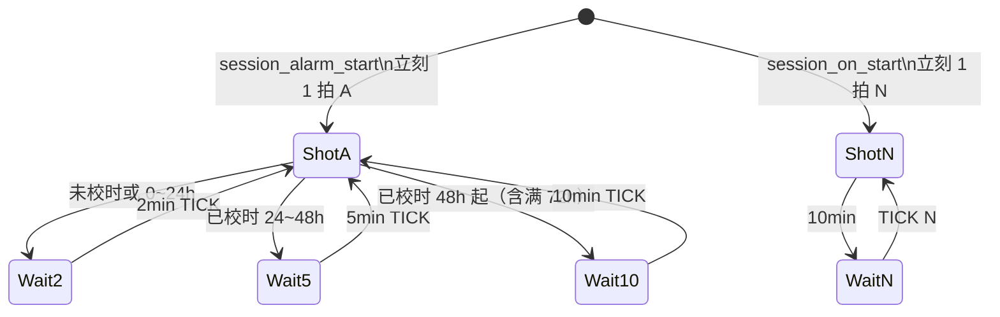

# app/session

告警 / 开机 / 低电 调度（GNSS / RDSS）

流程图与一拍用法：[`flow.md`](flow.md)。

> **变更记录（2026-08-18）**  
> 假关机 RTC 10s 由 MODE/LED 驱动，session 钩子只用 Unix 判断 2/5/10min 是否到点。  
> `LOW_BATT` 仍只发 1 条 N、不发 SHOT；可由 OFF 冷启动/看电触发（MODE 侧 `lb_sent` 防 STOP2 重复）。告警会话不被低电打断。

| 阶段 | 周期 | 报文 |
|------|------|------|
| 进 ALARM | 立刻 1 次 | `A` |
| ALARM 未校时或 0～24h | 每 **2 分钟** | `A` |
| ALARM 24～48h | 每 **5 分钟** | `A` |
| ALARM 48h 起（含 ≥72h） | 每 **10 分钟** | `A` |
| 进 ON（人开机等独立通道） | 立刻 1 次 | `N` |
| ON | 每 **10 分钟** | `N` |
| LOW_BATT | **只发 1 条** → `MODE_EVT_LOW_BATT_DONE` | `N` |



每拍前后通知 MODE（便于假关机）：

```text
SHOT_BUSY  →  FAKE_OFF 醒到 resume（ON 或 ALARM）
run_one_cycle（成功 / 失败 / 无卡空过都算一拍结束）
SHOT_IDLE  →  无 USB 且当前 ON/ALARM 则可进 FAKE_OFF
```

LOW_BATT / `test.session.once` **不发** SHOT 事件。

| API | 说明 |
|-----|------|
| `session_alarm_start/stop` | ALARM 节奏（墙钟 Unix；未校时锚点=0） |
| `session_alarm_resume` | 复位后续告警，**不刷新节奏起点** |
| `session_on_start/stop` | ON 10min；进入时允许再校 RTC 一次 |
| `session_lowbatt_once` | 低电单次（不校 RTC） |
| `session_stop_all` | 停当前任意会话 |

| 文件 | 说明 |
|------|------|
| `session_alarm.*` | 启停 + 软定时；按策略 `rtc_post_unix`；SHOT 事件 |
| `msg_pack.*` | MBA01；当前/首次 Unix 来自 GNSS RMC，不读 RTC |

每拍开 GNSS 前 `adc_bat_sample_wait`（刚离开 CHARGE 的第一拍跳过）。  
组包电量仍为 MBA01 头内 2 位 `00`～`99`（**协议未改**）。

**SIM 门控（仅产品会话）：** `run_one_cycle` 开头读 `sim_present()`。无卡 → 不开 LNA/GNSS/RDSS，本拍空过，2/5/10min 节奏照走，**仍发 SHOT_IDLE**。本拍已上电后拔卡 **不**停会话。  
**透传 / CLI `test.gnss` `test.rdss`：不查卡、不校 RTC。**

## 墙钟与校时

`rtc_get_unix()` 未校时为 **0**。短报文时间戳用本次 `fix.unix_sec`。

| 条件 | 行为 |
|------|------|
| ON，本次进入后第一次 `unix_sec≠0` | `rtc_post_unix(GNSS)` 一次 |
| ALARM 且 `!rtc_is_synced()` | 允许 `post`；并把节奏锚点锁成该 Unix（`mode_alarm_anchor_latch`） |
| ALARM 已校过 | 不写 RTC；锚点保持进入时的 Unix |
| RDSS / 透传 / `test.session.once` | 不校 |

未校时 ALARM：`alarm_start_unix=0`，一直 2min，不切 5min/10min。  
复位时锚点仍为 0 或 RTC 未 synced：elapsed 当 0，续 ALARM。

假关机：逻辑 `FAKE_OFF` 由 MODE 根据 SHOT 事件切换；RTC 10s 浅醒闪灯+空载采电已接。真关机 STOP2 见 `docs/low_power_stop2.md`。2/5/10min 节拍**不写** Flash / BKP（校时只写 RTC 日历 + DAT2）。
