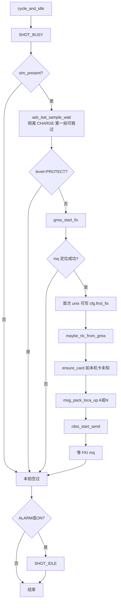
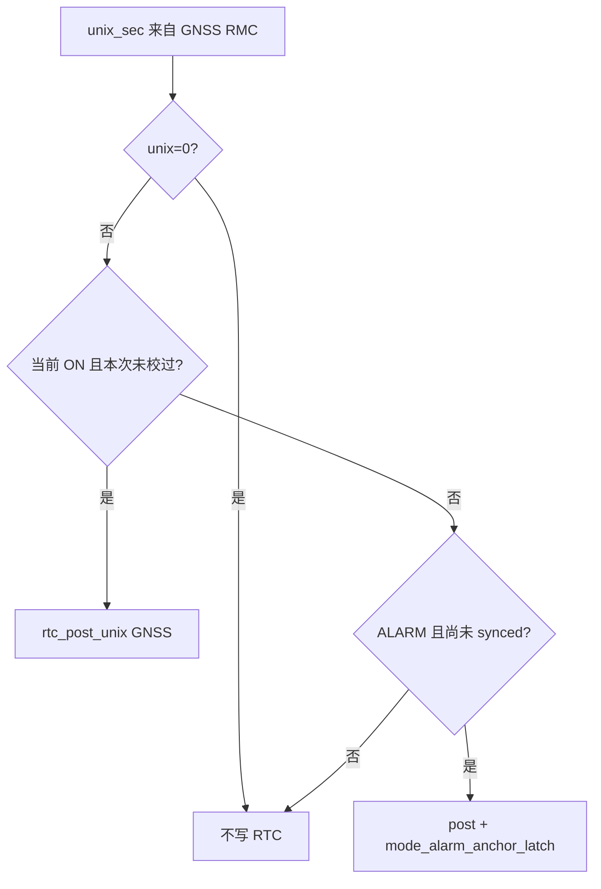

# session 流程图

> 实现：`session_alarm.c` / `msg_pack.c`。规则与用法：[`README.md`](README.md)。

## 1. 一拍 `run_one_cycle`

LOW_BATT / `test.session.once` **不发** SHOT。ALARM / ON 在拍前后发 `SHOT_BUSY` / `SHOT_IDLE`。

## 2. 校时（仅产品拍）

RDSS / 透传 / `test.gnss.fix` / `test.session.once`：**不写 RTC**。

## 3. 节奏

见 README 状态图：ALARM 立刻 A → 2/5/10min（满 72h 仍 A）；ON 立刻 N → 10min（独立通道）；LOW_BATT 只 1 条 N。

## 使用

| 场景 | 怎么触发 |
|------|----------|
| 产品 ON/ALARM/LOW_BATT | MODE 调 `session_*`，不要 CLI 强切 MODE |
| 强制一拍 | `{"cmd":"test.session.once"}`（不改 MODE、不校时、不发 SHOT） |
