# 对话原文 2026-08-18

回 [总目录](../chat_history.md)。本页是当天对话原话，未改写。

---

<a id="q-37"></a>

## 37. 用户 · Tuesday, Aug 18, 2026, 9:42 AM (UTC+8)

我认为只要ON的时候，有定位到就校准一次，其他时候可以不用校准，毕竟我们短报文发送获取的时间是GNSS上截取的，所以系统RTC的时间偏差一点没有关系，你认为呢？另外GNSS有包含RTC的所有时间信息吗？年月日时分秒都有吗？

## 助手

你的大方向对：短报文上的时刻跟 RTC 脱钩，用 GNSS 当场截就行，RTC 不必跟每一拍对齐。

## 只在 ON 校一次

可以，而且比「每拍都写」干净。RTC 在这里只服务两件事：**告警 48h 墙钟**、**看门狗后续跑**。LSE 在 48h 里通常只差几秒，短报文又不读 RTC，ALARM 的 2/5min 完全没必要改钟。

建议把「一次」理解成：**进入 ON 后，第一次有效定位写一次 RTC；这次 ON 里后面的 10min 不再写。** 下次再进 ON（关机再开、告警满 48h 回到 ON）再允许写一次。真掉电后 `synced` 没了，自然会再校。不要理解成「出厂只校一辈子」。

有一个例外建议保留，否则 48h 会空转：

**还没校过，却直接进了 ALARM**（关机长按 SOS、跌落，从未开过机）。这时第一拍 GNSS 已经有合法时间，若不写 RTC，锚点一直是 0 / 2020，48h 对不齐。  
做法：未校时，ALARM 第一次有效定位也写一次；已经校过就按你说的，ALARM 不再校。

这样平时符合「只在 ON 校」，应急又不会没墙钟。

## GNSS 时间齐不齐

**GGA 不齐**：只有当天 `hhmmss.ss`，没有年月日，不能校 RTC。

**RMC 齐**：`hhmmss.ss` + 日期 `ddmmyy` + 定位有效标志 `A/V`。年月日时分秒都有，年是两位（25→2025），秒可丢掉小数。模块默认一般会出 RMC，校时用这个就够，不必为 ZDA 再配语句。

**ZDA 更齐**：四位年 + 日/月 + 时分秒，往往默认不开。

结论：定位成功且 RMC `status=A`、日期不是空/全 0，就可以得到 RTC 需要的年月日时分秒（星期几由日期算）。只有 GGA、没有 RMC 时这一拍不校，报文时间戳也只能填 0。

你若认可：**ON 第一次有效定位校一次；未校过时 ALARM 也允许校一次；RDSS 不校**，就可以按这个改。

---

<a id="q-38"></a>

## 38. 用户 · Tuesday, Aug 18, 2026, 9:56 AM (UTC+8)

ON 第一次有效定位校一次；未校过时 ALARM 也允许校一次；RDSS 不校。先记住这个方案，然后我想RMC是什么？ZDA又是什么？我们如何把年月日也校准进去？或者用JSON配置？

## 助手

方案已记下，后面写代码按这个来：

- 只用 GNSS，不用 RDSS  
- **ON**：这次开机后第一次有效定位校一次 RTC  
- **ALARM**：只有还没校过才允许校一次  
- 短报文时刻从 GNSS 截，不靠 RTC  

---

## RMC / ZDA 是什么

都是 GNSS 模块按 NMEA 往外吐的一行文本，不是两种时钟芯片。

**GGA（现在在用）**  
管定位：经纬度、质量、卫星数。时间只有 **当天时刻** `hhmmss.ss`，**没有年月日**，不能单独校 RTC。

**RMC（Recommended Minimum）**  
「最小定位信息」。除了位置，还带：

| 字段 | 例子 | 含义 |
|------|------|------|
| UTC 时刻 | `163422.00` | 16:34:22 UTC |
| status | `A` / `V` | A=有效，V=无效（不要用来校时） |
| date | `300615` | **日=30 月=06 年=15** → 2015-06-30 |

所以 **年月日时分秒都在 RMC 里**。年是两位，产品里按 2000+ 即可（`25`→2025）。ATGM336H 默认一般会出 RMC，校时用它就够。

**ZDA（Time & Date）**  
专门报时间：四位年 + 日/月 + 时分秒。更完整，但模块常常 **默认不开**，要发配置才能出。我们不必为校时再配 ZDA。

---

## 年月日怎么进 RTC（不用 JSON 配日历）

流程可以是：

```text
同一拍定位
  GGA quality≥1     → 位置有效
  RMC status=A
    时刻 hhmmss     → 时分秒
    日期 ddmmyy     → 年(2000+yy) 月 日
        ↓
  合成 UTC Unix → rtc_post_unix
        ↓
  RTC 线程写入芯片日历（年/月/日/时/分/秒，星期由日期算）
```

芯片日历本来就是一套完整日期时间，RMC 一次就能填满，不是「先校时分秒、年月日另配」。

**不要用 JSON `cfg` 配年月日。** 日历是卫星时间，会变；`cfg` 是出厂身份（卡号、设备编号）。人手填日期会填错、还会和 GNSS 打架。工厂/调试已经有 `test.rtc` 带 `"unix"`，够用，不必再加配置项。

缺 RMC 或 `status=V` 的那一拍：照常发位置报文（时间戳可填 0），**不写 RTC**。

---

<a id="q-39"></a>

## 39. 用户 · Tuesday, Aug 18, 2026, 9:59 AM (UTC+8)

那你的建议是怎么做

## 助手

建议按下面做，不再加 JSON 配日期，也不开 ZDA。

## 时间从哪来

定位仍以 **GGA quality ≥ 1** 为准。同一拍再收 **RMC**：`status=A` 且日期不是空/全 0。

用 RMC 拼完整 UTC：

- 时刻 `hhmmss` → 时分秒（小数丢掉）
- 日期 `ddmmyy` → 日、月、年（`yy+2000`）

写进 `gnss_fix_t.unix_sec`。没有合法 RMC 则 `unix_sec=0`，照常报定位，不校 RTC。

透传不解析、不校时。RDSS 不校时。

## 何时写 RTC

走现有 `rtc_post_unix(..., RTC_SRC_GNSS)`，GNSS 不直接改寄存器。

| 时机 | 写 RTC？ |
|------|----------|
| ON，这次进入后第一次 `unix_sec≠0` | 写一次，后面 10min 不再写 |
| ALARM，且 `rtc_is_synced()==0` | 允许写一次 |
| ALARM 已校过 / ON 后续拍 / 透传 | 不写 |

「这次 ON」用 RAM 标志，进 ON 清掉，第一次成功校时置位。看门狗若 RTC 已 `synced`，再进 ON 仍会再校一次（你定的「ON 第一次」），次数很少。

## 未校时怎么对待墙钟

`rtc_get_unix()`：未 `synced` 时对外当 **0**（不要把 2020-01-01 当时间）。

进 ALARM 未校时：BKP 记 `alarm_active=1`，`alarm_start_unix=0`。节奏一直 2min，不切 5min、不满 48h。

第一次校时成功：把 48h 锚点锁成这次 GNSS 时间，再写 BKP。

## 组包

MBA01 当前时间、`first_fix_unix` 都用 **这次 fix 的 `unix_sec`**，不要读 RTC（异步写入会赶不上组包）。

## 启动顺序

RTC 改到 `INIT_ENV`，保证 `mode_init` 读钟时硬件和 `synced` 已经好。

---

CLI `test.rtc` 仍留给工厂/调试，不当作出厂配置项。

你点头后我就按这个改代码和文档。

---

<a id="q-40"></a>

## 40. 用户 · Tuesday, Aug 18, 2026, 10:00 AM (UTC+8)

OK，顺便相关MD文档要全部详细更新

## 助手

按已定方案改 GNSS/RTC 校时，并同步更新相关文档。先读实现与现有文档入口。

## 助手

开始改 GNSS、RTC、session/mode 和组包，随后把文档一次补齐。

## 助手

已按定稿接上 GNSS 校时，相关说明也改过了。

**时间从哪来**  
定位仍看 GGA；同一拍用 RMC 的 `hhmmss` + `ddmmyy` 合成 UTC，填进 `gnss_fix_t.unix_sec`。没有合法 RMC 就为 0，照常报点、不写 RTC。不用 ZDA，也不用 JSON 配日期。

**何时写 RTC**  
- ON：这次进入后第一次 `unix_sec≠0` 校一次  
- ALARM：只有还没校过才校；并把 48h 锚点锁成这次 GNSS 时间  
- RDSS / 透传 / `test.gnss.fix`：不校  

**墙钟**  
未校时 `rtc_get_unix()` 为 0（不再把 2020-01-01 当时间）。ALARM 锚点先为 0，一直 2min，等第一次 GNSS 再开始 48h。RTC 改为 `INIT_ENV`，保证 MODE 上电能读到是否已校。

**组包**  
当前时间和首次定位都用 GNSS 的 Unix，不读 RTC。

细则以 `BSP/rtc/README.md`、`BSP/gnss/README.md`、`app/session/README.md` 为准，手册和 roadmap 已对齐。

---

<a id="q-41"></a>

## 41. 用户 · Tuesday, Aug 18, 2026, 10:06 AM (UTC+8)

这个有没有进行解耦？我们最好也是通过消息来校准RTC以达到最大解耦。
另外到时候2分钟5分钟我也想靠RTC来定时唤醒，短报文发送结束会进入假关机状态来节省功耗，是否我们可以通过RTC校准SYSTICK来实现？先说下你的看法

## 助手

写 RTC 已经是消息队列，没有在业务里直接改寄存器。SysTick 扛不了假关机；2/5 分钟深睡只能靠 RTC 闹钟。

## 校时解耦：现在怎样

```text
GNSS          只解析 RMC，填 fix.unix_sec
                 （不 include rtc，不写日历）
    ↓ mq（定位结果）
session       按 ON/ALARM 策略决定「要不要校」
                 rtc_post_unix()     ← 已经是非阻塞消息
    ↓ rtc 自己的 sync mq
rtc 线程      唯一写硬件日历 + DAT2
```

CLI `test.rtc` 也走同一条 `post`。没有第二条写路径。

这样拆是故意的：

| 模块 | 该知道的 | 不该知道的 |
|------|----------|------------|
| GNSS | 这句话几点几分 | ON / 告警 / 48h |
| session | 何时允许校一次 | 日历寄存器 |
| RTC | 把 Unix 写成芯片日历 | MODE、RMC |

若改成 GNSS 每次定位都 `post`，RTC 线程就得懂「ON 第一次才写」，校时驱动会绑上状态机，解耦更差。策略留在 session、落盘留在 RTC 消息，已经是这一层该有的最大解耦。

后面若还想再松一点，也只适合加一个很薄的 `time_sync_post(unix)` 仍进同一队列，不必让 GNSS 直接碰 RTC。

## 2/5 分钟 + 假关机：不要用 RTC 去校准 SysTick

SysTick 是 **CPU 在跑时的 1ms 节拍**（调度、短超时、软定时器）。假关机进 STOP2 后 HCLK 关掉，**SysTick 停死**，`rt_tick` 也不走。用 RTC 去「校准」一个睡着的计数器，唤醒对不齐 2/5 分钟。

该分成两套钟：

| 用途 | 用什么 |
|------|--------|
| 按键 5s、定位 30s、在醒着时的短等待 | SysTick / `rt_timer` |
| 2min / 5min / 10min / 48h、假关机几点醒 | **RTC 日历 + Alarm**（LSE 深睡还在走） |

假关机推荐时序（和现有 STOP2 方案一致）：

```text
本拍短报文结束、射频关干净
  → 用已校时的 Unix 算 next_wake（+2/+5/+10 分钟）
  → 设 RTC Alarm
  → 进假关机 STOP2
唤醒（Alarm 或按键/USB）
  → 时钟恢复，SysTick 从 0 重新配
  → 不要接着用睡前的 tick 剩余时间
  → 按墙钟再跑一拍或按按键进状态机
```

醒来后把 `rt_tick` 拨成 RTC 也没意义：RT-Thread 不拿 tick 当墙钟，一拨还会把超时和调度搞乱。**对齐的是 Unix，不是 SysTick。**

现在醒着发信、2/5 分钟仍用软定时，和 LSE 差不了几秒，够用。假关机落地时，把「下一拍」从 `rt_timer` 换成 RTC Alarm 即可；校时这条消息路径正好给 Alarm 一个可信的墙钟。

**结论：** 校时保持「session 决策 + `rtc_post_unix` 消息落盘」；假关机用 RTC 闹钟唤醒，不要用 RTC 校准 SysTick。

---

<a id="q-42"></a>

## 42. 用户 · Tuesday, Aug 18, 2026, 10:13 AM (UTC+8)

你的理解不对，当在2/5/10分钟定时的时候，如果短报文已经发送完成了，系统没有事情可以做了，完全可以进入STOP2，只留RTC运行，而当RTC定时时间到，SYSTICK时钟已经不重要，重新赋值0都可以，然后重新跑，我们不是有记住MODE状态和发送的短报文次数好像就可以了，我们只要再次启动GNSS，RDSS获取信息，发送短报文，然后记录位置后进入假关机，等RTC时间到了再唤醒重复？你说下你的理解

## 助手

你说的是 **发完就睡、到点再冷拉起来跑一拍**，不是在睡着时用 SysTick 接着数 2/5/10 分钟。这点和假关机一致。

## 循环（ALARM / ON 间隙）

```text
醒着：开 GNSS → 定位 → 组包 → RDSS 发完（失败也结束本拍）
     → 关射频、灯
     → 记下逻辑态（ALARM 或 ON）+ 告警锚点 Unix
     → 用 RTC 算出下一次：+2 / +5 / +10 分钟
     → STOP2，只留 LSE/RTC
睡着：SysTick、RTOS、GNSS/RDSS 全可以当没有
到点：RTC Alarm 唤醒
     → 时钟重配，SysTick 从 0 开始
     → 当一次「冷启动」把线程拉起来
     → 读出 MODE，再跑一拍 GNSS/RDSS
     → 再睡
```

按键 / USB / 跌落用 EXTI 提前叫醒，醒后走现在的状态机，不是等到 2 分钟。

CHARGE、看电 5 秒、透传不要进这种睡。

## 要记住什么

不必记「发了多少条」。2/5 分钟分界和 48 小时用 **告警开始的 Unix** 算已经过了多久就行：无卡空过、定位失败，墙钟照走，次数会对不齐 24h/48h。

跨过 STOP2 建议只留：

| 记住 | 作用 |
|------|------|
| 逻辑 MODE（ALARM 或 ON） | 醒了还是告警还是开机，不是用户关过机 |
| `alarm_start_unix`（告警中） | 选 2min 还是 5min，满 48h 转 ON |
| 「这是假关机唤醒」 | 和看门狗/真掉电分开 |

看门狗、真掉电：**仍然不恢复 ON**（现有规则）。假关机醒来：**必须恢复 ON/ALARM**，否则 10 分钟开机拍睡一觉就变成关机。靠 BKP 里一个睡标志或唤醒原因区分即可，不必靠报文次数。

GNSS/RDSS 不用跨睡保现场，每拍重新上电、定位、发信，和现在「一拍会话」一样。位置/时间该写 Flash 的（首次定位、卡号）仍按现在的空闲写，不要在 STOP2 里擦 Flash。

## 和 SysTick 的关系

你说得对：到点之后 SysTick 不重要，清零重跑即可。它只服务醒着那几十秒（滤波、定位超时、线程调度）。**谁负责到点叫醒的是 RTC Alarm，不是校准后的 SysTick。**

我前面理解偏了的地方：把「2/5/10 分钟」当成醒着空转等软定时；你要的是 **发完立刻 STOP2，用 RTC 当唯一长定时。** 后面做假关机就按这个循环接。

---

<a id="q-43"></a>

## 43. 用户 · Tuesday, Aug 18, 2026, 10:17 AM (UTC+8)

对的，必要的信息我们保留在BKP里面就可以了，你把你理解的整个方案说下，我看下有没有问题

## 助手

下面是整案（**已落地的** + **假关机以后做的**）。你对一下有没有和产品意思不一致的地方。

---

## 1. 两套时间、两种睡

| | 现在（已做） | 假关机（以后） |
|--|--|--|
| 短超时（按键 5s、定位 30s） | SysTick | 醒着时同样 |
| 2 / 5 / 10 分钟、48h | 软定时 + 墙钟 Unix | **RTC Alarm** 到点叫醒 |
| 发完没事干 | idle → STOP0（RAM 还在，SysTick 大约还在跑） | **STOP2**，普通 RAM 丢掉，只留 RTC/BKP |

SysTick **不**用来跨过假关机。醒来时钟重配，SysTick 从 0 开始，当一次冷启动把 RTOS 拉起来。

---

## 2. 三套存储（不变）

| 库 | 谁写 | 内容 |
|----|------|------|
| Flash | 仅 cfg | 身份、卡槽、offset、首次定位 |
| BKP DAT1/DAT2 | 仅 RTC | 日历 magic、已校时 |
| BKP DAT3+ | 仅 mode | 逻辑态 + 告警锚点 + **假关机标志** |
| R-SRAM | 这套方案不用 | 上下文都能进 BKP，不必再占 16KB |

2/5/10 分钟节拍本身不擦 Flash。假关机前也不擦 Flash。

---

## 3. 醒着时一拍（现在就这样，假关机后还是这样）

```text
有卡 → ADC → GNSS 定位（GGA + RMC）→ 组包 → RDSS 发完（失败也算本拍结束）
无卡 → 不开射频，本拍空过
```

短报文时刻用 GNSS 的 Unix，不读 RTC。

校时仍走消息：`session` 决定要不要校 → `rtc_post_unix` → RTC 线程写日历。

- ON：这次进入后第一次有效定位校一次  
- ALARM：只有还没校过才校  
- RDSS / 透传：不校  

未校时：`rtc_get_unix()=0`，ALARM 锚点=0，一直按 2 分钟、不满 48h。

---

## 4. 假关机主循环（ALARM / ON）

```text
本拍结束（成功、失败、无卡空过都一样）
  → 关 GNSS/RDSS/灯，射频计数到 0
  → 已校时？ 否 → 不进 STOP2，维持现在醒着/STOP0 + 软定时
                 是 → 写入 BKP（见下）
                    → 按墙钟设 RTC Alarm（+2 / +5 / +10 分钟）
                    → STOP2（只留 LSE/RTC/BKP）

RTC 到点（或按键/USB/跌落 EXTI）
  → 复位式冷拉起（SRAM 已不可信）
  → 读 BKP：这是假关机，不是看门狗
  → 恢复逻辑 ALARM 或 ON
  → SysTick=0，线程重建
  → 立刻再跑一拍
  → 再睡
```

进 ALARM / 进 ON 的**第一拍仍立刻发**，发完再睡，不是先睡再发。

CHARGE、BATT 5 秒、透传：**禁止** STOP2。  
OFF / FORCE_OFF 可以以后同样 STOP2 等按键/USB，和「发信间隙假关机」是同一档休眠、不同逻辑态。

---

## 5. BKP 里到底留什么（假关机够用）

在现有粘性上加「睡着」即可，大约还是几十字节：

| 字段 | 作用 |
|------|------|
| `mode` | 逻辑态：ALARM / ON / OFF / FORCE_OFF |
| `prev` | 一层返回（充电等） |
| `alarm_active` + `alarm_start_unix` | 2/5 分界、48h；未校时为 0 |
| `sleeping` | **1=假关机**。看门狗/真掉电没有这标志 |
| （可选）`next_wake` | 和 RTC Alarm 对一下，坏了当一次冷启动 |

**不记**短报文条数。2/5 分钟和 48h 用 `现在 Unix − alarm_start_unix`。无卡、定位失败墙钟照走，条数会对不齐。

**不记** GNSS 坐标、线程栈、电量动画。每拍重采、重发。

---

## 6. 三种「醒来」必须分开

| 原因 | 怎么认 | 行为 |
|------|--------|------|
| RTC Alarm / 假关机 EXTI | BKP `sleeping=1` | **恢复 ON 或 ALARM**，再跑一拍或按按键走 fsm |
| 看门狗 | 复位标志 + `sleeping=0` | **不恢复 ON**；告警未满 48h 才续 ALARM；否则看电量 OFF/FORCE_OFF |
| 真掉电 | BKP 没了 | 身份从 Flash；不续告警；不恢复 ON |

这是为了：假关机睡一觉开机态还在；看门狗死掉不当成用户还开着机。

---

## 7. 到点怎么算下一拍

每次睡前（已校时）算一次：

```text
ALARM 且 elapsed ≥ 48h  → 逻辑改 ON，下一拍按开机发，再按 10min 睡
ALARM 且 elapsed ≥ 24h  → Alarm = now + 5min
ALARM 且 elapsed < 24h  → Alarm = now + 2min
ON                      → Alarm = now + 10min
```

按键长按/跌落在睡着时叫醒：退出假关机，按现行 fsm 进 ALARM（立刻一拍，再睡）。USB 叫醒：非告警进 CHARGE（禁止再 STOP2）；告警保持 ALARM。

---

## 8. 和现有规则怎么叠

- 进 FORCE_OFF：告警窗作废，`sleeping` 清掉，充电回来不续 48h  
- 告警正常结束（满 48h 或长按结束）：RAM 仍回 ON；若接着假关机，BKP 记 ON+sleeping，**不当成看门狗那种「不恢复 ON」**  
- 身份、卡号、首次定位：仍只在业务拍里按 dirty 写 Flash，不在进睡路径擦页  

---

## 9. 实施时必须先核对的一点（芯片）

STOP2 里 **独立看门狗往往还在跑**。若 IWDG 只有几秒，会在 2 分钟 Alarm 之前把芯片复位，并被当成「看门狗、不恢复 ON」。假关机落地时要么进睡前停 IWDG（若芯片允许），要么超时大于最长间隙（10 分钟 + 余量），要么改用 RTC 喂狗窗口——**否则这套循环不成立**。

---

**一句话：** 发完就 STOP2；BKP 只记逻辑态、告警锚点、这是假关机；RTC 负责到点；醒来当冷启动，SysTick 清零，重开 GNSS/RDSS 发一拍再睡。看门狗/掉电和假关机用 `sleeping` 分开。未校时先不睡。

你看第 5～7 节（BKP 字段、三种醒来、未校时不睡）有没有要改的。没问题再把假关机写进文档；代码仍等你说做再动。

---

<a id="q-44"></a>

## 44. 用户 · Tuesday, Aug 18, 2026, 10:50 AM (UTC+8)

1. “未校时：rtc_get_unix()=0，ALARM 锚点=0，一直按 2 分钟、不满 48h。”这个理解应该不对吧？前24小时是2分钟，24-48小时是5分钟。
2.  “→ 关 GNSS/RDSS/灯，射频计数到 0”，射频计数做什么用？灯被我忘记考虑了！原来定ON/ALARM时候灯是5/10秒进行闪烁的，这个我们得再考虑下。
3. 是否我们可以用看门狗复位来处理LED闪烁？
4. sleeping不能用来做假关机吧？sleep是空闲任务调用的吗？假关机我们是否有必要在MODE里面新增一个状态？
5. BKP里面考虑再增加什么可以解决我们LED闪烁的问题吗？
6. “按键长按/跌落在睡着时叫醒：退出假关机，按现行 fsm 进 ALARM（立刻一拍，再睡）。USB 叫醒：非告警进 CHARGE（禁止再 STOP2）；告警保持 ALARM。”这个有必要详细再分解下，我觉得理解不到位。
7. STOP2 应该有两种状态，真关机看门狗要关闭，对应时钟线也关闭。如果是假关机，那看门狗是否可以用来当LED闪烁的启动？
8. 改用 RTC 喂狗也是可以。
你理解下重新跟我核对一遍
6.

## 助手

先核对现有 ON/ALARM 的灯效和电源脚，再按你这 8 点把整案重说一遍。

## 助手

下面按你的 8 点重核。第 1 点是我没说清；第 3/5/7 和灯绑在一起；第 6 按事件拆开。

---

## 1. 2 分钟 / 5 分钟（告警报文）

产品规则没变：

- **0～24h：每 2 分钟一拍**
- **24～48h：每 5 分钟一拍**
- **满 48h → ON，之后每 10 分钟**

我上次说的「一直 2 分钟、不满 48h」**只针对还没校时**：没有墙钟就不知道有没有过 24h/48h，只能暂时用 2 分钟，**不是**把 24～48h 改掉。

校上 RTC 之后，立刻按上面 2/5/10 分钟走。

灯的 5 秒 / 10 秒是另一套，不要和报文间隔混在一起。

---

## 2. 「射频计数」和灯

**射频计数**只是共享脚 `MCU_EN_PLNA`：GNSS、RDSS 各 `acquire` 一次，都 `release` 完计数到 0 才拉低。进假关机前必须到 0，否则 LNA 还开着。不是业务状态。

**灯（现行）：**

| 逻辑态 | 灯 |
|--------|----|
| ON | 每 **10s** 三灯亮 200ms |
| ALARM | 每 **5s** 三灯亮 100ms |
| OFF / FORCE_OFF | 灭 |

STOP2 时 CPU 停、普通 RAM 没了，灯脚不会自己闪。要保持 5s/10s，必须**周期叫醒翻一次 GPIO**，和 2/5/10 分钟发信是两档定时。

---

## 3 / 5 / 7 / 8. 灯、看门狗、两种 STOP2

不建议用 **看门狗复位当闪灯节拍**。

- 假关机若每 5 秒整片复位一次：RTOS/Flash/外设全初始化，功耗和 2 分钟发信都划不来，USB 也会反复枚举。
- 真关机你要 **关掉看门狗**；假关机若靠 IWDG 闪灯，两种 STOP2 互相打架。
- 更致命：看门狗复位和「故障复位不恢复 ON」分不清。5 秒闪一次灯就会被当成看门狗，开机态全丢。

BKP **可以**记下灯周期、下次闪的 Unix、下次发信 Unix、逻辑态，但 BKP 自己不会亮灯，还是要有人叫醒去翻脚。

更干净的分法：

| 哪种 STOP2 | 看门狗 | 谁叫醒 | 灯 |
|------------|--------|--------|----|
| **真关机**（OFF / FORCE_OFF） | **关** | 只留 SOS/USB EXTI（和必要的检测） | 灭，不必醒 |
| **假关机**（逻辑仍是 ON/ALARM） | 可开，当**故障保险** | **RTC** 叫醒 | 见下 |

假关机里 RTC 可以设**最近的那个点**（灯 5s/10s 和发信 2/5/10min 取更近的）：

- 到点只是闪灯、还没到发信 → 亮一下（100ms/200ms）→ 再 STOP2（尽量别整片初始化，见下面）
- 到点该发信了 → 完整拉起 GNSS/RDSS 跑一拍 → 再睡
- 若程序卡死、RTC 没来得及进睡 → **IWDG 才复位**（这才是故障，按「不恢复 ON」处理）

「RTC 喂狗」也成立：假关机每次 RTC 叫醒（闪灯或发信）都清一次 IWDG；IWDG 超时略长于灯周期（例如灯 5s，IWDG 8～10s）。真关机：IWDG 关，不喂狗。

闪灯若也要「STOP2 后 SRAM 没了还不能整片复位」，就得靠 **R-SRAM 里一小段** 醒来只翻灯再睡；BKP 只存时间点不够单独完成闪灯。若能接受假关机间隙灯全灭，就可以不搞 5s 唤醒，等发信那一拍再闪——这是产品取舍，要你定。

---

## 4. `sleeping` 和要不要新 MODE

对，**不要用 `sleeping` 这个名字**，也和空闲任务的 STOP0 无关。

- 空闲钩子 STOP0：逻辑还是 ON/ALARM，RAM 还在，只是 CPU 浅睡。
- 假关机 STOP2：RAM 丢了，是另一种「人看起来像关机、逻辑还在发信日程上」。

**建议 MODE 里单独加一个态**（名字用 `SLEEP` / `FAKE_OFF` 均可，避免和 idle 混）：

- 逻辑态仍记住 **从哪睡的**：`resume = ON 或 ALARM`（放 BKP）
- `OFF` / `FORCE_OFF` 的 STOP2 **不要**进这个态，就是真关机

调试时能直接看到「现在是假关机」，比「MODE 还显示 ON、另有一个 BKP 位」清楚。按键仍按 **resume 那一层** 走现行 fsm（见第 6 点）。

---

## 6. 睡着时叫醒（按事件拆）

先分清：叫醒后 KEY 仍要滤波，才能分短按/长按。下面「逻辑态」= BKP 里的 `resume`（ON 或 ALARM），不是空闲浅睡。

### 假关机（逻辑 ON）

| 叫醒 | 行为 |
|------|------|
| RTC 仅闪灯 | 三灯按 ON 闪一下，再睡 |
| RTC 到发信 | 完整一拍 GNSS/RDSS（N 报文），再睡 10min |
| SOS **短按** | → **真关机 OFF**（灯灭，关 IWDG，STOP2 等按键/USB） |
| SOS **长按** / FALL | → **ALARM**，立刻一拍（A），再按告警 2/5min 假关机 |
| USB 插入 | → **CHARGE**，**禁止**再 STOP2（充电/USB 要活着） |
| USB 拔出 | 若当时已是 CHARGE：回 ON，可以再假关机 |

### 假关机（逻辑 ALARM）

| 叫醒 | 行为 |
|------|------|
| RTC 仅闪灯 | 按 ALARM 闪一下，再睡 |
| RTC 到发信 | 看墙钟：&lt;24h 仍 2min，24～48h 改 5min；满 48h → 逻辑改 ON，发 N，再按 10min 睡 |
| SOS **短按** | **忽略**（和醒着告警一样） |
| SOS **长按** | 退出告警：USB 在 → CHARGE（不睡）；USB 不在 → `prev`（ON 则假关机，OFF 则真关机） |
| FALL | **保持 ALARM**，不新开一拍（和醒着一样） |
| USB 插入 | **保持 ALARM**；建议 **先别睡**（USB 在位），发信节奏仍按 2/5min，但用醒着/STOP0；拔 USB 后再假关机 |
| USB 拔出 | 仍 ALARM，可以再假关机 |

### 真关机 STOP2（逻辑 OFF / FORCE_OFF）

| 叫醒 | 行为 |
|------|------|
| SOS 短按 | → BATT 看电 5s（必须完整跑灯流水），超时回 OFF/FORCE_OFF 再真睡 |
| SOS 长按 / FALL | OFF 且非保护 → ALARM 立刻一拍；FORCE_OFF **忽略** |
| USB 插入 | → CHARGE，不睡 |

没有「RTC 闪灯」。没有看门狗。

---

## 重新收成一张表

```text
真关机 STOP2：MODE=OFF/FORCE_OFF，灯灭，IWDG 关，EXTI 等人
假关机 STOP2：MODE=SLEEP（resume=ON/ALARM）
              RTC 管「下次闪灯」和「下次发信」里更近的那个
              叫醒：闪灯则翻灯再睡；发信则冷拉起跑一拍再睡
              IWDG 只当卡死保险，RTC 叫醒时喂狗
              按键/USB 按上面矩阵走现行 fsm
```

还需要你拍板的只有两件：

1. **假关机间隙灯要不要保持 5s/10s 闪**（要：RTC 短唤醒 ± 最好 R-SRAM 小 stub；不要：睡就灭，发信那一拍再闪）  
2. **假关机 MODE 叫 `SLEEP` 还是别的名字**（不要用 idle 的 sleep 含义）

这两点定了，方案就可以写进文档。

---

<a id="q-45"></a>

## 45. 用户 · Tuesday, Aug 18, 2026, 11:02 AM (UTC+8)

1. 灯还是要保持闪烁，我想把告警的灯和ON的灯改成10秒闪烁一次，压榨功耗，然后ON是10秒里面有100MS亮，ALARM是10秒里面先亮100MS，200ms后再亮一次100ms，其他都是灭的，这样是否可以？是否把RTC改成10秒醒一次，然后分别计数到2分钟5分钟和10分钟。你评估下。
2. 用FAKE_OFF比较不容易混淆吧？
你把完整理解下，并做个流程图，流程图按功能状态分开，要清晰易懂。我看下没有问题我们再改程序，这个改动比较大，对你来说有难度。

## 助手

先评估灯和 10 秒 RTC，再给出按状态拆开的流程图。程序先不动。

## 1. 灯改成 10 秒一次 —— 可以，而且合理

| | ON | ALARM |
|--|----|--------|
| 周期 | 10s | 10s（原来 5s，唤醒次数减半） |
| 亮法 | 亮 **100ms**，其余灭 | 亮 **100ms** → 灭 **200ms** → 再亮 **100ms**，其余灭 |
| 观感 | 单闪 | 双闪，远处能分出告警 |

10 秒醒一次、用计数凑出发信间隔，算术是齐的：

- 2 分钟 = 12 次  
- 5 分钟 = 30 次  
- 10 分钟 = 60 次  

**建议两套钟一起用，不要只靠计数：**

- **灯、10 秒心跳**：RTC 周期唤醒（不依赖校时，没对过墙钟也能闪）
- **2/5/10 分钟该不该发信**：已校时用 Unix 比较（定位/发信可能占用 30s，纯计数会漂）
- **24h / 48h**：必须用 `alarm_start_unix`，不能用「数了多少个 10 秒」（漏醒、发信超时都会错）

未校时：灯照闪；发信暂时按 12 次≈2 分钟；还是不知道 24h/48h，校上之后再切 5 分钟和满 48h。

**真正的难点（改动大就大在这儿）：**  
STOP2 后普通 RAM 没了。若 **每 10 秒都完整启动 RT-Thread**，一天要醒八千多次，假关机省电会被吃掉。

可行结构是 **两种醒来**：

| 醒来 | 干什么 | 怎么跑 |
|------|--------|--------|
| **浅醒**（大多数 10s） | 只按 ON/ALARM 闪灯，喂狗，再 STOP2 | 不要拉完整应用；R-SRAM 小 stub 或复位后 BKP 判定「只闪灯」就睡 |
| **满醒**（到点发信 / 按键 / USB） | 时钟、线程、GNSS/RDSS 一拍 | 现在这套冷启动 |

看门狗：假关机里超时略大于一次 10s+双闪（例如 2～3s 余量），浅醒/满醒都喂；真关机 **关 IWDG**。看门狗不当闪灯节拍，只当卡死复位。

---

## 2. 名字用 `FAKE_OFF`

同意，和空闲 STOP0、真 `OFF` 都不容易混。

- `OFF` / `FORCE_OFF`：真关机 STOP2，灯灭，IWDG 关  
- `FAKE_OFF`：假关机，BKP 里带 `resume ∈ {ON, ALARM}`  
- 空闲 STOP0：仍是 ON/ALARM 醒着发信时的浅睡，不进 MODE  

---

## 3. 整案（按状态）

真关机和假关机都是 STOP2，配置不同。发信节奏仍是 0～24h / 2min、24～48h / 5min、ON / 10min。

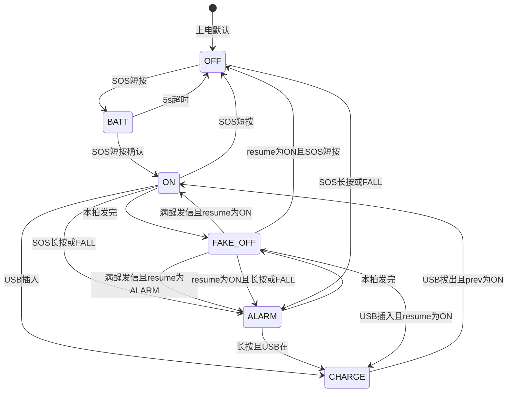

---

### 真关机 `OFF` / `FORCE_OFF`

灯灭。关 IWDG。关多余时钟。只等人。

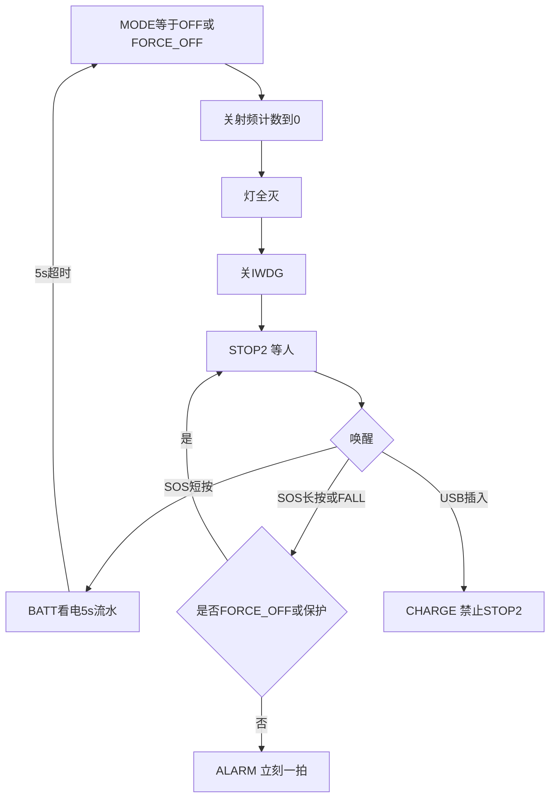

---

### 假关机 `FAKE_OFF`（10 秒心跳）

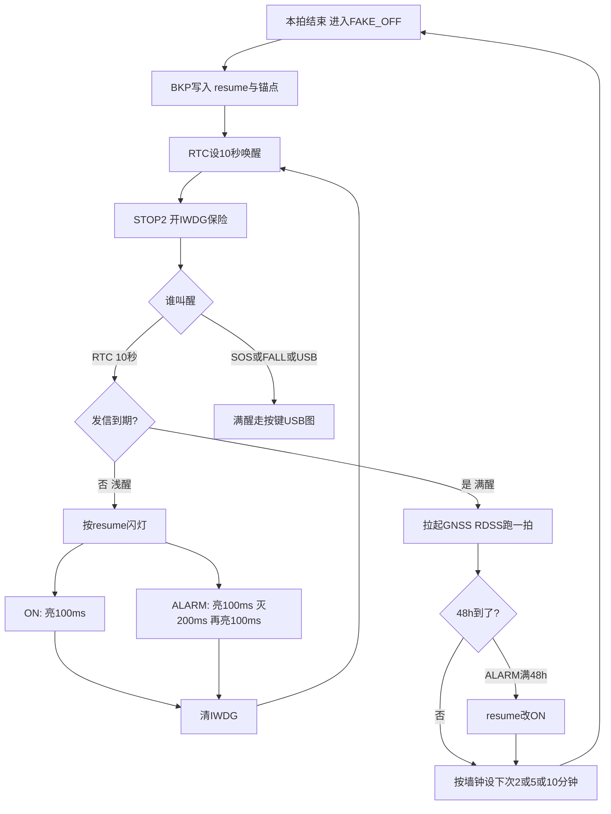

发信是否到期（已校时用 Unix，未校时 ALARM 先按 12 个 10 秒≈2 分钟）：

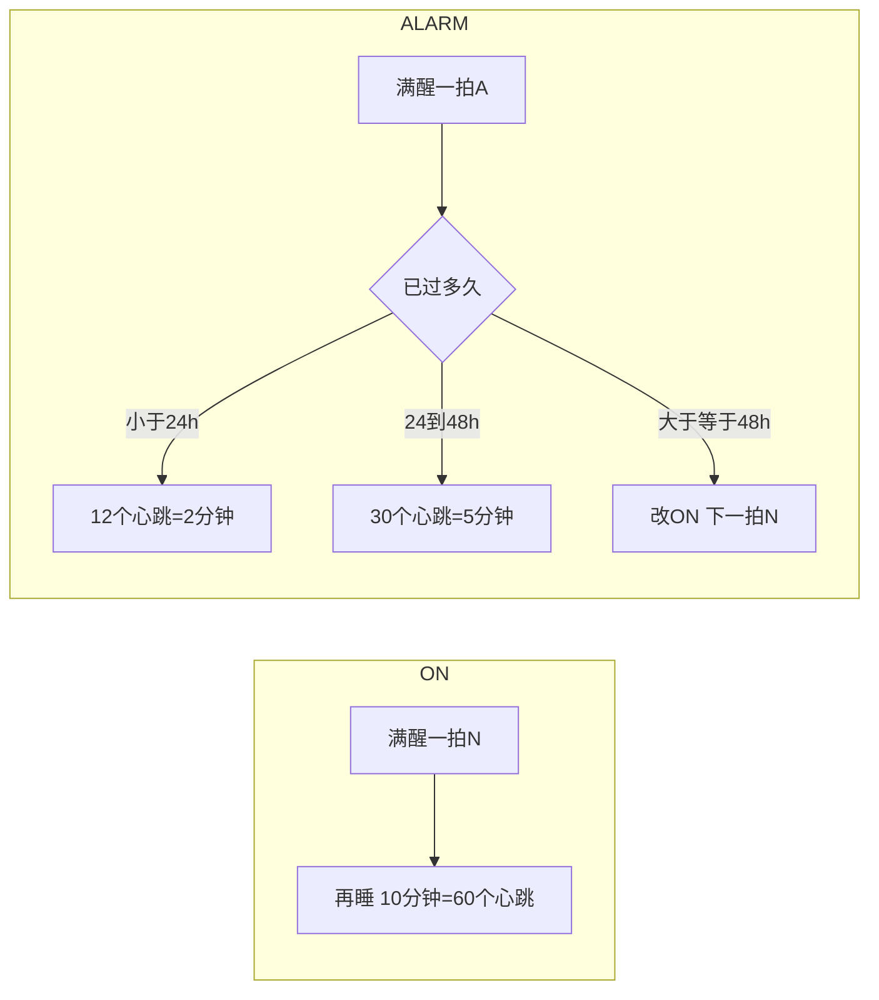

---

### 假关机里的按键 / USB（满醒，按 `resume` 走现行 fsm）

```mermaid
flowchart TD
    W[EXTI叫醒 满醒] --> R{BKP.resume}
    R -->|ON| ON
    R -->|ALARM| AL}

    subgraph ON [逻辑开机]
        ON --> OS{事件}
        OS -->|SOS短按| OFF[真关机OFF]
        OS -->|SOS长按或FALL| ALM[进ALARM立刻一拍]
        OS -->|USB插入| CH[CHARGE 禁止假关机]
    end

    subgraph AL [逻辑告警]
        AL --> AS{事件}
        AS -->|SOS短按| IGN[忽略再FAKE_OFF]
        AS -->|FALL| KEEP[保持ALARM不新开拍]
        AS -->|SOS长按| EXIT{USB在?}
        EXIT -->|在| CH2[CHARGE]
        EXIT -->|不在| PREV[回prev]
        AS -->|USB插入| HOLD[保持ALARM 有USB不睡STOP2]
        AS -->|USB拔出| SLEEP2[仍ALARM 可再FAKE_OFF]
    end
```

CHARGE、BATT、透传：不进 `FAKE_OFF`。

---

### 灯时序（每个 10 秒窗口）

```text
ON:     亮 100ms |---------------- 灭约 9.9s ----------------|
ALARM:  亮 100ms | 灭 200ms | 亮 100ms |------ 灭约 9.6s ------|
        <---------------------- 10s RTC 周期 -------------------->
```

---

## 4. BKP 建议（假关机）

| 字段 | 用途 |
|------|------|
| `mode = FAKE_OFF` | 和真 OFF、空闲浅睡分开 |
| `resume` | ON 或 ALARM（灯型、按键、发信间隔） |
| `prev` | 退出告警用 |
| `alarm_start_unix` | 24h/48h；未校时为 0 |
| `next_msg_unix` | 已校时：下次满醒发信 |
| `led_ticks` | 未校时：10 秒心跳计数（凑 2 分钟） |
| `synced` | 仍在 RTC 的 DAT2 |

不记报文条数。不记坐标。

---

## 5. 对你来说「大」在哪（事先说清）

方案本身（10 秒 RTC + 单闪/双闪 + `FAKE_OFF`）不乱。工程量大是因为要 **切开浅醒和满醒**：浅醒几乎不能跑现在的 `main`/线程，否则 10 秒一复位会比不睡还费电。这要动启动、BKP、RTC WakeUp、IWDG 真/假两套，不是改几个定时器。

你先核这三句有没有问题：

1. 灯：ON 单闪 100ms / ALARM 双闪 100+200+100，都是 10 秒周期  
2. 假关机态名：`FAKE_OFF`，`resume` 为 ON 或 ALARM  
3. 10 秒 RTC 只负责心跳和灯；2/5/10 分钟和 48h 以墙钟为主、未校时才用心跳计数凑 2 分钟  

没问题再改程序和文档。

---

<a id="q-46"></a>

## 46. 用户 · Tuesday, Aug 18, 2026, 11:35 AM (UTC+8)

1. CHARGE模式下，长按SOS或者FALL是不是也要进ALARM?
2. 假关机 FAKE_OFF（10 秒心跳）里面“STOP2 开IWDG保险”好像不对，IWDG只在OFF或者FORCE_OFF时候关闭，其他时间应该都要开，并且IWDG的定时按大于16S来设定。
3. 假关机里的按键 / USB里面“ALARM”有短按还是要进入BATT显示电量5秒再返回ALARM。
4. 其他没有问题，你重新理解下帮告诉我你的理解，每问题再改代码

## 助手

按你这 3 条改理解。**先不改代码**，下面是核对稿。

## 你纠正后的口径

**1. CHARGE 长按 / FALL → ALARM**  
对，和现行 fsm 一样：充电时 SOS 长按或跌落进 ALARM（保护/`FORCE_OFF` 除外）。立刻跑一拍告警报文。USB 若还在：告警保持、**先不** `FAKE_OFF`（有 USB 不进假关机）。

**2. IWDG**  
只在 **OFF / FORCE_OFF**（真关机 STOP2）里关掉。  
ON、ALARM、`FAKE_OFF`、CHARGE、BATT、透传等 **都开**，超时 **大于 16s**。  
10 秒浅醒、满醒发信都要喂狗。定位/波束可能超过 16s，线程里照样要喂，不能只靠 10 秒醒一次。  
IWDG **不当**闪灯节拍，只防卡死。

**3. 假关机 ALARM 短按看电**  
`FAKE_OFF` 且 `resume=ALARM` 时，SOS **短按** → **BATT 显示 5s** → 回 ALARM（再按有没有 USB 决定是否回去假关机）。  
这和现在「告警中短按忽略」不同，按你这次为准。

看电这 5 秒必须当 **告警上的叠一层**，不能当成关机前的 BATT：

- 5s 到 → 回 ALARM  
- 再短按 → 不要变成开机 ON  
- USB 插入 → **保持告警**，不要走「BATT→CHARGE」把告警退出  
- 长按：退出告警（USB 在→CHARGE，不在→prev）  
- FALL：保持 ALARM，不新开拍  

醒着的 ALARM（例如 USB 在位没睡）建议同一套短按看电，避免两套键。

---

## 灯 / 10 秒 / `FAKE_OFF`（你已点头的部分）

- ON：10s 内亮 100ms  
- ALARM：10s 内亮 100ms → 灭 200ms → 再亮 100ms  
- RTC **10 秒**心跳：浅醒只闪灯+喂狗；满醒才 GNSS/RDSS  
- 2/5/10 分钟、24h/48h：**已校时用墙钟**；未校时 ALARM 先用 12 个心跳凑 2 分钟  
- 态名：`FAKE_OFF`，BKP 带 `resume=ON|ALARM`

---

## 总态

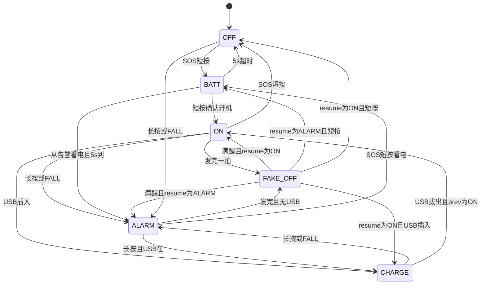

---

## IWDG 与两种 STOP2

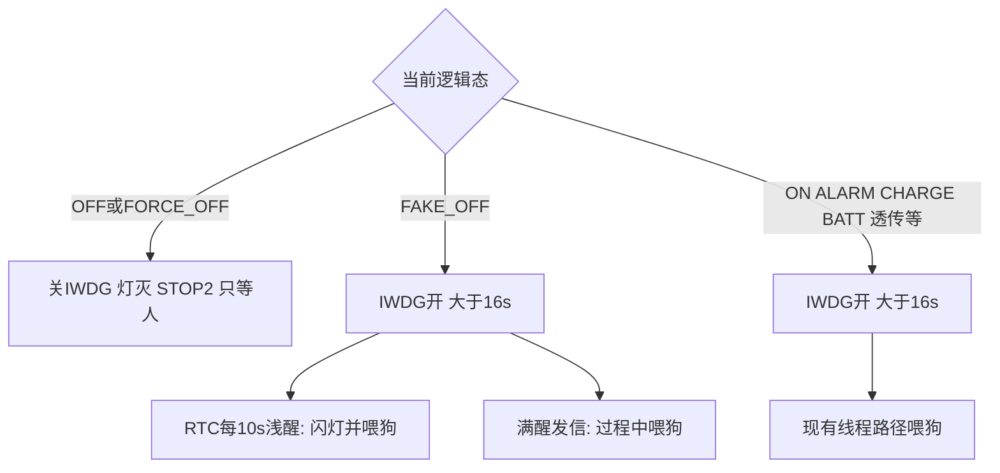

---

## `FAKE_OFF` 按键 / USB

**resume = ON**

| 事件 | 行为 |
|------|------|
| RTC 10s 未到发信 | 单闪 100ms，喂狗，再睡 |
| 到发信 | 满醒一拍 N，再按 10min 睡 |
| SOS 短按 | 真关机 OFF（关 IWDG） |
| 长按 / FALL | ALARM，立刻一拍 |
| USB 插入 | CHARGE，禁止假关机 |

**resume = ALARM**

| 事件 | 行为 |
|------|------|
| RTC 10s 未到发信 | 双闪，喂狗，再睡 |
| 到发信 | 满醒一拍 A；按墙钟 2/5min 或满 48h 转 ON |
| SOS **短按** | **BATT 看电 5s**，超时回 ALARM |
| FALL | 保持 ALARM，不新开拍 |
| 长按 | 退出告警：USB 在→CHARGE；不在→prev |
| USB 插入 | 保持 ALARM，**不** STOP2 |
| USB 拔出 | 仍 ALARM，可再 `FAKE_OFF` |

CHARGE 本身不进 `FAKE_OFF`；长按/FALL 仍进 ALARM。

---

## 真关机 OFF / FORCE_OFF

关 IWDG。短按→BATT 5s；长按/FALL：OFF 可进 ALARM，FORCE_OFF 忽略；USB→CHARGE。

---

若这版没问题，再说一声，再改程序和文档（含灯周期、`FAKE_OFF`、ALARM 短按看电、IWDG 策略）。工作量主要在 **10 秒浅醒不要整片初始化**。

---

<a id="q-47"></a>

## 47. 用户 · Tuesday, Aug 18, 2026, 11:42 AM (UTC+8)

3. 假关机 ALARM 短按看电这个我理解错了，这个应该是属于ALARM进入到FAKE_OFF,所以长按应该是进ON或者进OFF，具体看ALARM是不是超过48H，短按显示电量5秒，没有错吧。其他没有问题，你再理解下

## 助手

按你这次改：**假关机里的告警，短按看电；长按结束告警，去 ON 还是 OFF 看有没有满 48h。** 先不改代码。

## 口径（只改这一块）

`FAKE_OFF` 且 `resume=ALARM`：已经是告警发完在假关机，不是醒着那套「长按回 prev」。

| 事件 | 行为 |
|------|------|
| SOS **短按** | **BATT 看电 5s** → 回 ALARM（再进 `FAKE_OFF`，有 USB 则不睡） |
| SOS **长按** | **结束告警**：**未满 48h → OFF**（真关机）；**已满 48h → ON**（后面按开机 10min 假关机） |
| FALL | 仍保持 ALARM，不新开一拍 |
| USB 插入 | 保持 ALARM，不进 STOP2 |

看电 5 秒仍是告警上叠一层：不能短按变成开机；USB 不能把告警变成 CHARGE 退出。

长按若 USB 还在：未满 48h 退出告警 → **CHARGE**（不要真关机还插着电）；已满 48h → **CHARGE**（逻辑已是开机）。无 USB 才是上面的 OFF / ON。

满 48h 本来就会在满醒发信时改成 ON。若还没满醒、灯仍是告警双闪，长按已满 48h 就立刻按 ON 处理。

---

## 和 ON 假关机对比

| | `resume=ON` | `resume=ALARM` |
|--|--|--|
| 短按 | 真关机 OFF | 看电 5s，回到 ALARM |
| 长按 | 进 ALARM，立刻一拍 | 未满 48h→OFF；满 48h→ON |
| 灯 | 10s 单闪 100ms | 10s 双闪 100+200+100 |
| IWDG | 开，大于 16s | 同左 |

真关机 OFF/FORCE_OFF：关 IWDG。CHARGE 长按/FALL：仍进 ALARM。

---

## 假关机 ALARM 按键

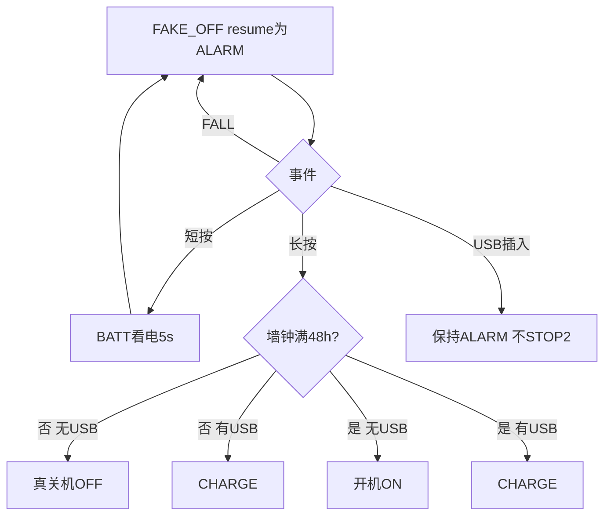

---

其余保持上次理解：10 秒 RTC 心跳、浅醒只闪灯、满醒才发信、IWDG 仅 OFF/FORCE_OFF 关且超时大于 16s、CHARGE 可进 ALARM。

这版若没问题，再说一声再改程序和文档。

---

<a id="q-48"></a>

## 48. 用户 · Tuesday, Aug 18, 2026, 11:44 AM (UTC+8)

有个冲突，你把ALARM短按和长按的理解，还有ALARM->FAKE_OFF后短按和长按的理解画个流程图，我感觉这里有逻辑疏忽，我觉得可能要调整

## 助手

冲突在于：**同一套「逻辑 ALARM」被写成了两套按键。** 先把两边原样画出来，再点破差在哪。先不改代码。

现行 **醒着的 ALARM**（`fsm.md` 已落地）：

- 短按：**忽略**
- 长按：**退出告警** → 有 USB 则 CHARGE，否则回 **prev**（从哪进告警回哪：常是 ON 或 OFF）
- 满 48h：会话自己切 **ON**，和按键无关

上次 **ALARM → FAKE_OFF 之后**：

- 短按：**BATT 看电 5s** → 回 ALARM
- 长按：看 48h → 未满 **OFF**，已满 **ON**（有 USB 则 CHARGE）
- 不再用 prev

同一次告警，发信过程中按、和发完睡着按，长按去的地方不一样，这就是疏忽。

---

## A. 醒着的 ALARM（正在 GNSS/RDSS 或 USB 在位没睡）

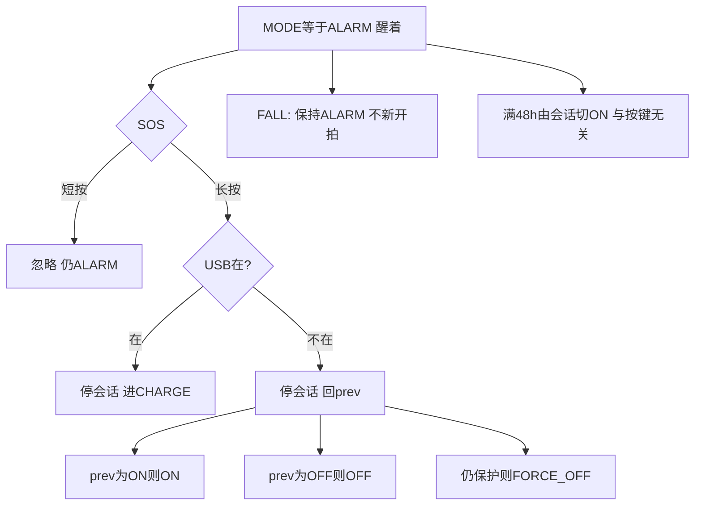

---

## B. ALARM 发完进入 FAKE_OFF 之后（上次理解）

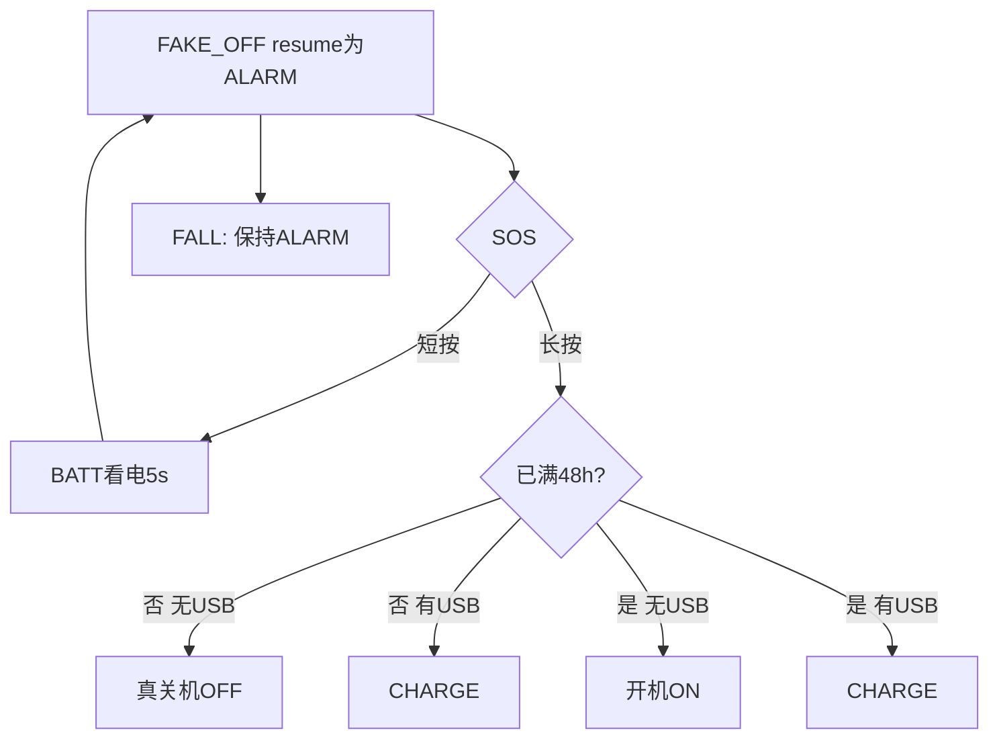

---

## C. 两套叠在一起（冲突点）

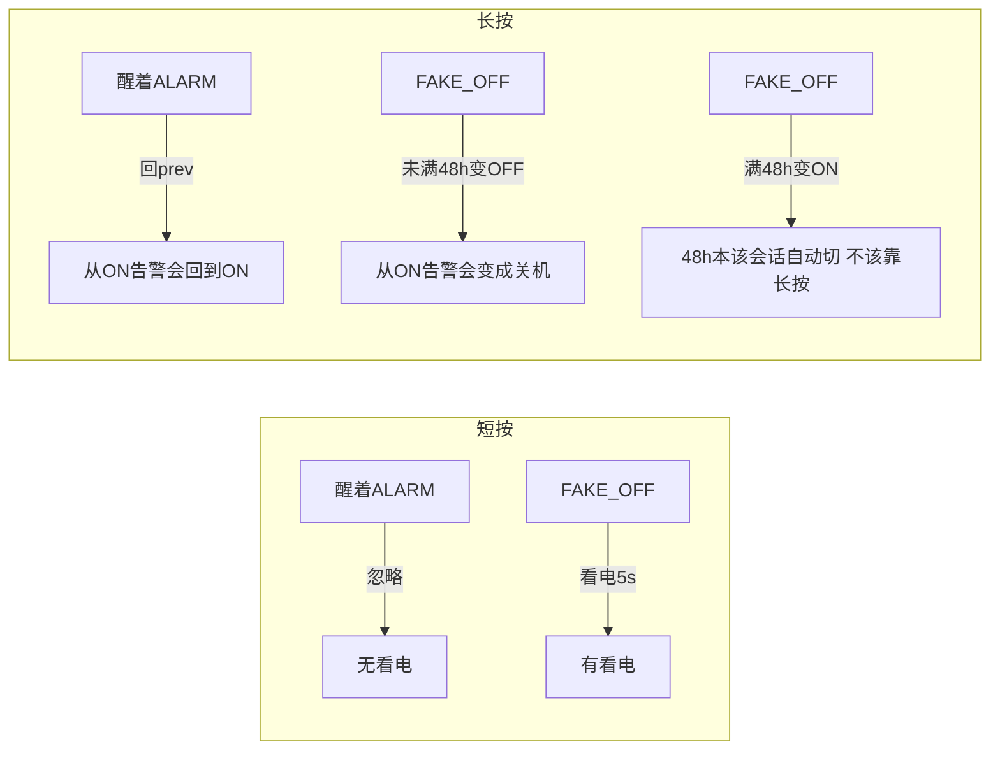

三处对不上：

1. **短按**：醒着没看电，睡着有看电。人还是告警态，不该两套。  
2. **长按**：醒着用 **prev**（从开机进告警，取消后还是开机）；睡着未满 48h 直接 **OFF**，等于同一告警取消后结果相反。  
3. **48h**：产品已是「到点自动 → ON」。再拿长按分支 48h，会和自动切 ON 抢含义；睡着若还没满醒，灯仍是告警，长按又被解释成开机。

另外：从 ALARM 叠 BATT 看电时，不能走「OFF 环」那套 BATT 短按确认开机，否则 5 秒里再短按会变成 ON，等于用看电退出告警。

---

## 建议收成一套（逻辑 ALARM 只有一张表）

不管正在发信还是已经 `FAKE_OFF`，只要逻辑还是 ALARM：

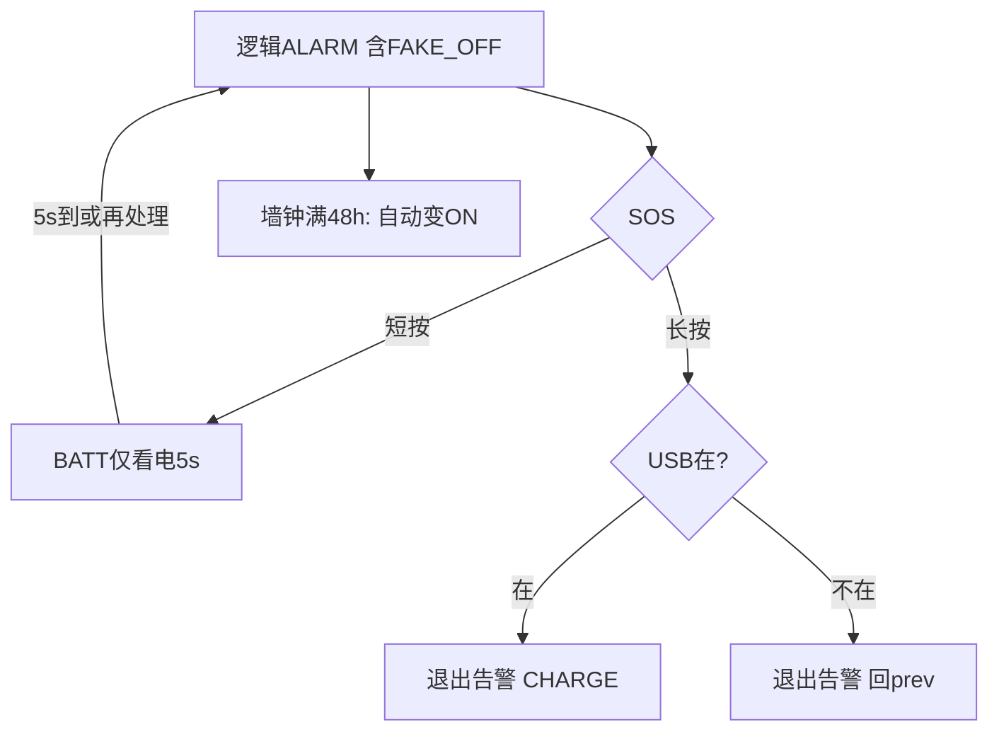

- 短按：一律看电，和你要的假关机短按一致。  
- 长按：一律结束告警，回 prev / CHARGE，和现在醒着一致，**不要用 48h 决定 ON/OFF**。  
- 48h：只留给 RTC/满醒自动切 ON，按键不管。

若你其实想要「告警中长按 = 关机」，那醒着的 ALARM 长按也要改成 OFF（有 USB 则 CHARGE），两边一起改，仍然不要和 48h 绑在一起。

你选一下长按要 **回 prev** 还是 **一律 OFF**。短按看电我按两边同样来。定了再改程序。

---

<a id="q-49"></a>

## 49. 用户 · Tuesday, Aug 18, 2026, 11:49 AM (UTC+8)

当ALARM超过48小时退回到ON状态，如果再长按SOS或者FALL又进入ALARM，我认为是不对的，我觉得应该是再从ALARM->ON的72小时内，不再接收任何状态到ALARM，除非ALARM的72小时内被手动长按SOS，否则不再48小时-72小时内进ALARM.你重新理解下，给出你的建议和方案

## 助手

核心是：**48h 自动回 ON 之后，不要马上又能被 FALL/长按再次打进 ALARM。** 冷却怎么起算，下面给一个能落地的口径。

## 建议（推荐）

告警从 **进入 ALARM 的 Unix（`alarm_start_unix`）** 起算一条时间轴，不要做成两套按键：

| 相对进入 ALARM | 状态 | 再进 ALARM |
|----------------|------|------------|
| 0～48h | 就在 ALARM | 已在告警；FALL 不刷新；短按看电（假关机） |
| 48h | **自动 → ON** | — |
| **48～72h** | ON（可 `FAKE_OFF`） | **只允许 SOS 长按**；FALL、CHARGE 跌落等 **一律禁止** |
| ≥72h | 正常 ON | 长按 / FALL 都可再进 ALARM |

这样对应你说的「48～72 小时内不要进 ALARM」，冷却实际是回 ON 后再锁 **24 小时**。  
「ALARM→ON 的 72 小时内」如果按字面从回 ON 再数 72h，会变成告警结束后还要静音 3 天。示位标偏长，**除非你明确要 3 天，否则用「进入 ALARM 起 72h」更干净**，而且只用现有锚点，不必再记一个「回 ON 时刻」。

冷却 **只对「满 48h 自动回 ON」生效**。告警没满 48h、用户长按主动退出：不进入冷却，之后 FALL/长按仍可立刻告警（人主动取消，不是系统自动结束）。

冷却期内 SOS 长按进 ALARM：视为 **新的一次告警**，重写 `alarm_start_unix`，重新 48h + 72h。

---

## 谁可以进 ALARM（一张表）

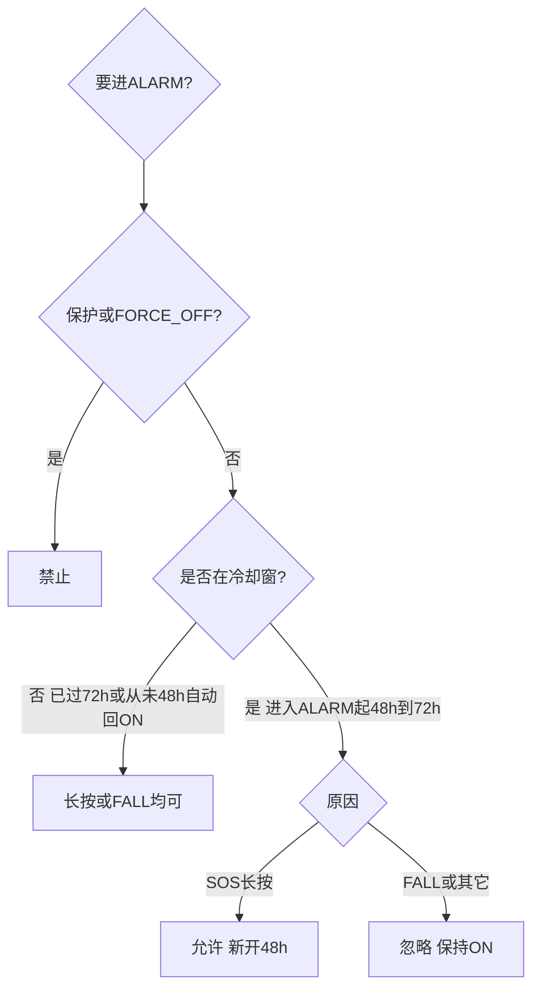

冷却窗判定（推荐）：`rtc 已校时` 且 `alarm_start_unix ≠ 0` 且 `48h ≤ now - start < 72h` 且上次结束原因是 **48h 到期**（BKP 里一个标志即可）。未校时：没有可靠 48h，**不要进冷却**，避免误锁。

---

## 和按键怎么对齐（消除上一轮冲突）

逻辑还在 **ALARM**（醒着发信或 `FAKE_OFF` resume=ALARM）——只有一套：

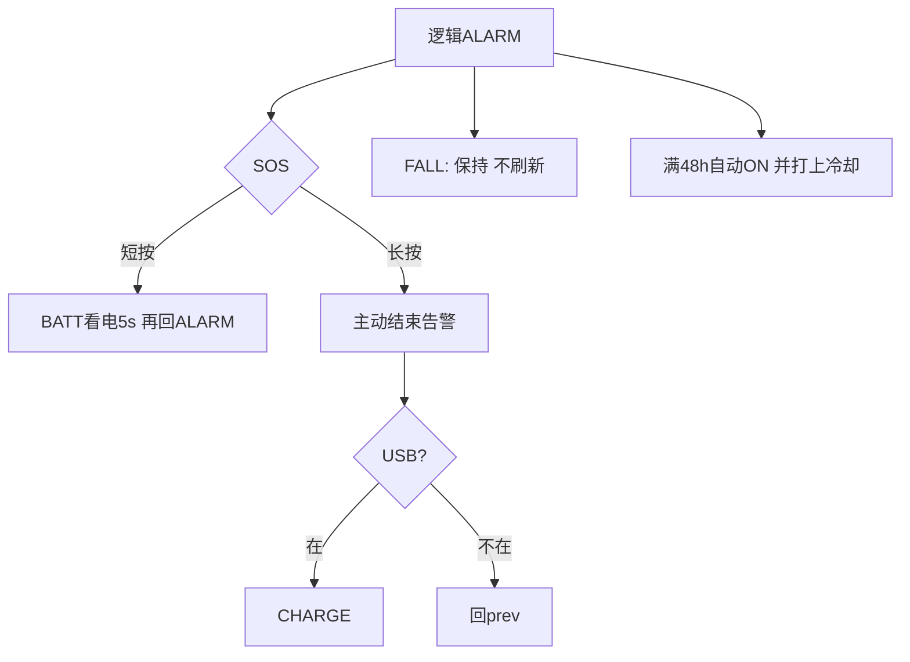

已经 **48h 自动回 ON**（含 `FAKE_OFF` resume=ON，且还在 48～72h）：

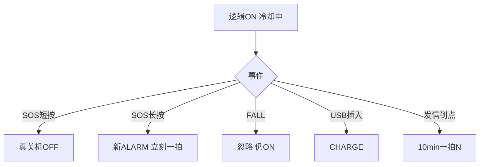

冷却结束（≥72h）后，ON 的长按 / FALL 又都可以进 ALARM。

---

## BKP 建议多两样

| 字段 | 用途 |
|------|------|
| `alarm_start_unix` | 已有；48h/72h 都靠它 |
| `alarm_auto_ended` | 1=上次是 48h 自动回 ON（冷却有效）；手动长按退出则清 0 |
| （可选）`quiet_until` | 冗余：`start+72h`，校时后写死，避免以后改阈值改错 |

假关机、10s 灯、IWDG＞16s、CHARGE 长按进 ALARM（若在冷却则 FALL 进不了，**长按仍能进**）保持上次已点头的部分。

---

请你只定这一句：冷却是 **「进入 ALARM 起 72h（回 ON 后再锁 24h）」**，还是 **「回 ON 之后再锁满 72h」**。  
定了、上一轮按键也按这张表没问题，再说改程序。

---

<a id="q-50"></a>

## 50. 用户 · Tuesday, Aug 18, 2026, 11:52 AM (UTC+8)

如果0-72小时都算ALARM，分别按2/5/10分钟唤醒发报文，然后ON单独一个按10分钟发报文，这样会不会更合适？

## 助手

更合适，而且正好能消掉上一轮「回 ON 后又像告警、又不让进 ALARM」的拧巴。

## 为什么更合适

原来是 **48h 告警 → 自动 ON**，再在 ON 上加 48～72h 冷却，于是出现：灯已经是开机单闪，FALL 又进不了告警，长按语义还和假关机打架。

改成 **0～72h 都是 ALARM**，只是发信变稀：

| 相对进入 ALARM | MODE | 发信 | 灯 / 按键 |
|----------------|------|------|-----------|
| 0～24h | ALARM | **2min** | 告警双闪；短按看电；长按结束告警；FALL 保持不刷新 |
| 24～48h | ALARM | **5min** | 同上 |
| 48～72h | ALARM | **10min** | 同上（间隔已和 ON 一样，但人仍知道在告警） |
| ≥72h | **自动 → ON** | **10min** | 开机单闪；短按关机；长按 / FALL 可再开一次新告警 |

ON 只负责「人确认开过机」的常态 10 分钟，不再兼任告警尾巴。

48～72h 射频间隔和以前回 ON 差不多，多出来的主要是 **灯仍按告警、按键仍按告警**，这正是你要的。

---

## 建议定稿（发信 + 按键）

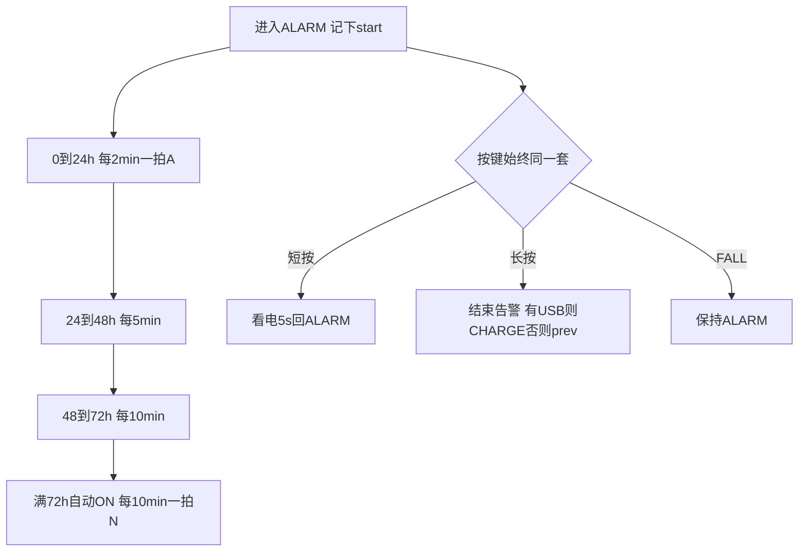

满 72h 自动回 ON 之后：不必再搞「冷却禁止 FALL」。告警已经跑满三天，再跌落/长按应视为 **新的一次 ALARM**（新的 `start`，重新 0～72h）。若你还想自动结束后静音一段时间，那是另一条规则，不要和 48～72h 叠在 ON 上。

主动长按提前结束告警：不进入「自动满 72h」，回 prev 后允许马上再告警（人取消的，不是系统到期）。

未校时：仍先按 2min；校上墙钟后再切 5min/10min/满 72h。不要用 10 秒心跳去数 72 小时。

---

## 和 ON 的差别（不要混）

| | ALARM（含 48～72h） | ON |
|--|--|--|
| 报文 | A，2 → 5 → 10min | N，固定 10min |
| 灯 | 10s 双闪 | 10s 单闪 |
| 短按 | 看电 5s | 真关机 |
| 长按 | 结束告警 | 新开 ALARM |
| FALL | 保持 | 新开 ALARM |
| 假关机 | `FAKE_OFF` resume=ALARM | resume=ON |

CHARGE 长按/FALL：不在冷却里，直接进 ALARM（0～72h 那条轴从头开始）。

---

## 结论

**0～72h 都算 ALARM（2/5/10 分钟三档），ON 只做开机 10 分钟** —— 比「48h 回 ON 再禁止进 ALARM」更合适，MODE、灯、按键、假关机都只需认一个逻辑态。

请确认两句：① 三档就是 **24h + 24h + 24h**；② **满 72h 自动 ON**，之后长按/FALL 可以再开新告警。没问题再说改程序。

---

<a id="q-51"></a>

## 51. 用户 · Tuesday, Aug 18, 2026, 11:56 AM (UTC+8)

没有问题，可以开始写代码，并且完善MD文件，要详细的，我会再详细看有没有问题，包括新的流程图。最好按功能块写流程图，不然会很乱，各种状态都要明示出来

## 助手

先把状态机、会话 72h、灯效和文档按功能块落地；假关机先接上 MODE/`FAKE_OFF` 骨架，STOP2 浅醒按现有能力接，避免半套逻辑。

## 助手

先改会话 72h 与灯效，再接入 `FAKE_OFF` 和告警短按看电。

---

<a id="q-52"></a>

## 52. 用户 · Tuesday, Aug 18, 2026, 11:56 AM (UTC+8)

没有问题，可以开始写代码，并且完善MD文件，要详细的，我会再详细看有没有问题，包括新的流程图。最好按功能块写流程图，不然会很乱，各种状态都要明示出来

## 助手

接着改 `mode.c` 核心状态机，并顺带修 session 在满 72h 时多跑一拍的问题。

## 助手

核心状态机已经接上。接下来按功能块重写 `fsm.md`，并同步其它文档。

## 助手

代码和文档都已按定稿落地。请先看 **`app/mode/fsm.md`**：按功能块拆了流程图（总态、72h、逻辑告警按键、FAKE_OFF、真关机、USB、灯、复位、IWDG/STOP2），每种状态都写在图里，避免一张总图交叉。VS Code / Cursor 装 **Markdown Preview Mermaid Support** 后 `Ctrl+Shift+V` 预览。

**已经接上的逻辑**

- 告警轴：0～24h / 2min、24～48h / 5min、48～72h / 10min（报文 A）；满 72h → ON（报文 N，每 10min）。未校时锚点=0，一直 2min。
- **逻辑告警同一套按键**：物理 `ALARM`、`FAKE_OFF←ALARM`、告警短按叠上的 `BATT`  
  - 短按：只看电 5s，**不能**当「确认开机」  
  - 长按：退出告警 → USB 在则 CHARGE，否则回 `prev`（不进冷却）  
  - FALL：保持告警，不刷新会话  
  - USB：不退出告警；假关机时插 USB 会醒到 `ALARM`
- **`FAKE_OFF`**：一拍结束（成功/失败/无卡）且无 USB → 假关机；下一拍 `SHOT_BUSY` 再醒。CHARGE / BATT / 透传禁止进入。
- `FAKE_OFF←ON` 短按 → 真关机；长按/FALL → 新告警。
- 灯：ON 每 10s 亮 100ms；ALARM 每 10s 双闪（100 / 200 / 100ms）。假关机按 `resume` 显示对应灯。
- 复位：只续未满 72h 的告警；**不恢复 ON**（含 `FAKE_OFF←ON`）。

**明确没做（只写在文档里）**

- RTC **10s 浅醒**只闪灯（不跑整 OS）——未做，现在假关机仍是逻辑态 + idle STOP0。
- 真关机 **STOP2**、硬件 **IWDG**——未接。规划是：仅 OFF/FORCE_OFF 关看门狗，其它态超时 >16s，发信要喂；当前 `RT_USING_WDT` 仍关着，不要贸然打开。

相关 README 已同步到 72h / `FAKE_OFF`（session、led、rtc、nvflash、software_manual、low_power_stop2、roadmap）。你核对流程图时如果某一块和产品意图不一致，直接标块号即可改。

---

<a id="q-53"></a>

## 53. 用户 · Tuesday, Aug 18, 2026, 2:31 PM (UTC+8)

RTC 10s 浅醒只闪灯也要做，真关机 STOP2、硬件 IWDG也要做。另外RTC10S要怎么做耦合度最低？
2. ON状态也要满足FORCE_OFF.
3. ON有几个通道进入？比如BATT5S内进入，ALARM72小时后进入等还有哪些？
4. LOW_BATT应该任何时候都能进入，除了USB-IN吧？
5. 透传模式是插着USB的，所以状态和CHARGE有冲突吗？应该优先透传。
6. 你把所有状态切换流程图画出来，按状态分块还是怎么分能清晰一点。
7. 如图你这流程图画的很费解。
8. BATT_TO是什么？
8.

## 助手

先按你的 8 个问题把规则说清楚，再改代码和流程图。先核对现有 RTC / 低功耗 / 看门狗 / 状态机实现，确认 ON 入口和 FORCE_OFF 是否真接上。

## 助手

先把规则定死：RTC 10s 用注册表解耦；真关机走 STOP2；IWDG 只在非关机态开。接着改代码，并把流程图改成「一态一块」，避免再出现 `BATT_TO` 这种把事件画成状态的图。

---

<a id="q-54"></a>

## 54. 用户 · Tuesday, Aug 18, 2026, 2:31 PM (UTC+8)

RTC 10s 浅醒只闪灯也要做，真关机 STOP2、硬件 IWDG也要做。另外RTC10S要怎么做耦合度最低？
2. ON状态也要满足FORCE_OFF.
3. ON有几个通道进入？比如BATT5S内进入，ALARM72小时后进入等还有哪些？
4. LOW_BATT应该任何时候都能进入，除了USB-IN吧？
5. 透传模式是插着USB的，所以状态和CHARGE有冲突吗？应该优先透传。
6. 你把所有状态切换流程图画出来，按状态分块还是怎么分能清晰一点。
7. 如图你这流程图画的很费解。
8. BATT_TO是什么？
8.

## 助手

[REDACTED]

## 助手

[REDACTED]

## 助手

先直接回答你的问题，再说明代码怎么接的。流程图已经改成 **「一个状态一张图」**，请看 `app/mode/fsm.md`（不要再用之前那张 USB 总图）。

---

**1. RTC 10s 怎么做耦合最低？**（已按这个落地）

RTC **只报时**，不认识灯、会话、MODE：

```text
RTC 10s ISR：清标志 → 喂狗 → 调 3 个钩子（互不 include）
  LED 钩子：只投「闪一拍」
  session 钩子：只投「看一眼到点没有」
  MODE 钩子：只投「采一电、看保护」
MODE 只负责进/出 FAKE_OFF 时 start/stop 10s
72h 仍然用 Unix，不用 10s 去数
```

STOP0 里 SysTick 会停，LED 不能再空等 9.9s，所以假关机改等 RTC 心跳。

**真关机 STOP2、硬件 IWDG** 也已接：`OFF`/`FORCE_OFF` 走 STOP2（R-SRAM 栈，醒后软件复位）；IWDG 超时约 26s，**只在非真关机打开**。IWDG 一旦 Enable 硬件通常关不掉，所以冷启动关机 **先不启动狗**，STOP2 前关掉狗的唤醒/复位位。发信等待每 5s 喂一次，避免 30s 定位被咬。

---

**2. ON 也要满足 FORCE_OFF**

要。保护边沿会切 `FORCE_OFF`；假关机每 10s 还会采电，ON / `FAKE_OFF←ON` 空闲时电压掉下去也能进保护。充电中仍保持 CHARGE。

---

**3. ON 有几条路进来？**

| # | 路径 |
|---|------|
| 1 | 关机看电 `BATT`，**5 秒内再短按** |
| 2 | 告警满 **72h**（USB 在则先 CHARGE，prev=ON，拔 USB 才到 ON） |
| 3 | 未满 72h 长按退出告警，且进入前 prev=ON |
| 4 | CHARGE 拔 USB，prev=ON |
| 5 | LOW_BATT 发完 1 条，进入前是 ON |
| 6 | 退出透传，resume=ON |
| 7 | `FAKE_OFF` 下一拍开始（只醒着发一次，发完再假关机） |
| — | **复位不恢复 ON** |

---

**4. LOW_BATT 是不是除了 USB 随时能进？**

不完全是。已按「除 USB 外尽量能进」收紧如下：

- **不能进：** 插着 USB（CHARGE / 透传带电）、`FORCE_OFF`、**逻辑告警**（已经在发 A，不能打断 72h）
- **能进：** ON、`FAKE_OFF←ON`、OFF、关机看电 BATT  
发完 1 条 **回到进入前的态**，不再一律回 ON。

---

**5. 透传和 CHARGE 冲突吗？**

不抢同一个状态。**透传优先**：状态机保持 `PASSTHRU`，USB 只改 LED 看起来像充电。短按/长按/FALL 仍须先退出透传。

---

**8. `BATT_TO` 是什么？**

**不是状态。** 是事件：看电窗口 **5 秒到了**（`MODE_EVT_BATT_TO`）。  
图里应写成「5 秒超时」，不要画成 `BATT_TO` 圆圈。之前那张 USB 图把 `BATT_OFF` / `BATT_A` / `Prev` 缠在一起，所以难读。

---

请用 `fsm.md` 第 1～9 节按状态核对。若 LOW_BATT 也要在告警里插一条 N，或 72h 满时 USB 在位必须停在 ON 而不是 CHARGE，说一下我按产品改。

[REDACTED]

---

<a id="q-55"></a>

## 55. 用户 · Tuesday, Aug 18, 2026, 3:12 PM (UTC+8)

1. 我们原来定的采电是这样的吧？我认为不用改10S采样一次？你认为呢？
“采集时机（只这些）
时机	动作
上电
校准 + 空载采 1 次
BATT
request()
进入 CHARGE（含上电已插 USB）
set_charging(1)：立刻采（减 offset）+ 开 15s 周期
离开 CHARGE（拔 USB）
set_charging(0)：停周期，不采
SESSION 每拍、开 GNSS 前
sample_wait；若本拍是 CHARGE 刚出来的第一拍则跳过
进入/离开/停留在 PASSTHRU
不采、不周期；从 CHARGE 进来要先停周期
GNSS/RDSS 工作中、KEY、LED
不采
OFF / FORCE_OFF：无周期、无采集。

充电压差（不变）
仍一张 OCV 表。充电且 
V
测
<
4180
 
m
V
V 
测
​
 <4180mV 时：

V
查表
=
V
测
−
charge_offset_mv
V 
查表
​
 =V 
测
​
 −charge_offset_mv
≥
4180
 
m
V
≥4180mV 不再减。vbat_mv 仍是真实端电压；percent/level 用查表电压。offset 宏默认 100，JSON charge_offset_mv 可改（0=关补偿）。

状态 × ADC
→ BATT          request（空载）
→ CHARGE        set_charging(1)  采 + 15s
CHARGE → 拔USB  set_charging(0)  停周期，不采
                回 ON 则本拍会话不采 ADC
→ PASSTHRU      停周期，不采（USB 插拔也不采）
PASSTHRU → CHARGE   set_charging(1)
PASSTHRU → ON       不在 MODE 里采；SESSION 开 GNSS 前采（模块已关）
SESSION 周期拍      sample_wait（CHARGE 退出后第一拍除外）
透传中 LED 若因 USB 显示充电流水，用进透传前的 percent，不在透传里刷新电量。”
2. LOW_BATT 可以不要要在告警里插。
3. 如图，OFF->LOW_BATT这个流程是不是可以不要，在OFF状态下，全关了就不用处理任何事情，除了按键，USB触发，应该没有其他了吧？

## 助手

先核对当前采电时机、告警里的 LOW_BATT，以及 OFF 是否还会走进 LOW_BATT，再按你原来的约定改。

[REDACTED]

## 助手

[REDACTED]

## 助手

同意：10s 只叫醒闪灯，不采电。接着改代码：去掉 RTC 心跳采电、关掉 OFF→LOW_BATT，告警里也不插 LOW_BATT。

[REDACTED]

## 助手

[REDACTED]

## 助手

[REDACTED]

---

<a id="q-56"></a>

## 56. 用户 · Tuesday, Aug 18, 2026, 3:22 PM (UTC+8)

1. 我们原来定的采电是这样的吧？我认为不用改10S采样一次？你认为呢？
“采集时机（只这些）
时机	动作
上电
校准 + 空载采 1 次
BATT
request()
进入 CHARGE（含上电已插 USB）
set_charging(1)：立刻采（减 offset）+ 开 15s 周期
离开 CHARGE（拔 USB）
set_charging(0)：停周期，不采
SESSION 每拍、开 GNSS 前
sample_wait；若本拍是 CHARGE 刚出来的第一拍则跳过
进入/离开/停留在 PASSTHRU
不采、不周期；从 CHARGE 进来要先停周期
GNSS/RDSS 工作中、KEY、LED
不采
OFF / FORCE_OFF：无周期、无采集。

充电压差（不变）
仍一张 OCV 表。充电且 
V
测
<
4180
 
m
V
V 
测
​
 <4180mV 时：

V
查表
=
V
测
−
charge_offset_mv
V 
查表
​
 =V 
测
​
 −charge_offset_mv
≥
4180
 
m
V
≥4180mV 不再减。vbat_mv 仍是真实端电压；percent/level 用查表电压。offset 宏默认 100，JSON charge_offset_mv 可改（0=关补偿）。

状态 × ADC
→ BATT          request（空载）
→ CHARGE        set_charging(1)  采 + 15s
CHARGE → 拔USB  set_charging(0)  停周期，不采
                回 ON 则本拍会话不采 ADC
→ PASSTHRU      停周期，不采（USB 插拔也不采）
PASSTHRU → CHARGE   set_charging(1)
PASSTHRU → ON       不在 MODE 里采；SESSION 开 GNSS 前采（模块已关）
SESSION 周期拍      sample_wait（CHARGE 退出后第一拍除外）
透传中 LED 若因 USB 显示充电流水，用进透传前的 percent，不在透传里刷新电量。”

## 助手

（本条无可见文字回复）

---

<a id="q-57"></a>

## 57. 用户 · Tuesday, Aug 18, 2026, 3:26 PM (UTC+8)

1. 我们原来定的采电是这样的吧？我认为不用改10S采样一次？你认为呢？
“采集时机（只这些）
时机	动作
上电
校准 + 空载采 1 次
BATT
request()
进入 CHARGE（含上电已插 USB）
set_charging(1)：立刻采（减 offset）+ 开 15s 周期
离开 CHARGE（拔 USB）
set_charging(0)：停周期，不采。
SESSION 每拍、开 GNSS 前sample_wait；若本拍是 CHARGE 刚出来的第一拍则跳过，
进入/离开/停留在 PASSTHRU不采、不周期；从 CHARGE 进来要先停周期。
GNSS/RDSS 工作中、KEY、LED不采。
OFF / FORCE_OFF：无周期、无采集。
offset 宏默认 100，JSON charge_offset_mv 可改（0=关补偿）。

状态 × ADC
→ BATT          request（空载）
→ CHARGE        set_charging(1)  采 + 15s
CHARGE → 拔USB  set_charging(0)  停周期，不采
                回 ON 则本拍会话不采 ADC
→ PASSTHRU      停周期，不采（USB 插拔也不采）
PASSTHRU → CHARGE   set_charging(1)
PASSTHRU → ON       不在 MODE 里采；SESSION 开 GNSS 前采（模块已关）
SESSION 周期拍      sample_wait（CHARGE 退出后第一拍除外）
透传中 LED 若因 USB 显示充电流水，用进透传前的 percent，不在透传里刷新电量。”

## 助手

同意：采电时机维持原表，RTC 10s 只叫醒闪灯，不采 ADC。正在去掉心跳采电，并同步关掉 OFF→LOW_BATT。

[REDACTED]

## 助手

[REDACTED]

## 助手

[REDACTED]

## 助手

[REDACTED]

## 助手

[REDACTED]

---

<a id="q-58"></a>

## 58. 用户 · Tuesday, Aug 18, 2026, 3:52 PM (UTC+8)

目前OFF状态下有没有响应BATT_LOW

## 助手

正在核对当前代码里 OFF 态是否会响应低电预警（LOW_BATT / BAT_WARN）。

[REDACTED]

## 助手

[REDACTED]

## 助手

**没有。** 当前代码里，`OFF` 不会进 `LOW_BATT`，也不会响应低电预警发报文。

依据在 `handle_bat_warn()`：

```883:891:app/mode/mode.c
static void handle_bat_warn(void)
{
    /* 只在逻辑 ON 发 1 条 N：OFF/看电/告警/充电/透传/保护都不进 */
    if (usb_is_present() || (s_state == MODE_ST_CHARGE) ||
        (s_state == MODE_ST_PASSTHRU) || (s_state == MODE_ST_FORCE_OFF) ||
        (s_state == MODE_ST_OFF) || (s_state == MODE_ST_BATT) ||
        (s_state == MODE_ST_LOW_BATT))
    {
        return;
```

也就是说：

| 在 `OFF` 时 | 会不会响应 |
|-------------|------------|
| `MODE_EVT_BAT_WARN` → `LOW_BATT` | **不会**，直接 `return` |
| `MODE_EVT_BAT_PROTECT` → `FORCE_OFF` | **会**（保护边沿） |
| 短按 → `BATT` 看电 | **会** |
| 长按 / FALL → `ALARM` | **会** |
| USB 插入 → `CHARGE` | **会** |

这和你们定的采电策略也一致：`OFF` 无周期、无主动采电，只有上电空载采 1 次；关机态本来就不该再跑低电预警会话。

补充两点：

1. **告警里也不进** `LOW_BATT`（`logic_is_alarm()` 也会拦）。
2. **`fsm.md` 还没改**，第 1、2、8 节仍画着 `OFF → LOW_BATT`，和代码不一致；需要的话我可以把文档同步掉。

如果你希望「关机看电 `BATT` 那 5 秒里若已是预警，再短按开机后补发 1 条 N」，这条路径代码里已有：`BATT → ON` 时会检查 `adc_bat_get_level() == WARN` 再调 `handle_bat_warn()`。

[REDACTED]

---

<a id="q-59"></a>

## 59. 用户 · Tuesday, Aug 18, 2026, 3:56 PM (UTC+8)

请用 fsm.md 第 1～9 节按状态核对。若 LOW_BATT 也要在告警里插一条 N，或 72h 满时 USB 在位必须停在 ON 而不是 CHARGE，说一下我按产品改。
按这个状态继续写代码，我认为RTC10S采样一次ADC也是可以，而且OFF状态下如果触发LOW_BATT，OFF状态启动发送一条RDSS流程也是合理

## 助手

按你的定稿继续：RTC 10s 可以采一次 ADC；OFF 触发 LOW_BATT 时发 1 条 RDSS。先核对当前代码和 `fsm.md` 第 1～9 节，再改实现。

## 助手

按你定的产品规则改：RTC 10s 在假关机采一次 ADC；OFF（含关机看电）可进 LOW_BATT 发 1 条 N。告警里仍不插 N；72h 满且 USB 在位仍进 CHARGE。

## 助手

按 `fsm.md` 第 1～9 节已经改完代码。两条产品选择按你上次的口径没动：**告警里不插 N**；**72h 满且 USB 在位仍进 CHARGE**（prev=ON）。

---

**RTC 10s 采 ADC：可以，而且只加在假关机上。**

原来的表仍然有效：上电 1 次、BATT `request()`、CHARGE 立刻采 + 15s、拔 USB 停周期不采、会话开 GNSS 前 `sample_wait`、透传不采、OFF/FORCE_OFF 不采。

多出来的只有一行：`FAKE_OFF` 被 RTC 10s 叫醒时，空载 `request()` 一次。不开 15s 周期，也不在 ISR 里判电；WARN/PROTECT 仍由 ADC 线程边沿上报。CHARGE 继续走自己的 15s。

这样 10s 只服务「浅醒闪灯 + 空载看一眼电」，和充电采样不会搅在一起。

---

**OFF 触发 LOW_BATT 发 1 条 N：可以。**

`OFF` 本身不轮询、不跑 RTC 10s（真关机 STOP2）。预警从这里进来：

- 关机看电 `BATT` 的 `request()` 采到 WARN → 立刻 `LOW_BATT`，发 1 条 N，resume=OFF  
- 看电 5 秒超时回到 OFF 时已经是 WARN → 同样发 1 条  
- 发完回 OFF，再进 STOP2  

上电那 1 次若已是 WARN，**不在 INIT 里自动发**。否则 STOP2 软件复位会每次醒来再发一遍，变成低电死循环。人按键看电时再发，才合理。

告警（含 `FAKE_OFF←ALARM`、告警看电）仍然不进 `LOW_BATT`。

---

`app/mode/fsm.md` 第 1、2、5、8、11 节已按上面改过。若你希望「冷启动 OFF 且已 WARN 也发 1 条」，可以说，我再加 BKP 防 STOP2 重复发。

---

<a id="q-60"></a>

## 60. 用户 · Tuesday, Aug 18, 2026, 4:04 PM (UTC+8)

冷启动 OFF 且已 WARN 也发 1 条，要防止STOP2重复发

## 助手

冷启动 OFF 且已 WARN 要发 1 条 N，并用 BKP 记下已发过，避免 STOP2 复位后重复发。先看粘性存储和开机路径。

## 助手

在 BKP 里记下本轮 WARN 已发过；电量回到 OK 再清。冷启动 OFF 且 WARN 发 1 条；STOP2 复位后读到标志则不再发。

## 助手

冷启动 **OFF 且已 WARN** 会发 1 条 N；STOP2 复位后不会再发。

做法：BKP 里增加 `lb_sent`（备份域，软件复位还在，真掉电才丢）。

| 时机 | 行为 |
|------|------|
| 冷启动 OFF、上电采到 WARN、尚未发过 | 进 `LOW_BATT`，发 1 条 N，立刻把 `lb_sent=1` 写入 BKP |
| STOP2 醒后仍是 WARN | 读到 `lb_sent`，**不再发** |
| 电量回到 OK（≥17%） | ADC 上报 `BAT_OK`，清 `lb_sent` |
| 以后再次掉进 WARN | 当作新一轮，再发 1 条 |

告警中仍然不插 N。初始化会先判电、再启动 MODE 线程，避免还没发就进 STOP2。

---

<a id="q-61"></a>

## 61. 用户 · Tuesday, Aug 18, 2026, 4:07 PM (UTC+8)

你更新下所有MD文档，并且加注这次更改的时间，更改的内容

## 助手

先找出仓库里所有 Markdown，对照这次改动（日期 2026-08-18）把过时内容和变更说明补全。

## 助手

产品侧 Markdown 已按 **2026-08-18** 对齐，并在文首加了变更说明。`middlewares/rt-thread` 未动。

**这次写进文档的内容：**

- `FAKE_OFF`：RTC 10s 浅醒闪灯，并空载采 ADC 1 次  
- `LOW_BATT`：ON / 假关机←ON / OFF / 关机看电可发 1 条 N；告警不插  
- 冷启动 OFF 且 WARN 发 1 条；BKP `lb_sent` 防止 STOP2 复位后重复发；回到 OK 清标志  
- 真关机 STOP2、硬件 IWDG 已接代码（电流仍待实机确认）

**已加注的文档：** 根 `README.md`、`app/mode/fsm.md` 与 `README.md`、`app/session/README.md`、`docs/software_manual.md`、`docs/low_power_stop2.md`、`docs/roadmap_power_msg.md`，以及 `BSP/`（adc/rtc/led/pm/iwdg/nvflash/bkp_user/rram/pwr/key/gnss/rdss）、`services/`（cfg/cli/stream/log/usb）、`tools/host_pc/README.md`。

定稿仍以 `app/mode/fsm.md` 为准。

---

<a id="q-62"></a>

## 62. 用户 · Tuesday, Aug 18, 2026, 4:10 PM (UTC+8)

目前编译有错，是不是哪些还没有完成

## 助手

先尝试编译，对照报错看哪些还没接完。

## 助手

编译失败是函数声明顺序和一处语法错误，不是功能没写完。正在对着报错修。

---

<a id="q-63"></a>

## 63. 用户 · Tuesday, Aug 18, 2026, 4:10 PM (UTC+8)

目前编译有错，是不是哪些还没有完成

## 助手

不是功能没写完，是 **C 声明顺序/函数头残缺** 导致编不过。RTC 10s、STOP2、IWDG、LOW_BATT 这些已经在工程里。

刚才修了两处：

1. **`app/session/session_alarm.c`**：`radio_abort()` 丢了函数头，只剩一段 `{ ... }`；`session_post` 定义在文件后部，前面已经调用，隐式声明和后面的 `static` 冲突。已补回函数头，并在文件前部加了原型。
2. **`app/mode/mode.c`**：`sticky_try_restore()` 里调用了 `batt_disarm()`，但定义更靠后。已在前面加了 `static void batt_disarm(void);`。

WSL 下 `make -j12` **已经通过**，固件已链出 `build/User.elf`。

还没在板子上验证的是：STOP2 电流、IWDG 在 STOP 里的行为、FAKE_OFF 的 10s 浅醒。这些不影响本次编译。

---

<a id="q-64"></a>

## 64. 用户 · Tuesday, Aug 18, 2026, 4:36 PM (UTC+8)

CHARGE 的 15s 周期是不是可以改成10S与RTC同步？另外其他哪里还有5S定时的吗

## 助手

先查 CHARGE 的 15s 周期实现，以及工程里还有哪些 5s 定时。

## 助手

**CHARGE 改成 10s 可以，但那只是周期数字对齐，并不是挂到 RTC 上。** CHARGE 期间 USB 在、核在跑，采电本来就是软件软定时器，不必用 RTC WakeUp。

当前 CHARGE 是 `ADC_BAT_CHARGE_PERIOD_MS = 15000`，`adc_bat_set_charging(1)` 立刻采一次，然后 `s_charge_tmr` 周期触发。RTC 10s 只在进 `FAKE_OFF` 时 `rtc_wu_start(10)`，离假关机就停；CHARGE 不会开这段 WakeUp。

所以：

- **只把 15s 改成 10s**：改宏即可，充电态采得更勤一点，和 RTC 仍是两套钟（SysTick vs LSE），相位也不会对齐。
- **真改成跟 RTC 同一拍**：CHARGE 也要开 WakeUp，并在钩子里采电。CHARGE 不睡 STOP0，SysTick 不停，收益不大，还会和假关机心跳绑在一起。

如果只是想少一套「奇怪周期」，改宏成 10000 就够。需要我改的话说一声。

---

业务侧和 **5 秒** 有关的只有这些：

| 用途 | 位置 | 是不是产品周期 |
|------|------|----------------|
| **看电窗口 5s** | `MODE_BATT_MS`（`app/mode/mode.h`） | **是。** 短按看电超时投 `BATT_TO` |
| RDSS 等卡号 | `RDSS_CARD_TIMEOUT_MS` 5s | 会话/开机等卡超时，不是周期 |
| 等 GNSS/RDSS 时多留 5s | `session_alarm.c`、`cli_test.c` 里 `+ 5000` | 等待上限余量 |
| 等消息时每 5s 喂狗 | `mq_recv_feed` 切片 5000 | IWDG 切片，不是业务定时 |

没有第二套「每 5s 采电/闪灯」的周期。LED 心跳是 **10s**（`LED_ON_PERIOD_MS` / `LED_ALARM_PERIOD_MS`，假关机改走 RTC 10s）。告警发报是 2/5/10 **分钟**，不是 5 秒。

---

<a id="q-65"></a>

## 65. 用户 · Tuesday, Aug 18, 2026, 4:39 PM (UTC+8)

那我们还有哪些没有完成的代码要写吗

## 助手

对照产品定稿、路线图和代码里的 TODO/桩函数，看还有哪些没落地。

## 助手

**按产品定稿，模式/报文/校时/采电/假关机/STOP2/IWDG 该写的代码已经接上，没有再卡着的功能缺口。** 现在差的主要是上板验证，不是再补一整块业务。

还没闭环、但不必先改代码的：

1. **STOP2 真机电流**，KEY/USB 唤醒后软件复位是否干净。  
2. **IWDG** 进 STOP2 前是否真关干净，会不会在深睡里咬复位。  
3. **FAKE_OFF 的 RTC 10s**：闪灯时长、空载 ADC 是否稳。  
4. **告警 72h 三档、ON 10min、LOW_BATT 一条 N、`lb_sent` 过复位**，要靠走表确认。

可以做、但不是缺功能：

| 项 | 说明 |
|----|------|
| CHARGE 15s→10s | 只改宏，不挂 RTC |
| CLI `io.*` | 表在，GPIO 仍标 `not_ready`，产品电源走 `BSP/pwr`，调试口未接 |
| `BSP/rram` 业务块 | STOP2 栈已用 `.rram`；blob 备份还没业务要写 |
| 线程栈压缩 | 文档写「值得做」，改善平时 RAM，不替代 STOP2 策略 |

明确不做或未进产品的：BLE 协议栈、ADC DMA、RT-Thread 官方 ADC/WDT、用 RDSS 校时。

下一步建议先烧板：关机电流、假关机 10s 心跳、插拔 USB 进出 CHARGE、保护进 FORCE_OFF。板测出问题再改代码。CHARGE 周期若要改成 10s，说一声即可改宏。

---

<a id="q-66"></a>

## 66. 用户 · Tuesday, Aug 18, 2026, 4:48 PM (UTC+8)

那如果我需要用板子进行一个功能模块一个功能模块验证，怎么做是做好的？如何做？比如
1. 验证晶振。
2. 验证USB转串口
3. 验证ADC
4. 验证电量指示
5. 验证KEY
6. 验证控制输出IO口
7. 验证GNSS透传
8. 验证RDSS透传
9. 验证GNSS
10. 验证RDSS
11. ...

## 助手

先对照现有 CLI、上位机和测试命令，整理一套能按模块上板验证的顺序和做法。

## 助手

最好的做法是：**烧同一份产品固件，USB 一直插着当调试口，用上位机一条条 `test.*` / `stream.*` 验，不要为每个模块改 `product_config.h` 重编。** 插 USB 时会进 `CHARGE`，不会进 STOP2，COM 口不会被真关机掐掉。

入口：`tools/host_pc`（`run.bat`）→ 选 COM → 连接（DTR=1）→ Ping 通。命令协议见 `services/cli/README.md`。

---

## 原则

1. **先通 USB，再测别的。** 后面 ADC/KEY/GNSS 都靠这条口回 JSON。  
2. **一次只动一个变量。** 例如测 GNSS 时先不要开 RDSS 透传。  
3. **射频相关要看电流/轨电压，不要只看 JSON。** 上电脚由 `BSP/gnss` / `BSP/rdss` / `BSP/pwr` 管，CLI `io.*` 目前几乎都是 `not_ready`。  
4. **`test.gnss.fix` / `test.rdss.*` 会阻塞十几秒到几十秒，等 RSP 回来再发下一条。**  
5. 整机状态机（告警 72h、假关机 10s、STOP2）放在模块都过了之后再拔 USB 测。

建议顺序：晶振/时钟 → USB → KEY → ADC → LED → 电源轨 → GNSS 透传 → RDSS 透传 → GNSS 定位 → RDSS 发信 → 一拍会话 → 再测 MODE。

---

## 1. 晶振 / 时钟

板子是 **HSE 32MHz → PLL 144MHz**，RTC 用 **LSE 32.768kHz**。

| 钟 | 怎么验 | 通过标准 |
|----|--------|----------|
| HSE | USB 能枚举、能 Ping | PLL 起来了；起不来通常枚举失败或跑飞 |
| LSE | `{"cmd":"test.rtc"}` | 能回 `unix`/`synced`；ulog 有 `[RTC]`。未校时 `unix=0`、`synced=0` 也算硬件活着 |
| LSE 走时 | 记一次 unix，等 10s 再 `test.rtc` | 若已校过，应大约 +10；未校时 unix 仍为 0，可先 `{"cmd":"test.rtc","unix":1735689600}` 再等 |

示波器可看 HSE/LSE 脚。没有示波器时：**USB 通 ≈ HSE 通；`test.rtc` 能读写 ≈ LSE 通。**

---

## 2. USB 转串口

1. `make flash`，插 USB，设备管理器出现 CDC COM。  
2. 上位机连接 → `{"cmd":"ping"}` → `ok:1`。  
3. `{"cmd":"mode.get"}`：插电时应为 `CHARGE`（或透传时 FSM 是 `PASSTHRU`、灯是充电外观）。  
4. 日志区能刷 ulog（灰色），说明 DTR/CDC 正常。

失败：驱动、线、DTR 没拉、口被别的串口助手占用。

---

## 3. ADC

```json
{"id":15,"cmd":"test.adc"}
```

看 RSP：`mv`、`lookup_mv`、`pct`、`level`、`charge`。插 USB 时 `charge` 应为 1。

对照：万用表量电芯，和 `mv` 比（充电时软件会减 `charge_offset_mv`，默认 100mV 再查表）。空载可拔充电座只留 USB 调试（若硬件允许），或看 `lookup_mv`。

`level`：`ok` / `warn` / `protect`。保护会进 `FORCE_OFF`，但 USB 在仍应停在充电侧。

---

## 4. 电量指示（LED）

硬件是 **低电平点亮**。先强制灯，再跟 ADC。

```json
{"cmd":"test.led","mode":4,"pct":50}
```

`mode` 与状态枚举一致：`0=OFF` 灭，`2=ON` 三灯 10s 闪 100ms，`3=ALARM` 双闪，`4=CHARGE` 流水。`pct` 管充电/看电流水档（&lt;30 / &lt;70 / ≥70）。

插 USB 本身就会走 CHARGE 流水；`pct≥98` 应三灯常亮。再 `test.adc` 看百分比是否和档位对得上。

---

## 5. KEY

```json
{"cmd":"test.key"}
```

按 SOS / FALL、插拔 USB，反复发命令，看电平翻转和 `sim_present`。  
然后看 `mode.get`：短按应进看电 5s（灯流水一轮）；长按告警等整机语义放到后面测，避免现在误进 ALARM。

---

## 6. 控制输出 IO

`io.list` / `io.set` **现在多数 `not_ready`，不能当主验证手段。** 产品轨是：

- `MCU_EN_PLNA`：`pwr_plna_acquire`（GNSS/RDSS 共用）  
- `EN_PGNSS` / `EN_LNA_GNSS`：GNSS 自管  
- RDSS 同类使能在 `BSP/rdss`

验证方法：开 GNSS 或 RDSS 测试（第 7～10 步）时，示波器/万用表看对应脚是否在会话开始变高、结束变低。不要靠 CLI 白名单去拨，以免和引用计数打架。

若一定要单脚拨，需要先把 `cli_io.c` 里对应项接到真实 GPIO（目前没接完）。

---

## 7. GNSS 透传

```json
{"cmd":"stream.set","name":"gnss","enable":1}
```

`mode.get` 应变为 `PASSTHRU`。NMEA 从 USB CDC **数据流**出来（不是 JSON 那一行）。天线上、室外，应看到 `$GNRMC`/`$GNGGA` 等。

测完务必 `enable:0` 退出透传，否则 MODE 停在透传，后面 `test.gnss.fix` 会 `busy_passthru`。

---

## 8. RDSS 透传

同样：`stream.set` `name":"rdss"`。一次只开一个通道。看到模块回 `$BD…` 即 UART+电源轨基本通。测完关掉。

---

## 9. GNSS 定位（正式路径）

透传关掉后：

```json
{"cmd":"test.gnss.fix"}
```

成功应有有效定位和 `unix`（来自 RMC，**这条命令不写 RTC**）。超时加大 `wait_ms`。同时看 `EN_PGNSS`/LNA 是否上电。

产品校时要走 ON 第一次定位，不是这条 test。

---

## 10. RDSS

```json
{"cmd":"test.rdss.card"}
{"cmd":"test.rdss.send"}
```

先查卡（`bd_card` / `cfg.get`），再发载荷 `TEST`。要波束、卡、频度都允许；`pa_enable` 默认 0，外场不够可 `cfg.set` 打开（注意法规/功耗）。

---

## 11. 之后建议接着验（你列表里的 …）

| 步 | 命令 / 操作 | 目的 |
|----|-------------|------|
| 一拍会话 | `test.session.once` | GNSS+打包+RDSS 整链，**不改 MODE** |
| 配置 | `cfg.get` / `cfg.set` | `recv_id`、`device_id`、掉电后再读 Flash |
| 校时 | 先 `test.gnss.fix` 有 unix，再进 ON 看 `test.rtc` 的 `synced` | 只 GNSS 校、ON 一次 |
| 假关机 10s | **拔 USB**，开机发完一拍后灯 10s 闪 | RTC WakeUp；插着 USB 测不到 |
| 真关机 STOP2 | 确认 OFF 后电流、按键/USB 能醒 | 醒后会软件复位，COM 会断再枚举 |
| 低电 N | 电量拉到预警，看是否发 1 条、告警态不插 N | 要能控电源或假电压 |

---

## 实操节奏（推荐）

每天/每块板用同一清单打勾：**Ping → rtc → key → adc → led → gnss 透传 → 关透传 → gnss.fix → rdss.card → rdss.send → session.once**。射频失败时先看轨电压和透传原始句，再查协议超时。

**不要**为「只测 ADC」关掉 GNSS/RDSS 重编，除非某模块把系统卡死、USB 都没了。那种情况才临时 `USE_xxx 0` 缩小范围。

如果你要，我可以把上面这份写成 `docs/board_bringup.md` 放进仓库，方便现场对着勾。

---

<a id="q-67"></a>

## 67. 用户 · Tuesday, Aug 18, 2026, 4:52 PM (UTC+8)

写进去，然后我们做这些流程，软件还有哪些没有实现的吗？

## 助手

先把上板流程写成文档并挂到索引；同时核对 `io.*`、透传 sink 等验证步骤在软件里是否真能走通。

## 助手

已经写成 [`docs/board_bringup.md`](docs/board_bringup.md)，并在仓库根 `README.md`、`docs/software_manual.md`、CLI/stream/上位机说明、路线图里加了入口。

按这份流程上板，**产品功能代码齐，但有两块调试桥没接完**，会卡住你列的第 6～8 步：

**1. GNSS/RDSS 透传到 USB（第 7、8 步）**  
`stream.set` 已经能进 `PASSTHRU`、给模块上电开 UART。模块侧也会 `stream_write`。可是 **从来没有 `stream_set_sink(..., cdc_acm_write)`**，CDC 收数又 **只进 CLI JSON**，不转 `gnss/rdss_passthru_write`。所以 PC 上 **看不到 NMEA / `$BD`，也不能从 USB 给模块下指令**。  
上板请改用：`test.gnss.fix`、`test.rdss.card` / `send`，同时量电源轨，看 ulog 里的 `[GNSS]`/`[RDSS]`。

**2. 控制口 CLI（第 6 步）**  
`io.list` 有表，全部 `ready:0`，`io.get`/`io.set` 都是 `not_ready`。灯用 `test.led`；EN_* 在 `test.gnss.fix` / `test.rdss.*` 时用表笔量。

其余步骤软件是通的：晶振用 USB + `test.rtc`，USB/`test.key`/`test.adc`/`test.led`/定位/查卡发信/`test.session.once` 都有命令。没有单独的「验晶振」指令，也不需要。

整机（假关机 10s、STOP2、72h、低电 N）代码已接，要 **拔 USB** 再测，插着会停在充电，测不到深睡。

建议现场先按文档第 12 节勾 USB 插着的清单；透传若必须在 PC 上看原始句，再说，我可以把 sink + CDC 分流补上。

---

<a id="q-68"></a>

## 68. 用户 · Tuesday, Aug 18, 2026, 5:10 PM (UTC+8)

1. 透传的数据就是到USB串口的，也就是GNSS/RDSS的数据直接到USB串口
2. 12节是调试的时候勾选的吗

## 助手

透传应把 GNSS/RDSS 直接送到 USB 串口；第 12 节是现场调试勾选表。先把 USB 桥接上，并核对 CDC 收发会不会和 CLI 抢同一条口。

---

<a id="q-69"></a>

## 69. 用户 · Tuesday, Aug 18, 2026, 5:10 PM (UTC+8)

1. 透传的数据就是到USB串口的，也就是GNSS/RDSS的数据直接到USB串口
2. 12节是调试的时候勾选的吗

## 助手

对，就是这个意思。

**1. 透传到的就是 USB 串口**

GNSS / RDSS 模块 UART 和电脑上的 **同一个 USB CDC COM** 直通：

- 模块往外吐的 NMEA / `$BD…` → 直接出现在这个 COM 上  
- 电脑往这个口发的内容：不以 `{` 开头的行写给模块；以 `{` 开头的仍是 JSON CLI（这样才能发 `stream.set` 关掉透传）

ulog 也走这条口，日志和透传数据会混在一起。上位机 V0.1 没有单独透传页，看日志区或另开串口助手即可。

**2. 第 12 节就是调试勾选表**

上板时 USB 插着，按项打勾，确认过了再往下。不是「还没写的软件清单」。

文档已按这两点改过：`docs/board_bringup.md` 第 7、8、12 节，以及 stream / 手册里原先写「sink 未接」的地方。

---

<a id="q-70"></a>

## 70. 用户 · Tuesday, Aug 18, 2026, 5:13 PM (UTC+8)

两块调试桥没接完是哪两个？

## 助手

原先说的「两块调试桥」就是这两块：

1. **透传 USB 桥** — GNSS/RDSS UART ↔ USB CDC  
   **已经接上了。** 模块句会出现在同一个 COM；电脑发的非 `{` 行会写给模块。

2. **CLI `io.*` GPIO 桥** — 上位机 IO 页拨 `EN_*` / LED  
   **还没接。** `cli_io.c` 里表有了，真正读写脚仍返回 `not_ready` / `ready:0`。产品跑起来时轨和灯由 GNSS/RDSS/LED 模块自己管，调试时用万用表或 `test.led`，不能从 IO 页强拨。

所以现在固件侧只剩第 2 块没接。上位机没有单独透传终端页，那是 PC 软件界面，不算这块桥。

---

<a id="q-71"></a>

## 71. 用户 · Tuesday, Aug 18, 2026, 5:17 PM (UTC+8)

那有更好的办法解决串口数据混在一起吗？

## 助手

先看当前 USB/日志/透传是怎么共用这一条口的，再给能落地的方案。

## 助手

有，而且混在一起不只是「看起来乱」：ulog 和透传都调 `cdc_acm_write`，中间没有互斥，日志线程可能把一行 NMEA **从中间截断**，串口助手/解析都会坏。

按投入从低到高：

**1. 透传时关掉 CDC 日志（最划算，建议先做这个）**

`stream.set enable:1` 时把 ulog CDC 后端静音（或滤到 ERROR）；`enable:0` 再打开。COM 上就只剩模块原文。退出透传后日志照常。

代价：透传窗口里看不到 `[GNSS]`/`[RDSS]` 软件日志，看硬件句和轨电压就够了。

**2. 上位机按行分流（不改 USB）**

同一 COM 上：`{` → JSON，`[` → ulog，`$` → NMEA。V0.1 日志区已经有颜色，可以再加一个透传窗只收 `$`。

这只能整理「整行」，**挡不住 ulog 插进半句 NMEA**，所以不能单独当正解，要和 1 一起用。

**3. 双 CDC（两条 COM，才是物理隔离）**

`stream` 当初就按「多 CDC 只改 `stream_set_sink`」留的。一条口 CLI+ulog，一条口纯透传。

代价是 USB 描述符、端点、Windows 复合设备、上位机选两个口，工作量比静音大一截，上板调试不必现在做。

不建议把 NMEA 再包进 JSON：那就不是透传了，u-center / 串口助手也接不上。

**结论：** 现在更好的办法是 **透传期间静音 ulog**，需要时再加上位机 `$` 窗。双 CDC 留给以后。若要做静音，可以说一声我改固件。
