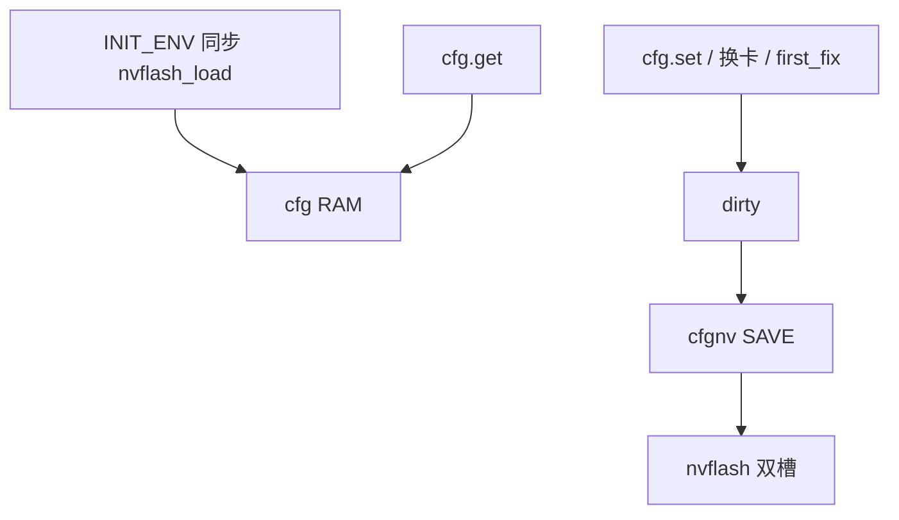

# cfg 流程图

字段与 Flash：[`README.md`](README.md)。`pa_enable` 只 RAM。透传静音 **不是** cfg 字段。

```json
{"cmd":"cfg.get"}
{"cmd":"cfg.set","recv_id":13500001,"device_id":1325000001,"charge_offset_mv":100,"pa_enable":0,"hw_ver":"A1"}
```


