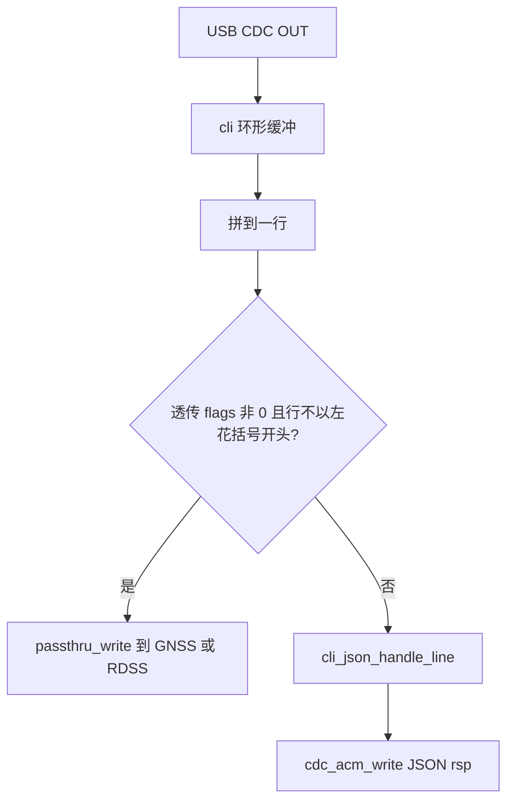

# CLI 流程图

用法命令表：[`README.md`](README.md)。上板：[`docs/board_bringup.md`](../../docs/board_bringup.md)。

```mermaid
flowchart TD
  A[USB CDC OUT] --> B[cli 环形缓冲]
  B --> C[拼到一行]
  C --> D{透传 flags 非 0 且行不以左花括号开头?}
  D -->|是| E[passthru_write 到 GNSS 或 RDSS]
  D -->|否| F[cli_json_handle_line]
  F --> G[cdc_acm_write JSON rsp]
```

退出透传必须发 `{` 开头的 `stream.set` `enable:0`。

`io.*` 表在 `cli_io.c`，GPIO **未接**，返回 `not_ready`。
