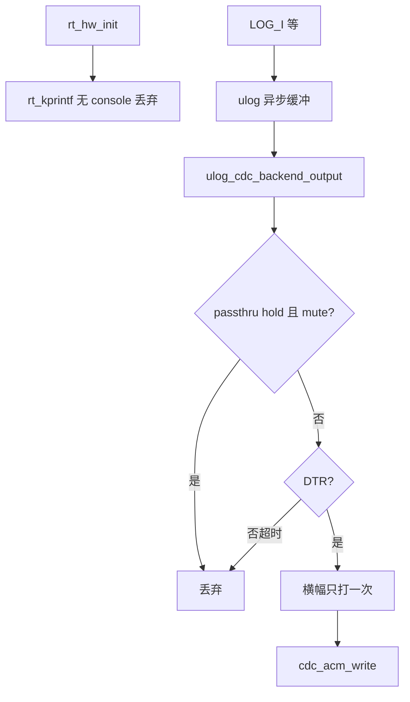

# ulog CDC 流程图

用法：[`README.md`](README.md)。

```json
{"cmd":"log.lvl","lvl":6}
{"cmd":"log.cdc"}
{"cmd":"log.cdc","passthru_mute":0}
```


```mermaid
flowchart TD
  B[rt_hw_init] --> K[rt_kprintf 无 console 丢弃]
  L[LOG_I 等] --> Q[ulog 异步缓冲]
  Q --> O[ulog_cdc_backend_output]
  O --> M{passthru hold 且 mute?}
  M -->|是| X[丢弃]
  M -->|否| D{DTR?}
  D -->|否超时| X
  D -->|是| P[横幅只打一次]
  P --> W[cdc_acm_write]
```

JSON rsp / NMEA **不**走本后端。`passthru_mute` 只 RAM，不进 cfg。
