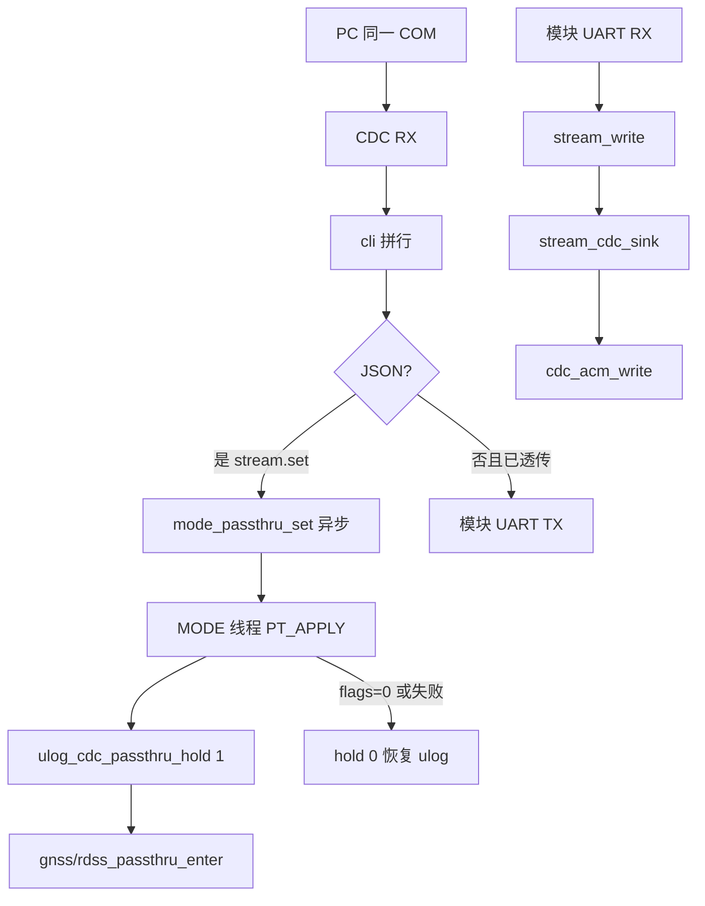

# stream / 透传流程图

用法：[`README.md`](README.md)。静音：[`../log/README.md`](../log/README.md)。

一次只开 gnss 或 rdss 一个通道。ON/CHARGE 才能进；ALARM/OFF 拒绝。  
串口助手：USB CDC、DTR、一行 JSON `stream.set`；关必须 `{` 开头。详见 [`README.md`](README.md)、[`docs/board_bringup.md`](../../docs/board_bringup.md) 第 0.3、7、8 节。
