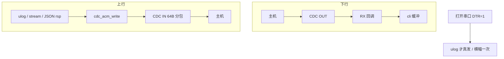

# USB CDC 流程图

板级时钟/引脚：`board/usb_hw.*`。本目录：会话与 `cdc_acm_write`。

```mermaid
flowchart TD
  subgraph 下行
    PC1[主机] --> OUT[CDC OUT]
    OUT --> CB[RX 回调]
    CB --> CLI[cli 缓冲]
  end
  subgraph 上行
    W1[ulog / stream / JSON rsp] --> W[cdc_acm_write]
    W --> IN[CDC IN 64B 分包]
    IN --> PC2[主机]
  end
  DTR[打开串口 DTR=1] --> LOG[ulog 才真发 / 横幅一次]
```

插 USB：MODE `pm_lock`，不进 STOP0/STOP2。
