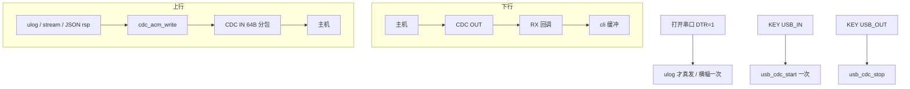

# USB CDC 流程图

板级时钟/引脚：`board/usb_hw.*`。本目录：会话与 `cdc_acm_write`。插入/拔出滤波见 [`BSP/key/flow.md`](../../BSP/key/flow.md)。

插 USB：PA7 或 `usb_cdc_is_on()` → idle 不 STOP0。CHARGE 另有 MODE `pm_lock`。确认在位期间不 `stop+start`。
